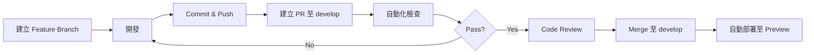

# 部署架構與 CI/CD 規劃

## 版本：v1.0
## 更新日期：2025-11-29

---

> ⚠️ **重要提醒**：部署前請先完成 [外部設定檢查清單 - Phase 3](./10_EXTERNAL_SETUP_CHECKLIST.md#-phase-3部署前設定) 的所有項目。

---

## 1. 部署架構總覽

### 1.1 架構圖

```
┌─────────────────────────────────────────────────────────────┐
│                         使用者端                             │
├─────────────┬───────────────────────────────────────────────┤
│  GM 端      │  玩家端                                        │
│  (Desktop)  │  (Mobile)                                     │
└─────┬───────┴──────┬────────────────────────────────────────┘
      │              │
      │              │  HTTPS
      │              │
      ▼              ▼
┌─────────────────────────────────────────────────────────────┐
│                    Vercel (CDN + Edge)                       │
│  - Next.js SSR/SSG                                          │
│  - API Routes                                               │
│  - Edge Functions                                           │
└────┬──────────┬──────────┬──────────┬──────────────────────┘
     │          │          │          │
     │          │          │          │
     ▼          ▼          ▼          ▼
┌─────────┐ ┌──────┐ ┌─────────┐ ┌──────────┐
│ MongoDB │ │Pusher│ │ Vercel  │ │ Resend   │
│ Atlas   │ │ (WS) │ │  Blob   │ │ (Email)  │
└─────────┘ └──────┘ └─────────┘ └──────────┘
```

---

## 2. 雲端服務配置

### 2.1 Vercel（主要部署平台）

> ⚠️ **需外部設定**：請參考 [外部設定檢查清單 - Vercel](./10_EXTERNAL_SETUP_CHECKLIST.md#31-vercel-帳號與專案設定)

**方案**：Hobby（免費）
- 100 GB 頻寬/月
- 無限部署次數
- 自動 HTTPS
- Global CDN
- Edge Functions

**升級考量**（Pro Plan）
- 商業專案需求
- 需要團隊協作
- 更高流量需求（1 TB/月）
- 進階分析功能

---

### 2.2 MongoDB Atlas（資料庫）

> ⚠️ **需外部設定**：請參考 [外部設定檢查清單 - MongoDB](./10_EXTERNAL_SETUP_CHECKLIST.md#11-mongodb-atlas-設定)

**方案**：M0（免費）
- 512 MB 儲存空間
- 共享 RAM
- 支援 ~100 concurrent connections
- 自動備份（最近 7 天）

**資料中心位置**：選擇 `ap-east-1`（香港）或 `ap-southeast-1`（新加坡）

**升級考量**（M2 或更高）
- 儲存空間不足
- 連線數超過限制
- 需要更高效能

---

### 2.3 Pusher（WebSocket）

> ⚠️ **需外部設定**：請參考 [外部設定檢查清單 - Pusher](./10_EXTERNAL_SETUP_CHECKLIST.md#21-pusher-設定websocket)

**方案**：Sandbox（免費）
- 100 concurrent connections
- 200k messages/day
- 無 SLA 保證

**Cluster**：`ap3`（新加坡）

**升級考量**（Pro Plan）
- 超過 100 concurrent connections
- 需要 SLA 保證
- 生產環境需求

---

### 2.4 Vercel Blob（圖片儲存）

**方案**：Hobby（免費）
- 1 GB 儲存空間
- 讀取/寫入無限制

**升級考量**
- 圖片數量超過限制
- 需要更大儲存空間

---

### 2.5 Resend（Email）

**方案**：Free
- 100 emails/day
- 單一發送者網域

**升級考量**（Pro Plan）
- 超過 100 GM/day
- 需要多個發送者網域
- 需要進階分析

---

## 3. 環境配置

### 3.1 環境劃分

| 環境 | 分支 | 用途 | 自動部署 |
|------|------|------|----------|
| **Development** | `develop` | 開發測試 | ✅ 自動部署至 Preview |
| **Staging** | `staging` | 預發布測試 | ✅ 自動部署至 Preview |
| **Production** | `main` | 正式環境 | ✅ 自動部署至 Production |

### 3.2 環境變數管理

每個環境使用獨立的環境變數：

```
Production  → 使用 Production MongoDB、Pusher App
Preview     → 使用 Staging MongoDB、Pusher App
Development → 使用 Dev MongoDB、Pusher App
```

**設定方式**
1. Vercel Dashboard → Settings → Environment Variables
2. 為每個變數指定環境（Production / Preview / Development）

---

## 4. CI/CD 流程

### 4.1 Git 工作流程

```
feature/xxx  →  develop  →  staging  →  main
    (PR)         (PR)         (PR)      (Production)
```

### 4.2 Pull Request 流程



### 4.3 自動化檢查

每次 PR 自動執行：

1. **ESLint**：程式碼風格檢查
2. **TypeScript**：類型檢查
3. **Build**：確保可成功建置
4. **Tests**（若有）：單元測試與整合測試

**GitHub Actions 配置**（`.github/workflows/ci.yml`）

```yaml
name: CI

on:
  pull_request:
    branches: [develop, staging, main]

jobs:
  lint-and-type-check:
    runs-on: ubuntu-latest
    steps:
      - uses: actions/checkout@v4
      - uses: pnpm/action-setup@v2
        with:
          version: 9
      - uses: actions/setup-node@v4
        with:
          node-version: 20
          cache: 'pnpm'
      
      - name: Install dependencies
        run: pnpm install
      
      - name: Run ESLint
        run: pnpm lint
      
      - name: Type check
        run: pnpm type-check
      
      - name: Build
        run: pnpm build
        env:
          # 使用測試環境變數
          MONGODB_URI: ${{ secrets.MONGODB_URI_STAGING }}
          SESSION_SECRET: ${{ secrets.SESSION_SECRET_STAGING }}
```

---

## 5. 部署流程

### 5.1 自動部署（Vercel）

1. **Merge 至 `main`**
   - Vercel 自動偵測
   - 執行 `pnpm build`
   - 部署至 Production
   - 更新 `larp-nexus.vercel.app`

2. **PR 至 `develop` 或 `staging`**
   - Vercel 建立 Preview 部署
   - 產生唯一 URL（例：`larp-nexus-xxx.vercel.app`）
   - 可於 PR 中預覽變更

### 5.2 手動部署（緊急修復）

```bash
# 安裝 Vercel CLI
pnpm add -g vercel

# 部署至 Production
vercel --prod

# 部署至 Preview
vercel
```

---

## 6. 資料庫遷移策略

### 6.1 Schema 變更流程

1. **開發階段**
   - 於 `develop` 分支修改 Mongoose Schema
   - 撰寫 migration script（若需要）

2. **測試階段**
   - 於 Staging DB 執行 migration
   - 驗證資料完整性

3. **生產部署**
   - 於 Production DB 執行 migration
   - 監控錯誤日誌

### 6.2 Migration Script 範例

```typescript
// scripts/migrations/001_add_wsChannelId.ts
import mongoose from 'mongoose';
import Character from '@/lib/db/models/Character';

async function migrate() {
  await mongoose.connect(process.env.MONGODB_URI!);
  
  const characters = await Character.find({ wsChannelId: { $exists: false } });
  
  for (const char of characters) {
    char.wsChannelId = `character-${char._id}`;
    await char.save();
  }
  
  console.log(`Migrated ${characters.length} characters`);
  await mongoose.disconnect();
}

migrate();
```

**執行方式**
```bash
tsx scripts/migrations/001_add_wsChannelId.ts
```

---

## 7. 監控與日誌

### 7.1 Vercel Analytics

**啟用方式**
```typescript
// app/layout.tsx
import { Analytics } from '@vercel/analytics/react';

export default function RootLayout({ children }) {
  return (
    <html>
      <body>
        {children}
        <Analytics />
      </body>
    </html>
  );
}
```

**提供指標**
- Page Views
- Unique Visitors
- Core Web Vitals（LCP, FID, CLS）

---

### 7.2 日誌管理

使用 Vercel 內建日誌系統：

- **Deployment Logs**：建置過程日誌
- **Function Logs**：API Routes 執行日誌
- **Edge Logs**：Edge Functions 日誌

**進階方案**：整合 Datadog、LogRocket 等第三方服務

---

## 8. 備份策略

### 8.1 資料庫備份

**MongoDB Atlas 自動備份**
- 免費方案：最近 7 天
- 每日自動備份
- 手動復原至任意時間點（Cloud Backup）

**手動備份**
```bash
# 使用 mongodump
mongodump --uri="mongodb+srv://..." --out=./backup

# 復原
mongorestore --uri="mongodb+srv://..." ./backup
```

### 8.2 圖片備份

Vercel Blob 無自動備份，建議：

- 定期匯出重要圖片至 S3 或其他儲存服務
- 或使用 Vercel Blob API 定期下載

---

## 9. 效能優化

### 9.1 CDN 與快取

Vercel 自動提供：

- **靜態檔案**：自動快取於 CDN
- **ISR（Incremental Static Regeneration）**：用於劇本公開資訊頁
- **Edge Caching**：API Routes 可設定快取

```typescript
// app/api/games/[id]/route.ts
export const revalidate = 60; // 快取 60 秒
```

### 9.2 圖片優化

使用 Next.js Image Component：

```tsx
<Image
  src={imageUrl}
  alt="..."
  width={500}
  height={300}
  quality={80}
  placeholder="blur"
/>
```

Vercel 自動提供：
- WebP 轉換
- 響應式圖片
- Lazy Loading

---

## 10. 安全性

### 10.1 HTTPS

Vercel 自動提供免費 SSL 憑證（Let's Encrypt）

### 10.2 環境變數保護

- 敏感資料僅存於 Vercel Environment Variables
- 不上傳至 Git
- 不暴露於前端（避免 `NEXT_PUBLIC_*`）

### 10.3 CORS 設定

```typescript
// middleware.ts
export function middleware(req: NextRequest) {
  const res = NextResponse.next();
  
  res.headers.set('Access-Control-Allow-Origin', process.env.NEXT_PUBLIC_APP_URL!);
  res.headers.set('X-Frame-Options', 'DENY');
  res.headers.set('X-Content-Type-Options', 'nosniff');
  
  return res;
}
```

---

## 11. 擴展計畫

### 11.1 Phase 1：MVP（免費方案）

- Vercel Hobby
- MongoDB M0
- Pusher Sandbox
- 支援 ~10 個劇本、~50 個角色

### 11.2 Phase 2：成長期（付費方案）

- Vercel Pro（$20/月）
- MongoDB M2（$9/月）
- Pusher Pro（$49/月）
- 支援 ~100 個劇本、~500 個角色

### 11.3 Phase 3：規模化（企業方案）

- Vercel Enterprise
- MongoDB M10+
- Pusher Enterprise
- 多區域部署
- 負載均衡

---

## 12. 災難復原計畫

### 12.1 資料庫失效

1. 聯絡 MongoDB Atlas 支援
2. 從最近一次備份復原
3. 通知使用者（預估復原時間）

### 12.2 Vercel 服務中斷

1. 檢查 [Vercel Status](https://www.vercel-status.com/)
2. 若為全球性問題，等待官方修復
3. 若為專案問題，回滾至上一個穩定版本

```bash
# 回滾部署
vercel rollback <deployment-url>
```

### 12.3 Pusher 失效

1. 玩家端失去即時更新（但仍可重新整理頁面）
2. GM 端無法推送事件
3. 等待 Pusher 恢復或切換至備用方案（Socket.io）

---

## 13. 部署檢查清單

### 13.1 首次部署

- [ ] 建立 Vercel 專案
- [ ] 連結 GitHub Repository
- [ ] 設定 Production 環境變數
- [ ] 設定自訂網域（選用）
- [ ] 測試所有 API Endpoints
- [ ] 測試 WebSocket 連線
- [ ] 測試圖片上傳
- [ ] 測試 Email 發送
- [ ] 測試玩家端 QR Code 存取

### 13.2 每次部署

- [ ] 通過 CI 檢查（ESLint, TypeScript, Build）
- [ ] Code Review 完成
- [ ] 測試於 Preview 環境
- [ ] 更新 CHANGELOG.md（若有）
- [ ] Merge 至 main
- [ ] 監控 Vercel Deployment 狀態
- [ ] 驗證 Production 功能正常
- [ ] 檢查錯誤日誌（Vercel Logs）

---

## 14. 成本估算

### 14.1 免費方案（MVP）

| 服務 | 方案 | 成本 |
|------|------|------|
| Vercel | Hobby | $0 |
| MongoDB Atlas | M0 | $0 |
| Pusher | Sandbox | $0 |
| Vercel Blob | Free | $0 |
| Resend | Free | $0 |
| **總計** | | **$0/月** |

**限制**
- ~10 個劇本
- ~50 個角色
- ~100 concurrent connections

---

### 14.2 付費方案（成長期）

| 服務 | 方案 | 成本 |
|------|------|------|
| Vercel | Pro | $20/月 |
| MongoDB Atlas | M2 | $9/月 |
| Pusher | Pro | $49/月 |
| Vercel Blob | 增加儲存 | ~$5/月 |
| Resend | Pro | $20/月 |
| **總計** | | **$103/月** |

**支援**
- ~100 個劇本
- ~500 個角色
- ~500 concurrent connections

---

## 附註

- 定期檢查各服務的使用量
- 監控成本，適時升級或優化
- 保持文件更新

此文件將隨專案需求持續更新。

