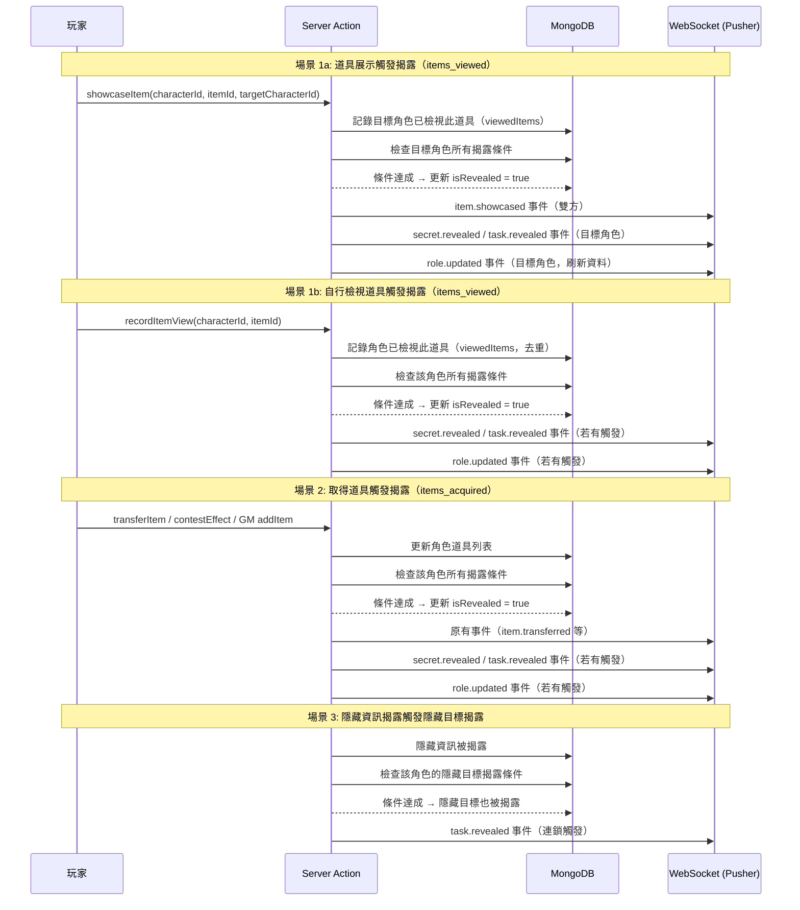
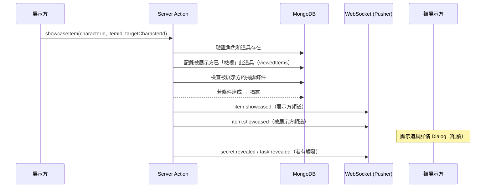
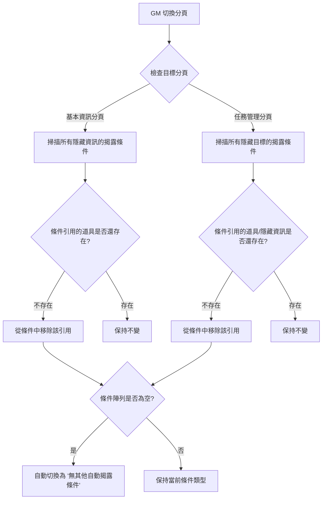

# SPEC-auto-reveal-item-showcase

## Phase 7.7: 自動揭露條件系統 + 道具展示功能

### 版本：v1.2
### 日期：2026-02-09
### 狀態：已完成

---

## 1. 功能概述

### 1.1 背景

目前系統中的「隱藏資訊」（Secrets）和「隱藏目標」（Hidden Tasks）僅有文字型的 `revealCondition` 欄位供 GM 備忘，揭露操作完全依賴 GM 手動切換 `isRevealed` 開關。此設計在遊戲進行中增加了 GM 的操作負擔，且無法根據遊戲進程自動觸發揭露。

### 1.2 目標

1. **自動揭露條件系統**：為隱藏資訊和隱藏目標新增結構化的自動揭露條件，當條件達成時自動揭露
2. **道具展示功能**：玩家可將道具展示給其他角色查看（僅查看，不含操作按鈕）
3. **條件健全性維護**：GM 端切換分頁時自動清理已失效的揭露條件引用

### 1.3 功能範圍

| 子功能 | 說明 |
|--------|------|
| A. 隱藏資訊自動揭露 | 支援「檢視過某幾樣道具」（展示/自行檢視）和「取得了某幾樣道具」兩種條件（支援 AND/OR 邏輯） |
| B. 隱藏目標自動揭露 | 支援上述兩種 + 「某幾樣隱藏資訊已揭露」共三種條件 |
| C. GM 端條件設定 UI | 下拉選單 + 條件道具/資訊標籤管理 |
| D. 道具展示功能 | 玩家選擇目標角色 → 目標收到道具詳情 Dialog |
| E. 條件健全性清理 | GM 切換分頁時自動驗證並清理失效引用 |
| F. 玩家端通知 | 揭露通知 + 展示通知 |

---

## 2. 技術架構

### 2.1 自動揭露條件評估流程



### 2.2 道具展示流程



### 2.3 GM 條件健全性清理流程



---

## 3. 資料模型

### 3.1 新增類型定義

#### 自動揭露條件（`types/character.ts`）

```typescript
/**
 * Phase 7.7: 自動揭露條件類型
 */
export type AutoRevealConditionType =
  | 'none'                    // 無其他自動揭露條件
  | 'items_viewed'             // 檢視過某幾樣道具（展示/自行檢視，支援 AND/OR 邏輯）
  | 'items_acquired'          // 取得了某幾樣道具（支援 AND/OR 邏輯）
  | 'secrets_revealed';       // 某幾樣隱藏資訊已揭露（僅隱藏目標可用）

/**
 * Phase 7.7: 自動揭露條件設定
 */
export interface AutoRevealCondition {
  type: AutoRevealConditionType;
  /**
   * 條件引用的道具 ID 列表（items_viewed 和 items_acquired 使用）
   * 此處的 ID 直接對應角色背包中的道具 ID，由 GM 在設定時選擇
   * items_viewed 和 items_acquired 的匹配邏輯完全一致，僅資料來源不同
   */
  itemIds?: string[];
  /** 條件引用的隱藏資訊 ID 列表（僅 secrets_revealed 使用） */
  secretIds?: string[];
  /**
   * 匹配邏輯（items_viewed 和 items_acquired 使用）
   * - 'and'：所有條件都要滿足（預設）
   * - 'or'：滿足其一即可
   *
   * secrets_revealed 固定為 AND 邏輯（所有指定隱藏資訊都必須已揭露）
   */
  matchLogic?: 'and' | 'or';
}
```

#### 擴展 Secret 介面（`types/character.ts`）

```typescript
export interface Secret {
  id: string;
  title: string;
  content: string;
  isRevealed: boolean;
  revealCondition?: string;          // 保留：GM 文字備忘
  autoRevealCondition?: AutoRevealCondition;  // 新增：結構化自動揭露條件
  revealedAt?: Date;
}
```

#### 擴展 Task 介面（`types/character.ts`）

```typescript
export interface Task {
  id: string;
  title: string;
  description: string;
  isHidden: boolean;
  isRevealed: boolean;
  revealedAt?: Date;
  status: 'pending' | 'in-progress' | 'completed' | 'failed';
  completedAt?: Date;
  gmNotes?: string;
  revealCondition?: string;          // 保留：GM 文字備忘
  autoRevealCondition?: AutoRevealCondition;  // 新增：結構化自動揭露條件
  createdAt: Date;
}
```

#### 角色已檢視道具追蹤（`types/character.ts`）

```typescript
/**
 * Phase 7.7: 角色已檢視的道具記錄
 * 用於追蹤「檢視過某幾樣道具」(items_viewed) 揭露條件
 *
 * 「檢視」的觸發場景有兩種：
 * 1. 別人展示道具給你（showcase）→ itemId 為展示方背包中的道具 ID
 * 2. 自己點開道具詳情查看（self-view）→ itemId 為自己背包中的道具 ID
 *
 * 判定邏輯：直接以道具 ID 匹配。
 * GM 應在設定條件時就把所有可能的道具（包含同名道具）都設定進去。
 * 同名道具的區分不在系統設計考量範圍內。
 */
export interface ViewedItem {
  /** 被檢視的道具 ID */
  itemId: string;
  /** 來源角色 ID（展示方角色 ID；若為自行檢視則為自己的角色 ID） */
  sourceCharacterId: string;
  /** 檢視時間 */
  viewedAt: Date;
}
```

### 3.2 資料庫 Schema 變更

#### Character Model（`lib/db/models/Character.ts`）

新增欄位：

```typescript
// 在 characterSchema 中新增

// Phase 7.7: 角色已檢視的道具記錄
viewedItems: [{
  _id: false,
  itemId: { type: String, required: true },
  sourceCharacterId: { type: String, required: true },
  viewedAt: { type: Date, default: Date.now },
}],
```

Secret Schema 擴展：

```typescript
secrets: [{
  _id: false,
  id: { type: String, required: true },
  title: { type: String, required: true },
  content: { type: String, required: true },
  isRevealed: { type: Boolean, default: false },
  revealCondition: { type: String, default: '' },
  // Phase 7.7: 自動揭露條件
  autoRevealCondition: {
    type: {
      type: String,
      enum: ['none', 'items_viewed', 'items_acquired'],
      default: 'none',
    },
    itemIds: [{ type: String }],
    matchLogic: { type: String, enum: ['and', 'or'], default: 'and' },
  },
  revealedAt: { type: Date },
}],
```

Task Schema 擴展：

```typescript
tasks: [{
  _id: false,
  // ... 既有欄位 ...
  // Phase 7.7: 自動揭露條件
  autoRevealCondition: {
    type: {
      type: String,
      enum: ['none', 'items_viewed', 'items_acquired', 'secrets_revealed'],
      default: 'none',
    },
    itemIds: [{ type: String }],
    secretIds: [{ type: String }],
    matchLogic: { type: String, enum: ['and', 'or'], default: 'and' },
  },
}],
```

### 3.3 新增事件類型

#### `types/event.ts` 新增

```typescript
/**
 * Phase 7.7: 隱藏資訊自動揭露事件
 */
export interface SecretRevealedEvent extends BaseEvent<{
  characterId: string;
  secretId: string;
  secretTitle: string;
  revealType: 'auto' | 'manual';  // 區分自動揭露與手動揭露
  triggerReason?: string;           // 觸發原因描述（如「檢視了道具：神秘信件」）
}> {
  type: 'secret.revealed';
}

/**
 * Phase 7.7: 隱藏目標自動揭露事件
 */
export interface TaskRevealedEvent extends BaseEvent<{
  characterId: string;
  taskId: string;
  taskTitle: string;
  revealType: 'auto' | 'manual';
  triggerReason?: string;
}> {
  type: 'task.revealed';
}

/**
 * Phase 7.7: 道具展示事件
 */
export interface ItemShowcasedEvent extends BaseEvent<{
  /** 展示方角色 ID */
  fromCharacterId: string;
  /** 展示方角色名稱 */
  fromCharacterName: string;
  /** 被展示方角色 ID */
  toCharacterId: string;
  /** 被展示方角色名稱 */
  toCharacterName: string;
  /** 道具資訊（完整，用於被展示方顯示 Dialog） */
  item: {
    id: string;
    name: string;
    description: string;
    imageUrl?: string;
    type: 'consumable' | 'equipment';
    quantity: number;
    tags?: string[];
  };
}> {
  type: 'item.showcased';
}
```

更新 `WebSocketEvent` 聯合類型：

```typescript
export type WebSocketEvent =
  | RoleUpdatedEvent
  | GameBroadcastEvent
  | SecretUnlockedEvent
  | RoleMessageEvent
  | TaskUpdatedEvent
  | InventoryUpdatedEvent
  | SkillUsedEvent
  | SkillCooldownEvent
  | SkillContestEvent
  | CharacterAffectedEvent
  | ItemTransferredEvent
  | SecretRevealedEvent      // Phase 7.7
  | TaskRevealedEvent        // Phase 7.7
  | ItemShowcasedEvent;      // Phase 7.7
```

### 3.4 資料範例

#### 隱藏資訊 - 檢視過某幾樣道具（OR 邏輯）

```json
{
  "id": "secret-abc123",
  "title": "莊園的真相",
  "content": "原來莊園主人其實是...",
  "isRevealed": false,
  "revealCondition": "當玩家看到神秘信件或密碼本時揭露",
  "autoRevealCondition": {
    "type": "items_viewed",
    "itemIds": ["item-xyz789", "item-abc456"],
    "matchLogic": "or"
  }
}
```

#### 隱藏目標 - 取得了某幾樣道具（AND 邏輯）

```json
{
  "id": "task-def456",
  "title": "收集所有線索",
  "description": "找到三把鑰匙後前往密室",
  "isHidden": true,
  "isRevealed": false,
  "revealCondition": "收集三把鑰匙",
  "autoRevealCondition": {
    "type": "items_acquired",
    "itemIds": ["item-key1", "item-key2", "item-key3"],
    "matchLogic": "and"
  }
}
```

#### 隱藏目標 - 某幾樣隱藏資訊已揭露

```json
{
  "id": "task-ghi789",
  "title": "最終決戰",
  "description": "你已經知道了所有真相，是時候做出選擇了",
  "isHidden": true,
  "isRevealed": false,
  "revealCondition": "得知所有秘密後揭露",
  "autoRevealCondition": {
    "type": "secrets_revealed",
    "secretIds": ["secret-abc123", "secret-def456"]
  }
}
```

---

## 4. 問題分析與解決方案

### 4.1 道具 ID 匹配機制

**設計決策**：揭露條件的道具匹配統一使用**道具 ID**（角色背包中的 `item.id`）進行直接比對。

**GM 設定流程**：
- 在下拉選單中列出劇本中**所有角色的所有道具**（帶角色名前綴），GM 選擇後儲存的是 `itemIds`
- GM 應在一開始就把所有可能觸發條件的道具（包含同名道具）都設定為條件
- 同名道具的區分不在系統設計考量範圍內

**判定邏輯**（`items_viewed` 和 `items_acquired` 匹配邏輯完全一致，僅資料來源不同）：
- `items_viewed`：檢查角色的 `viewedItems` 中是否有匹配的道具 ID（根據 `matchLogic` 決定 AND/OR）
  - 觸發時機：別人展示道具（showcase）、自己點開道具詳情（self-view）
- `items_acquired`：檢查角色背包 `items` 中是否擁有匹配 ID 的道具（根據 `matchLogic` 決定 AND/OR）
  - 觸發時機：道具轉移、偷竊、GM 新增道具

**AND/OR 邏輯**：
- `matchLogic: 'and'`（預設）：所有指定的道具 ID 都必須滿足條件（都要滿足）
- `matchLogic: 'or'`：任一指定的道具 ID 滿足條件即可（滿足其一）

### 4.2 揭露條件連鎖觸發

**問題**：隱藏資訊被揭露後，可能觸發隱藏目標的 `secrets_revealed` 條件，產生連鎖揭露。

**解決方案**：

- 每次揭露操作完成後，立即檢查該角色所有未揭露的隱藏目標
- 使用迴圈而非遞迴，避免無限連鎖（隱藏目標的揭露不會再觸發其他揭露）
- 揭露順序：先處理所有隱藏資訊，再處理所有隱藏目標

```
觸發事件（檢視道具/取得道具）
  → 檢查所有未揭露的隱藏資訊 → 揭露符合條件的
  → 檢查所有未揭露的隱藏目標（含剛揭露的隱藏資訊）→ 揭露符合條件的
  → 發送所有揭露通知
```

### 4.3 GM 端條件引用失效

**問題**：GM 可能在設定揭露條件後刪除了被引用的道具或隱藏資訊。

**解決方案**：

- GM 切換到「基本資訊」分頁時，掃描所有隱藏資訊的 `autoRevealCondition.itemIds`，移除已不存在的道具 ID
- GM 切換到「任務管理」分頁時，掃描所有隱藏目標的 `autoRevealCondition`，移除已不存在的道具 ID 和隱藏資訊 ID
- 清理後若條件陣列為空，自動將 `type` 重設為 `'none'`
- 清理操作在前端執行（即時反映），並在下次儲存時持久化到資料庫

### 4.4 展示道具的安全性

**問題**：展示道具只應讓對方看到基本資訊，不應洩露效果、檢定設定等敏感資訊。

**解決方案**：

- `item.showcased` 事件的 `item` payload 僅包含：`id`、`name`、`description`、`imageUrl`、`type`、`quantity`、`tags`
- 不包含：`effects`、`checkType`、`contestConfig`、`randomConfig`、`usageLimit`、`usageCount`、`cooldown` 等

### 4.5 pendingReveal 機制（延遲揭露）

**問題**：效果執行器內直接呼叫 `executeAutoReveal` 會導致揭露通知搶先於使用結果通知送達前端。

**解決方案**：

- 效果執行器（skill/item/contest）不直接呼叫 `executeAutoReveal`
- 改為回傳 `pendingReveal: { receiverId: string }` 物件
- 呼叫端（skill-use, item-use, select-target-item, contest-select-item）在發送完使用結果通知後，才觸發 `executeAutoReveal`
- 確保通知到達順序：使用結果 → 揭露通知

```typescript
// 效果執行器回傳介面
interface EffectExecutionResult {
  effectsApplied: string[];
  updatedCharacter: CharacterDocument;
  updatedTarget?: CharacterDocument;
  pendingReveal?: { receiverId: string }; // 延遲揭露
}
```

```
使用技能/道具 → 效果執行器（回傳 pendingReveal）
  → 發送 skill.used / item.used 通知
  → 觸發 executeAutoReveal（發送 secret.revealed / task.revealed）
```

**適用範圍**：
- `lib/skill/skill-effect-executor.ts`：`item_steal` 效果後設定 `pendingRevealReceiverId = characterId`
- `lib/item/item-effect-executor.ts`：同上
- `lib/contest/contest-effect-executor.ts`：同上（最早實作）
- `app/actions/item-showcase.ts`：不使用 pendingReveal，但確保 `await emitItemShowcased()` 在 `executeAutoReveal()` 之前

---

## 5. 實作步驟

### Phase 7.7-A: 資料模型與類型定義

- [x]步驟 1: 在 `types/character.ts` 新增 `AutoRevealConditionType`、`AutoRevealCondition`、`ViewedItem` 類型
- [x]步驟 2: 擴展 `Secret` 介面，新增 `autoRevealCondition` 欄位
- [x]步驟 3: 擴展 `Task` 介面，新增 `autoRevealCondition` 欄位
- [x]步驟 4: 在 `lib/db/models/Character.ts` 擴展 Secret Schema，新增 `autoRevealCondition` 子文檔
- [x]步驟 5: 在 `lib/db/models/Character.ts` 擴展 Task Schema，新增 `autoRevealCondition` 子文檔
- [x]步驟 6: 在 `lib/db/models/Character.ts` 新增 `viewedItems` 陣列欄位
- [x]步驟 7: 在 `types/event.ts` 新增 `SecretRevealedEvent`、`TaskRevealedEvent`、`ItemShowcasedEvent` 事件類型，更新 `WebSocketEvent` 聯合類型

### Phase 7.7-B: 自動揭露條件評估引擎

- [x]步驟 8: 建立 `lib/reveal/auto-reveal-evaluator.ts`
  - 實作 `evaluateSecretConditions(character, allGameItems): RevealResult[]`
  - 實作 `evaluateTaskConditions(character, allGameItems): RevealResult[]`
  - 實作 `executeAutoReveal(characterId, trigger): RevealResult[]`（統一入口，含連鎖邏輯）
- [x]步驟 9: 建立 `lib/reveal/reveal-event-emitter.ts`
  - 實作 `emitSecretRevealed(characterId, secretId, secretTitle, triggerReason)`
  - 實作 `emitTaskRevealed(characterId, taskId, taskTitle, triggerReason)`
  - 實作 `emitItemShowcased(fromCharacterId, fromName, toCharacterId, toName, item)`

### Phase 7.7-C: 道具展示與檢視記錄 Server Action

- [x]步驟 10: 建立 `app/actions/item-showcase.ts`
  - 實作 `showcaseItem(characterId, itemId, targetCharacterId)` Server Action
  - 驗證道具存在、目標角色存在且在同一劇本內
  - 記錄被展示方的 `viewedItems`（道具 ID + 展示方角色 ID）
  - 呼叫自動揭露評估引擎
  - 發送 `item.showcased` 事件給雙方
  - 發送揭露事件（若有觸發）
- [x]步驟 10.5: 在 `app/actions/item-showcase.ts` 新增 `recordItemView(characterId, itemId)` Server Action
  - 驗證角色和道具存在
  - 記錄角色的 `viewedItems`（道具 ID + 自身角色 ID，去重：同一道具 ID 不重複記錄）
  - 呼叫自動揭露評估引擎
  - 發送揭露事件（若有觸發）
  - 此 action 在玩家點開自己的道具詳情 Dialog 時呼叫

### Phase 7.7-D: 整合自動揭露到既有流程

- [x]步驟 11: 修改道具轉移流程 — 在 `app/actions/item-use.ts` 或相關道具轉移 action 中，道具轉移完成後呼叫自動揭露評估引擎
- [x]步驟 12: 修改 GM 新增/更新道具流程 — 在 `app/actions/character-update.ts` 中，當角色道具列表變化時呼叫自動揭露評估引擎
- [x]步驟 13: 修改對抗檢定效果流程 — 在 `lib/contest/contest-effect-executor.ts` 中，`item_steal`/`item_take` 效果執行後透過 `pendingReveal` 機制延遲呼叫自動揭露評估引擎
- [x]步驟 13.1: 修改非對抗偷竊效果流程 — 在 `lib/skill/skill-effect-executor.ts` 和 `lib/item/item-effect-executor.ts` 中加入 `pendingReveal` 機制
- [x]步驟 13.2: 新增延遲目標道具選擇 — 在 `app/actions/select-target-item.ts` 中，效果執行完成後觸發 `executeAutoReveal`
- [x]步驟 13.3: 修正通知順序 — 在 `app/actions/item-showcase.ts` 中，`emitItemShowcased` 移到 `executeAutoReveal` 之前（await 確保順序）
- [x]步驟 14: 修改 GM 手動揭露隱藏資訊流程 — 在 `app/actions/character-update.ts` 中，當隱藏資訊 `isRevealed` 從 `false` 變為 `true` 時，檢查是否有隱藏目標的 `secrets_revealed` 條件需要連鎖觸發

### Phase 7.7-E: GM 端 UI — 隱藏資訊揭露條件設定

- [x]步驟 15: 建立 `components/gm/auto-reveal-condition-editor.tsx` 通用條件編輯器組件
  - Props: `condition`, `onChange`, `availableItems`, `availableSecrets?`, `allowSecretsCondition`
  - 包含條件類型下拉選單、AND/OR 邏輯切換（radio）、道具/隱藏資訊選擇器、標籤管理
  - AND/OR 切換以中文顯示「都要滿足」/「滿足其一」，僅在 `items_viewed` 和 `items_acquired` 類型時顯示
- [x]步驟 16: 修改 `components/gm/character-edit-form.tsx`
  - 在每個隱藏資訊的 `revealCondition` 文字框下方新增 `AutoRevealConditionEditor`
  - 傳入 `allowSecretsCondition={false}`（隱藏資訊不支援 secrets_revealed 條件）
- [x]步驟 17: 實作取得劇本所有道具的輔助函數
  - `app/actions/games.ts` 新增 `getGameItems(gameId): { characterId, characterName, itemId, itemName }[]`

### Phase 7.7-F: GM 端 UI — 隱藏目標揭露條件設定

- [x]步驟 18: 修改 `components/gm/tasks-edit-form.tsx`
  - 在隱藏目標的 `revealCondition` 文字框下方新增 `AutoRevealConditionEditor`
  - 傳入 `allowSecretsCondition={true}`（隱藏目標支援 secrets_revealed 條件）
  - 傳入 `availableSecrets`（該角色所有的隱藏資訊列表）

### Phase 7.7-G: GM 端條件健全性清理

- [x]步驟 19: 建立清理邏輯 `lib/reveal/condition-cleaner.ts`
  - 實作 `cleanSecretConditions(secrets, existingItemIds): CleanResult`
  - 實作 `cleanTaskConditions(tasks, existingItemIds, existingSecretIds): CleanResult`
- [x]步驟 20: 在 GM 端切換分頁時觸發清理
  - `character-edit-form.tsx`：載入時清理隱藏資訊條件
  - `tasks-edit-form.tsx`：載入時清理隱藏目標條件

### Phase 7.7-H: 玩家端 — 道具展示 UI

- [x]步驟 21: 修改 `components/player/item-list.tsx`
  - 在道具詳情 Dialog 的 DialogFooter 中新增「展示」按鈕
  - 「展示」按鈕位於「轉移道具」按鈕之前
  - 點擊後開啟目標選擇 Dialog（複用 transferTargets 邏輯）
  - 玩家點開道具詳情 Dialog 時，呼叫 `recordItemView(characterId, itemId)` 記錄自行檢視（Fire-and-forget，不阻塞 UI）
- [x]步驟 22: 建立 `components/player/item-showcase-dialog.tsx`（唯讀道具 Dialog）
  - 接收 `ItemShowcasedEvent` 的 payload 並顯示道具詳情
  - 僅顯示：道具名稱、描述、圖片、類型 Badge、數量、標籤
  - 不顯示：效果、檢定、使用次數、冷卻時間
  - 僅有「關閉」按鈕

### Phase 7.7-I: 玩家端 — 事件處理與通知

- [x]步驟 23: 修改 `hooks/use-character-websocket-handler.ts`
  - 新增 `item.showcased` 事件處理：
    - 若為被展示方：顯示道具 Dialog + Toast「{展示方名稱} 向你展示了 {道具名稱}」
    - 若為展示方：顯示 Toast「向 {目標名稱} 展示了 {道具名稱}」
  - 新增 `secret.revealed` 事件處理：
    - 顯示 Toast「已揭露隱藏資訊，{隱藏資訊標題}」
    - 刷新角色資料 (`router.refresh()`)
  - 新增 `task.revealed` 事件處理：
    - 顯示 Toast「已揭露隱藏目標，{隱藏目標標題}」
    - 刷新角色資料 (`router.refresh()`)
- [x]步驟 24: 修改 `lib/utils/event-mappers.ts`
  - 新增 `mapSecretRevealed()` 映射函數
  - 新增 `mapTaskRevealed()` 映射函數
  - 新增 `mapItemShowcased()` 映射函數
  - 更新 `mapEventToNotifications()` 以包含新事件類型
- [x]步驟 25: 修改 `components/player/character-card-view.tsx`
  - 管理 `ItemShowcaseDialog` 的開啟/關閉狀態
  - 在 WebSocket 事件中處理 `item.showcased` 事件以顯示唯讀 Dialog

### Phase 7.7-J: 更新 character-update action 與 public action

- [x]步驟 26: 修改 `app/actions/character-update.ts`
  - 處理 `autoRevealCondition` 欄位的儲存
  - 處理 `viewedItems` 欄位的公開 API 過濾（不應暴露給玩家端）
- [x]步驟 27: 修改 `app/actions/public.ts`
  - `getPublicCharacter()` 中過濾掉 `autoRevealCondition`、`viewedItems` 等 GM 專用欄位

---

## 6. API 介面說明

### 6.1 新增 Server Action

#### `showcaseItem(characterId, itemId, targetCharacterId)` — Phase 7.7

展示道具給其他角色。

**參數**
```typescript
{
  characterId: string;         // 展示方角色 ID
  itemId: string;              // 要展示的道具 ID
  targetCharacterId: string;   // 被展示方角色 ID
}
```

**回傳**
```typescript
{
  success: boolean;
  data?: {
    showcased: boolean;
    revealTriggered?: boolean;  // 是否觸發了自動揭露
    revealedCount?: number;     // 觸發的揭露數量
  };
  message?: string;
}
```

**錯誤碼**
- `NOT_FOUND`：角色或道具不存在
- `INVALID_TARGET`：目標角色不在同一劇本內
- `SELF_TARGET`：不能展示給自己

**實作邏輯**
1. 驗證展示方角色和道具存在
2. 驗證目標角色存在且在同一劇本內
3. 驗證不是展示給自己
4. 記錄目標角色的 `viewedItems`（避免重複：同一道具 ID + 同一來源角色不重複記錄）
5. 呼叫自動揭露評估引擎
6. 發送 `item.showcased` 事件給雙方
7. 若有觸發揭露，發送揭露事件

### 6.2 新增 Server Action

#### `recordItemView(characterId, itemId)` — Phase 7.7

記錄角色自行檢視道具（玩家點開道具詳情時呼叫）。

**參數**
```typescript
{
  characterId: string;  // 檢視方角色 ID
  itemId: string;       // 被檢視的道具 ID
}
```

**回傳**
```typescript
{
  success: boolean;
  data?: {
    recorded: boolean;          // 是否新增記錄（已存在的不重複記錄）
    revealTriggered?: boolean;  // 是否觸發了自動揭露
    revealedCount?: number;     // 觸發的揭露數量
  };
  message?: string;
}
```

**錯誤碼**
- `NOT_FOUND`：角色或道具不存在

**實作邏輯**
1. 驗證角色和道具存在
2. 記錄角色的 `viewedItems`（避免重複：同一道具 ID 不重複記錄）
3. 無論是否為新記錄，都呼叫自動揭露評估引擎（GM 可能已重設揭露狀態）
4. 若有觸發揭露，發送揭露事件

**前端呼叫時機**
- 玩家點開道具詳情 Dialog 時 fire-and-forget 呼叫（不阻塞 UI、不顯示 loading）

### 6.3 新增 Server Action

#### `getGameItems(gameId)` — Phase 7.7

取得劇本中所有角色的所有道具列表（GM 端使用，用於揭露條件設定）。

**參數**
```typescript
{
  gameId: string;  // 劇本 ID
}
```

**回傳**
```typescript
{
  success: boolean;
  data?: Array<{
    characterId: string;
    characterName: string;
    itemId: string;
    itemName: string;
  }>;
  message?: string;
}
```

**認證需求**：需 GM Session + 權限驗證（劇本擁有者）

### 6.4 修改既有 Server Action

#### `updateCharacter` 擴展 — Phase 7.7

**新增欄位處理**：

```typescript
// secretInfo.secrets[].autoRevealCondition
// tasks[].autoRevealCondition
```

- 儲存時驗證 `autoRevealCondition.type` 為合法枚舉值
- `items_viewed` 時 `itemIds` 長度必須 >= 1，`matchLogic` 必須為 `'and'` 或 `'or'`
- `items_acquired` 時 `itemIds` 長度必須 >= 1，`matchLogic` 必須為 `'and'` 或 `'or'`
- `secrets_revealed` 時 `secretIds` 長度必須 >= 1，且僅限於 `isHidden === true` 的任務
- `none` 時忽略 `itemIds`、`secretIds` 和 `matchLogic`

---

## 7. 驗收標準

### 7.1 功能驗收

#### 自動揭露條件系統

- [x]AC-1: GM 可為隱藏資訊設定 `items_viewed` 條件，添加一至多個劇本中的道具，並可切換 AND/OR 邏輯
- [x]AC-2: GM 可為隱藏資訊設定 `items_acquired` 條件，添加多個道具（不重複），並可切換 AND/OR 邏輯
- [x]AC-3: GM 可為隱藏目標設定 `items_viewed`、`items_acquired`、`secrets_revealed` 三種條件
- [x]AC-4: `secrets_revealed` 選項僅出現在隱藏目標的條件下拉選單中，隱藏資訊不可選
- [x]AC-5: 保留既有文字型 `revealCondition` 欄位，自動揭露條件在其下方
- [x]AC-6: 條件設定下拉選單預設為「無其他自動揭露條件」

#### 道具展示

- [x]AC-7: 玩家可在道具詳情 Dialog 中看到「展示」按鈕
- [x]AC-8: 點擊「展示」後出現目標選擇 Dialog，可選擇同劇本其他角色
- [x]AC-9: 被展示方收到唯讀道具 Dialog，僅顯示基本資訊（名稱、描述、圖片、類型、數量、標籤）
- [x]AC-10: 被展示方 Dialog 僅有「關閉」按鈕，無「使用」「轉移」等操作按鈕
- [x]AC-11: 展示方收到 Toast「向 {目標名稱} 展示了 {道具名稱}」
- [x]AC-12: 被展示方收到 Toast「{展示方名稱} 向你展示了 {道具名稱}」

#### 自動揭露觸發

- [x]AC-13: 道具展示後，被展示方的 `items_viewed` 條件若匹配（依 AND/OR 邏輯判定），自動揭露對應的隱藏資訊/隱藏目標
- [x]AC-13.5: 玩家自行點開道具詳情後，`items_viewed` 條件若匹配（依 AND/OR 邏輯判定），自動揭露對應的隱藏資訊/隱藏目標
- [x]AC-14: 角色取得道具後（轉移、偷竊、GM 新增），`items_acquired` 條件若匹配（依 AND/OR 邏輯判定），自動揭露
- [x]AC-15: 隱藏資訊被揭露後，若有隱藏目標的 `secrets_revealed` 條件全部匹配（AND），連鎖自動揭露
- [x]AC-16: 玩家收到揭露通知 Toast「已揭露隱藏資訊，{標題}」或「已揭露隱藏目標，{標題}」
- [x]AC-17: 自動揭露後，`isRevealed` 設為 `true`，`revealedAt` 設為當前時間

#### 條件健全性清理

- [x]AC-18: GM 切換到基本資訊分頁時，自動清理隱藏資訊中引用已刪除道具的條件
- [x]AC-19: GM 切換到任務管理分頁時，自動清理隱藏目標中引用已刪除道具/隱藏資訊的條件
- [x]AC-20: 清理後若條件中所有引用項為空，自動切換為「無其他自動揭露條件」

### 7.2 錯誤處理驗收

- [x]ERR-1: 展示道具時目標角色不存在或不在同一劇本，返回 `INVALID_TARGET` 錯誤
- [x]ERR-2: 展示道具時道具已從背包中移除，返回 `NOT_FOUND` 錯誤
- [x]ERR-3: 嘗試展示道具給自己，返回 `SELF_TARGET` 錯誤
- [x]ERR-4: GM 設定 `items_viewed` 條件但未添加任何道具標籤，不允許儲存（前端驗證）
- [x]ERR-5: GM 設定 `items_acquired` 條件但未添加任何道具標籤，不允許儲存（前端驗證）
- [x]ERR-6: GM 設定 `secrets_revealed` 條件但未添加任何隱藏資訊標籤，不允許儲存（前端驗證）

### 7.3 使用者體驗驗收

- [x]UX-1: 揭露條件的下拉選單和標籤管理 UI 操作流暢，不會產生不一致狀態
- [x]UX-2: 展示道具的 Dialog 在被展示方端正確顯示，關閉後不影響其他操作
- [x]UX-3: 自動揭露通知在玩家端以 Toast 方式清楚呈現，可記錄到通知面板
- [x]UX-4: 條件引用的道具/隱藏資訊顯示名稱而非 ID，便於 GM 識別
- [x]UX-5: 條件標籤支援點擊移除（X 按鈕）

---

## 8. 潛在風險與對策

### 8.1 技術風險

| 風險 | 可能性 | 影響 | 對策 |
|------|--------|------|------|
| GM 未正確設定 AND/OR 邏輯 | 低 | 中 | UI 以中文明示「都要滿足」/「滿足其一」，降低誤解風險 |
| 連鎖揭露導致大量事件 | 低 | 低 | 批量發送揭露事件，限制連鎖深度為 2 層 |
| GM 刪除道具後條件殘留 | 中 | 中 | 分頁切換時自動清理 + 儲存時二次驗證 |
| WebSocket 事件遺失 | 低 | 中 | 揭露結果已寫入 DB，前端刷新時會同步 |

### 8.2 業務風險

| 風險 | 可能性 | 影響 | 對策 |
|------|--------|------|------|
| GM 不熟悉自動揭露設定 | 中 | 低 | 保留文字備忘欄位，自動揭露為可選功能 |
| 遊戲進行中修改揭露條件 | 中 | 中 | 條件變更即時生效，已揭露的不會回退 |

---

## 9. UI 設計參考

### 9.1 GM 端 — 隱藏資訊揭露條件設定（檢視道具）

```
┌────────────────────────────────────────────┐
│ 隱藏資訊 #1: 莊園的真相                      │
│                                            │
│ [標題] ___________________________________  │
│ [內容] ___________________________________  │
│         ___________________________________  │
│                                            │
│ 揭露條件（GM 備註）                          │
│ [__當玩家看到神秘信件或密碼本時揭露________]  │
│                                            │
│ 自動揭露條件                                 │
│ [▼ 檢視過某幾樣道具_____________________]   │
│                                            │
│ 條件邏輯                                    │
│ [● 都要滿足 (AND)]  [○ 滿足其一 (OR)]       │
│                                            │
│ 觸發道具                                    │
│ [▼ 選擇道具...___] [添加]                   │
│                                            │
│ [✕ 莊園主人 - 神秘信件] [✕ 管家 - 密碼本]    │
│                                            │
│ 已揭露  [OFF]                               │
└────────────────────────────────────────────┘
```

### 9.2 GM 端 — 隱藏目標揭露條件設定（取得道具）

```
┌────────────────────────────────────────────┐
│ 隱藏目標: 收集所有線索                        │
│                                            │
│ 揭露條件（GM 備註）                          │
│ [__收集三把鑰匙_________________________]   │
│                                            │
│ 自動揭露條件                                 │
│ [▼ 取得了某幾樣道具____________________]    │
│                                            │
│ 條件邏輯                                    │
│ [● 都要滿足 (AND)]  [○ 滿足其一 (OR)]       │
│                                            │
│ 觸發道具                                    │
│ [▼ 選擇道具...___] [添加]                   │
│                                            │
│ [✕ 黃金鑰匙] [✕ 銀色鑰匙] [✕ 黑鐵鑰匙]    │
│                                            │
│ 已揭露  [OFF]                               │
└────────────────────────────────────────────┘
```

### 9.3 GM 端 — 隱藏目標揭露條件設定（隱藏資訊）

```
┌────────────────────────────────────────────┐
│ 隱藏目標: 最終決戰                           │
│                                            │
│ 揭露條件（GM 備註）                          │
│ [__得知所有秘密後揭露___________________]    │
│                                            │
│ 自動揭露條件                                 │
│ [▼ 某幾樣隱藏資訊已揭露________________]    │
│                                            │
│ 觸發隱藏資訊                                 │
│ [▼ 選擇隱藏資訊...] [添加]                  │
│                                            │
│ [✕ 莊園的真相] [✕ 管家的秘密]               │
│                                            │
│ 已揭露  [OFF]                               │
└────────────────────────────────────────────┘
```

### 9.4 玩家端 — 道具展示按鈕

```
┌────────────────────────────────────────────┐
│ [消耗品] [有效果] [可轉移]                    │
│                                            │
│ 神秘信件                                    │
│                                            │
│ ┌──────────────────────────────────┐       │
│ │         [道具圖片]                │       │
│ └──────────────────────────────────┘       │
│                                            │
│ 一封看起來年代久遠的信件，上面的字跡...       │
│                                            │
│ ┌──────┐ ┌──────┐                          │
│ │ 數量 │ │使用次數│                          │
│ │  1   │ │ 3/3  │                          │
│ └──────┘ └──────┘                          │
│                                            │
│ [   使用道具   ] [  展示  ] [ 轉移道具 ]      │
└────────────────────────────────────────────┘
```

### 9.5 被展示方 — 唯讀道具 Dialog

```
┌────────────────────────────────────────────┐
│ [消耗品]                                [X] │
│                                            │
│ 神秘信件                                    │
│                                            │
│ ┌──────────────────────────────────┐       │
│ │         [道具圖片]                │       │
│ └──────────────────────────────────┘       │
│                                            │
│ 一封看起來年代久遠的信件，上面的字跡...       │
│                                            │
│ ┌──────┐                                   │
│ │ 數量 │                                   │
│ │  1   │                                   │
│ └──────┘                                   │
│                                            │
│ 來自：瑪格麗特夫人                            │
│                                            │
│              [  關閉  ]                     │
└────────────────────────────────────────────┘
```

---

## 10. 需更新的既有文件

完成 Phase 7.7 實作後，需更新以下文件：

| 文件 | 更新內容 |
|------|----------|
| `docs/specs/01_PROJECT_STRUCTURE.md` | 新增 Phase 7.7 區段，列出所有實作項目 |
| `docs/specs/03_API_SPECIFICATION.md` | 新增 `showcaseItem`、`getGameItems` API 規格 |
| `docs/specs/04_WEBSOCKET_EVENTS.md` | 新增 `secret.revealed`、`task.revealed`、`item.showcased` 事件規格 |
| `docs/refactoring/CONTEST_SYSTEM_CONTINUE.md` | 新增 Phase 7.7 進度追蹤區段 |
| `types/character.ts` | 新增/擴展類型定義 |
| `types/event.ts` | 新增事件類型定義 |

---

## 11. 檔案結構預覽

```
新增檔案：
  lib/reveal/auto-reveal-evaluator.ts      # 自動揭露條件評估引擎
  lib/reveal/reveal-event-emitter.ts       # 揭露事件發送器
  lib/reveal/condition-cleaner.ts          # 條件健全性清理
  app/actions/item-showcase.ts             # 道具展示 + 自行檢視記錄 Server Action
  components/gm/auto-reveal-condition-editor.tsx  # GM 端條件編輯器
  components/player/item-showcase-dialog.tsx      # 玩家端唯讀道具 Dialog

修改檔案：
  types/character.ts                       # 新增 AutoRevealCondition 等類型
  types/event.ts                           # 新增事件類型
  lib/db/models/Character.ts               # Schema 擴展
  app/actions/character-update.ts          # 支援 autoRevealCondition 儲存 + 連鎖揭露
  app/actions/public.ts                    # 過濾 GM 專用欄位
  app/actions/games.ts                     # 新增 getGameItems
  app/actions/item-showcase.ts             # 通知順序修正：emitItemShowcased 先於 executeAutoReveal
  app/actions/select-target-item.ts        # 延遲偷竊效果執行後觸發 executeAutoReveal
  app/actions/skill-use.ts                 # 效果執行後透過 pendingReveal 觸發 executeAutoReveal
  lib/skill/skill-effect-executor.ts       # 新增 pendingReveal 到 SkillEffectExecutionResult
  lib/item/item-effect-executor.ts         # 新增 pendingReveal 到 ItemEffectExecutionResult
  lib/contest/contest-effect-executor.ts   # pendingReveal 機制（原始實作）
  components/gm/character-edit-form.tsx     # 隱藏資訊條件 UI
  components/gm/tasks-edit-form.tsx         # 隱藏目標條件 UI
  components/player/item-list.tsx           # 新增展示按鈕 + 點開時記錄檢視
  components/player/character-card-view.tsx # 管理展示 Dialog 狀態
  hooks/use-character-websocket-handler.ts  # 新事件處理
  hooks/use-post-use-target-item-selection.ts # 使用成功後的延遲目標道具選擇流程
  lib/utils/event-mappers.ts               # 新事件映射 + 揭露通知文案格式修正
```
