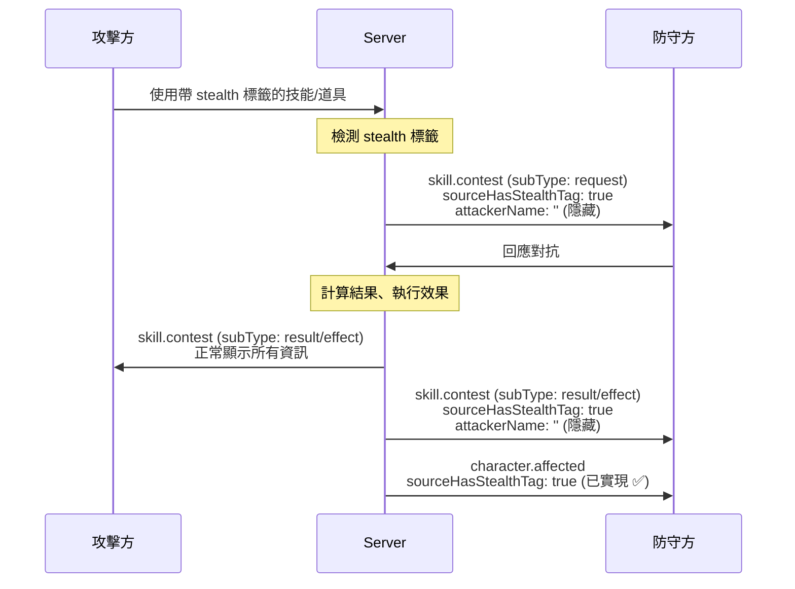

# SPEC-contest-stealth-tag

## 1. 功能概述

### 1.1 背景

隱匿標籤（stealth tag）已在效果執行層正確實現：當攻擊方使用帶隱匿標籤的技能/道具時，`character.affected` 事件會隱藏攻擊方名稱。

但在**對抗檢定流程**中，存在兩個缺漏：
1. **對抗請求事件**（`skill.contest` subType: `request`）：防守方收到的通知仍顯示攻擊方名稱
2. **對抗結果事件**（`skill.contest` subType: `result` / `effect`）：通知中仍顯示攻擊方名稱

### 1.2 預期行為

當攻擊方使用帶 `stealth` 標籤的技能/道具發起對抗檢定時：
- 防守方的對抗請求通知應顯示「有人對你發起了對抗檢定」而非「{攻擊方名稱} 對你發起了對抗檢定」
- 防守方的對抗結果通知應隱藏攻擊方名稱
- 攻擊方自己的通知**不受影響**，仍正常顯示所有資訊

---

## 2. 技術架構

### 2.1 資料流



### 2.2 影響範圍

僅修改後端 3 個檔案 + 前端 1 個檔案，不影響資料庫模型。

---

## 3. 資料模型

### 3.1 現有類型（無需修改）

```typescript
// types/event.ts - SkillContestEvent payload
interface SkillContestPayload {
  // ... 現有欄位
  attackerHasCombatTag?: boolean;     // 已存在
  sourceHasStealthTag?: boolean;      // 已定義於 CharacterAffectedEvent，需擴展到此處
}
```

### 3.2 需要擴展的類型

在 `types/event.ts` 的 `SkillContestEvent` payload 中，確認 `sourceHasStealthTag` 欄位存在。如果當前只定義在 `CharacterAffectedEvent` 中，需要也加到 `SkillContestEvent` 的 payload 中。

---

## 4. 問題分析與解決方案

### 4.1 問題 1：對抗請求事件缺隱匿標籤

**位置**：`lib/contest/contest-handler.ts` 第 209-210 行

**當前代碼**：
```typescript
const attackerTags = source.tags || [];
eventPayload.attackerHasCombatTag = attackerTags.includes('combat');
```

**問題**：只檢測 `combat` 標籤，未檢測 `stealth` 標籤。

**解決方案**：在同一位置加入 `stealth` 標籤檢測：
```typescript
const attackerTags = source.tags || [];
eventPayload.attackerHasCombatTag = attackerTags.includes('combat');
eventPayload.sourceHasStealthTag = attackerTags.includes('stealth');
```

並根據隱匿標籤決定是否隱藏攻擊方名稱（在發送給防守方的 payload 中）。

---

### 4.2 問題 2：對抗結果/效果事件缺隱匿標籤

**位置**：`lib/contest/contest-notification-manager.ts` 第 158-160 行

**當前代碼**：
```typescript
const attackerTags = attackerSource.tags || [];
contestPayload.attackerHasCombatTag = attackerTags.includes('combat');
```

**問題**：只設置 `attackerHasCombatTag`，未設置 `sourceHasStealthTag`。

**解決方案**：
```typescript
const attackerTags = attackerSource.tags || [];
contestPayload.attackerHasCombatTag = attackerTags.includes('combat');
contestPayload.sourceHasStealthTag = attackerTags.includes('stealth');
```

並在發送給防守方的通知中，根據 `sourceHasStealthTag` 隱藏攻擊方名稱。

---

### 4.3 問題 3：事件發送器未傳遞隱匿標籤

**位置**：`lib/contest/contest-event-emitter.ts`

**問題**：`emitContestRequest()`、`emitContestResult()`、`emitContestEffect()` 的 payload 類型可能不包含 `sourceHasStealthTag`。

**解決方案**：確保事件發送函數正確傳遞 `sourceHasStealthTag` 欄位到 payload 中（如果 payload 是透通傳遞的，則無需修改）。

---

### 4.4 問題 4：前端對抗通知未處理隱匿標籤

**位置**：`hooks/use-contest-handler.ts` 或 `lib/utils/event-mappers.ts`

**問題**：前端收到 `skill.contest` 事件時，`mapSkillContest()` 函數可能未根據 `sourceHasStealthTag` 隱藏攻擊方名稱。

**解決方案**：在 `event-mappers.ts` 的 `mapSkillContest()` 中，檢查 `sourceHasStealthTag`，如果為 true 則隱藏攻擊方名稱。

---

## 5. 實作步驟

### Step 1：擴展類型定義

- [ ] 確認 `types/event.ts` 中 `SkillContestEvent` 的 payload 包含 `sourceHasStealthTag?: boolean`
- [ ] 如果不存在，添加此欄位

### Step 2：修改後端 — contest-handler.ts

- [ ] 在 `lib/contest/contest-handler.ts` 第 209-210 行附近，加入 stealth 標籤檢測
- [ ] 當 `sourceHasStealthTag` 為 true 時，在發送給防守方的 payload 中將 `attackerName` 設為空字串

### Step 3：修改後端 — contest-notification-manager.ts

- [ ] 在 `lib/contest/contest-notification-manager.ts` 第 158-160 行附近，加入 stealth 標籤檢測
- [ ] 確保所有發送給防守方的通知 payload 都包含 `sourceHasStealthTag`
- [ ] 當 `sourceHasStealthTag` 為 true 時，隱藏攻擊方名稱

### Step 4：確認後端 — contest-event-emitter.ts

- [ ] 確認 `emitContestRequest()`、`emitContestResult()`、`emitContestEffect()` 正確傳遞 `sourceHasStealthTag` 欄位
- [ ] 如果 payload 是透通傳遞的，則無需修改

### Step 5：修改前端 — event-mappers.ts

- [ ] 在 `lib/utils/event-mappers.ts` 的 `mapSkillContest()` 函數中
- [ ] 檢查 `sourceHasStealthTag`
- [ ] 如果為 true，將攻擊方名稱替換為空字串或通用文字（如「某人」）
- [ ] 確保防守方的對抗回應 Dialog 也正確處理隱匿標籤

### Step 6：驗證

- [ ] 執行 `npm run type-check` 確認類型安全
- [ ] 執行 `npm run lint` 確認代碼規範

---

## 6. 驗收標準

### 6.1 功能驗收

- [ ] AC-1: 攻擊方使用帶 `stealth` 標籤的技能發起對抗檢定，防守方收到的對抗請求通知**不顯示**攻擊方名稱
- [ ] AC-2: 對抗結果通知中，防守方收到的通知**不顯示**攻擊方名稱
- [ ] AC-3: 攻擊方自己的通知**不受影響**，正常顯示所有資訊
- [ ] AC-4: 使用不帶 `stealth` 標籤的技能/道具時，對抗通知行為**不變**
- [ ] AC-5: 效果執行後的 `character.affected` 通知**仍正確隱藏**攻擊方名稱（已實現，確認不退步）

### 6.2 錯誤處理驗收

- [ ] ERR-1: `tags` 欄位為 `undefined` 或空陣列時，不影響正常對抗流程
- [ ] ERR-2: 同時包含 `combat` 和 `stealth` 標籤時，兩個標籤效果都正確生效

### 6.3 使用者體驗驗收

- [ ] UX-1: 防守方在對抗回應 Dialog 中看不到攻擊方名稱（隱匿場景）
- [ ] UX-2: 防守方的 toast 通知中看不到攻擊方名稱（隱匿場景）

---

## 7. 潛在風險與對策

| 風險 | 影響 | 對策 |
|------|------|------|
| 修改 payload 結構導致前端解析失敗 | 中 | `sourceHasStealthTag` 為 optional 欄位，預設 `false`，向後兼容 |
| 防守方回應 Dialog 中仍顯示攻擊方名稱 | 低 | 需確認 Dialog 元件也檢查 `sourceHasStealthTag` |
| 對抗超時通知洩漏攻擊方名稱 | 低 | 確認超時清理邏輯也遵循隱匿標籤規則 |

---

## 8. 修改檔案清單

| 檔案 | 修改類型 | 預估影響行數 |
|------|---------|------------|
| `types/event.ts` | 擴展類型 | ~2 行 |
| `lib/contest/contest-handler.ts` | 新增標籤檢測 | ~3 行 |
| `lib/contest/contest-notification-manager.ts` | 新增標籤檢測 + 名稱隱藏 | ~8 行 |
| `lib/utils/event-mappers.ts` | 前端通知隱藏名稱 | ~5 行 |
| **合計** | | **~18 行** |
