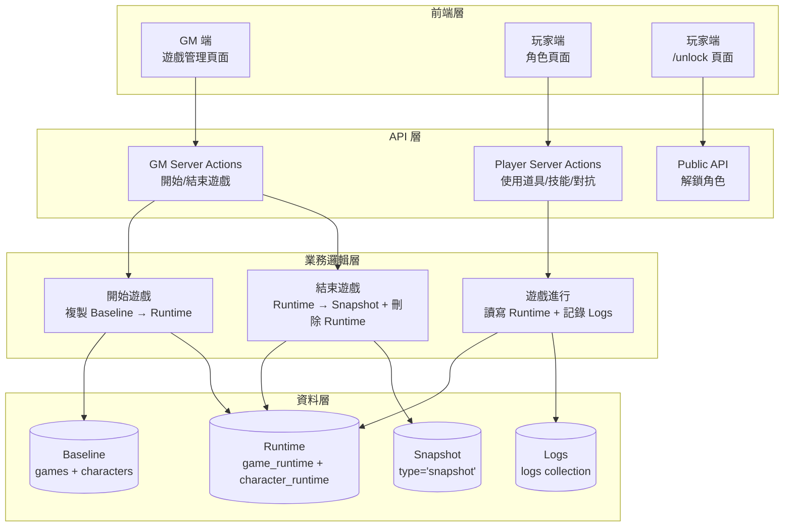
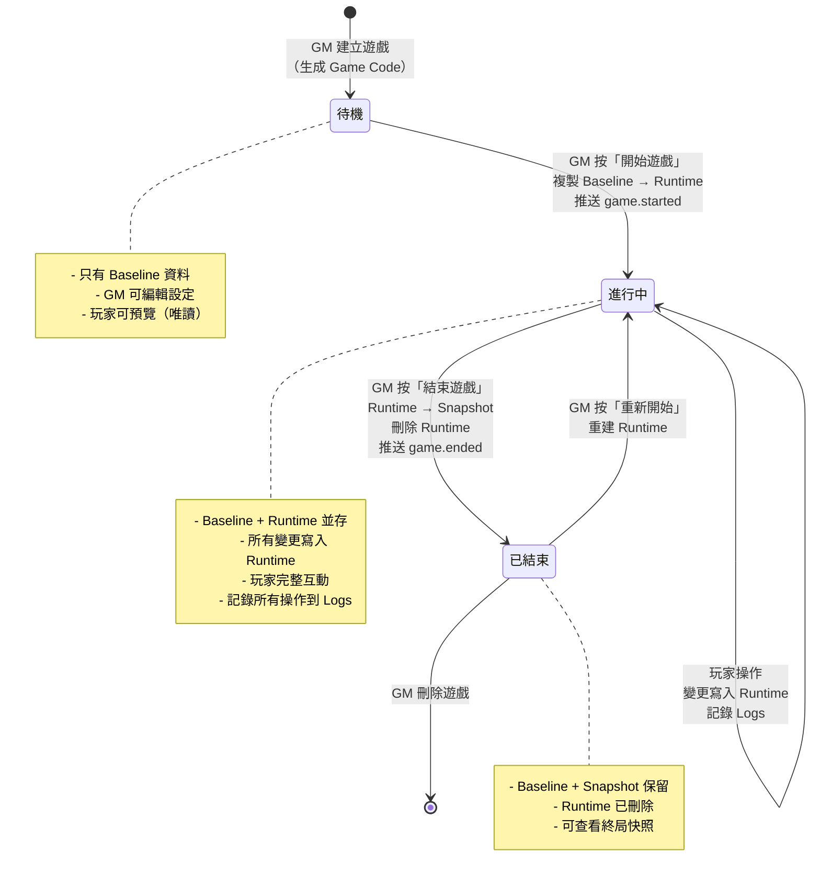
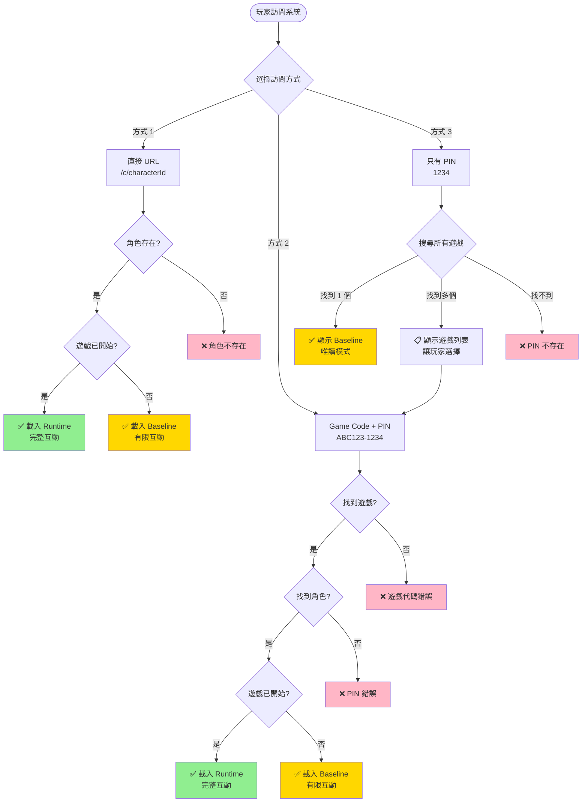

# SPEC-game-state-layers-2026-02-17

## 版本資訊
- **版本**：v1.0
- **日期**：2026-02-17
- **階段**：Phase 10 - 遊戲狀態分層與歷史保留
- **實作狀態**：📝 規劃中

---

## 1. 功能概述

### 1.1 目標

實作遊戲狀態分層系統，將「設定階段」（Baseline）與「遊戲進行中」（Runtime）的狀態分離，支援遊戲的啟動、進行、結束與歷史保留功能。

### 1.2 核心功能

1. **Game Code 系統**：為每場遊戲生成唯一識別碼，便於玩家快速加入
2. **狀態分層**：Baseline（設定）、Runtime（遊戲中）、Snapshot（歷史）三層資料結構
3. **遊戲生命週期管理**：開始遊戲、遊戲進行、結束遊戲
4. **多種訪問模式**：支援 Game Code + PIN、只有 PIN、直接 URL 三種玩家訪問方式
5. **操作日誌**：記錄所有遊戲中的變更操作
6. **唯一性檢查**：Game Code 全域唯一、PIN 同遊戲內唯一

### 1.3 解決的問題

| 問題 | 當前狀況 | Phase 10 解決方案 |
|------|---------|------------------|
| 設定與遊戲狀態混合 | 所有變更直接寫入 baseline，無法區分設定階段和遊戲進行中 | 分離 Baseline 和 Runtime，遊戲開始後所有變更寫入 Runtime |
| 無法保留歷史狀態 | 遊戲結束後，無法查看終局狀態 | 引入 Snapshot 機制，結束遊戲時保存快照 |
| 併發遊戲識別困難 | 玩家只有 PIN，無法區分不同遊戲的角色 | 引入 Game Code，玩家輸入 Game Code + PIN 即可加入特定遊戲 |
| PIN 衝突問題 | 不同遊戲可能有相同 PIN，玩家混淆 | PIN 在同遊戲內強制唯一，配合 Game Code 雙重識別 |
| 無操作記錄 | 無法追溯遊戲中的變更歷史 | 引入 Logs 系統，記錄所有操作 |

---

## 2. 技術架構

### 2.1 系統架構圖



### 2.2 遊戲生命週期流程



### 2.3 玩家訪問流程



---

## 3. 資料模型

### 3.1 Game Schema 擴展

```typescript
/**
 * Phase 10: Game Document 擴展
 * 新增 gameCode 欄位
 */
export interface GameDocument extends Document {
  _id: ObjectId;
  gmUserId: ObjectId;
  name: string;
  description: string;

  // Phase 10: Game Code（玩家識別碼）
  gameCode: string; // 6 位英數字，全域唯一，例如：'ABC123'

  isActive: boolean; // 遊戲是否進行中

  publicInfo?: {
    intro: string;
    worldSetting: string;
    chapters: Array<{
      title: string;
      content: string;
      order: number;
    }>;
  };

  randomContestMaxValue?: number;

  createdAt: Date;
  updatedAt: Date;
}
```

**Schema 定義**：

```typescript
const GameSchema = new Schema<GameDocument>({
  // ... 現有欄位

  gameCode: {
    type: String,
    required: true,
    unique: true, // 全域唯一
    uppercase: true,
    trim: true,
    match: /^[A-Z0-9]{6}$/, // 6 位英數字
  },

  isActive: {
    type: Boolean,
    default: false, // 預設為待機狀態
  },

  // ...
});

// 索引
GameSchema.index({ gameCode: 1 }, { unique: true });
GameSchema.index({ gmUserId: 1, isActive: 1 });
```

**資料範例**：

```json
{
  "_id": "507f1f77bcf86cd799439011",
  "gmUserId": "507f1f77bcf86cd799439012",
  "name": "謀殺懸案",
  "description": "一場發生在豪宅的謀殺案",
  "gameCode": "ABC123",
  "isActive": true,
  "publicInfo": {
    "intro": "一個風雨交加的夜晚...",
    "worldSetting": "1920 年代的英國莊園",
    "chapters": []
  },
  "randomContestMaxValue": 100,
  "createdAt": "2026-02-17T10:00:00.000Z",
  "updatedAt": "2026-02-17T14:30:00.000Z"
}
```

### 3.2 Character Schema 擴展

```typescript
// 複合索引：同一 Game 內 PIN 唯一
CharacterSchema.index(
  { gameId: 1, pin: 1 },
  {
    unique: true,
    sparse: true, // 允許 pin 為 null（無 PIN 鎖的角色）
    partialFilterExpression: {
      pin: { $exists: true, $ne: null, $ne: '' }
    }
  }
);
```

### 3.3 GameRuntime Schema（新增）

```typescript
/**
 * Phase 10: Game Runtime Document
 * 遊戲進行中的狀態，完全複製 Game Schema + 額外欄位
 */
export interface GameRuntimeDocument extends Document {
  _id: ObjectId; // Runtime 專屬 ID
  refId: ObjectId; // 指向 Baseline Game._id
  type: 'runtime' | 'snapshot'; // 類型標記

  // 以下欄位與 GameDocument 完全一致
  gmUserId: ObjectId;
  name: string;
  description: string;
  gameCode: string; // 繼承自 Baseline
  isActive: boolean; // 通常為 true（Runtime 存在即代表遊戲進行中）
  publicInfo?: {
    intro: string;
    worldSetting: string;
    chapters: Array<{
      title: string;
      content: string;
      order: number;
    }>;
  };
  randomContestMaxValue?: number;

  // Snapshot 專屬欄位（只有 type='snapshot' 時使用）
  snapshotName?: string; // 快照名稱
  snapshotCreatedAt?: Date; // 快照建立時間

  createdAt: Date; // Runtime 建立時間
  updatedAt: Date; // Runtime 最後更新時間
}
```

**Schema 定義**：

```typescript
const GameRuntimeSchema = new Schema<GameRuntimeDocument>({
  refId: {
    type: Schema.Types.ObjectId,
    ref: 'Game',
    required: true,
  },
  type: {
    type: String,
    enum: ['runtime', 'snapshot'],
    default: 'runtime',
    required: true,
  },

  // 以下欄位與 GameSchema 完全一致（複製定義）
  gmUserId: {
    type: Schema.Types.ObjectId,
    ref: 'GMUser',
    required: true,
  },
  name: {
    type: String,
    required: true,
  },
  description: String,
  gameCode: {
    type: String,
    required: true,
  },
  isActive: {
    type: Boolean,
    default: true,
  },
  publicInfo: {
    intro: String,
    worldSetting: String,
    chapters: [{
      _id: false,
      title: String,
      content: String,
      order: Number,
    }],
  },
  randomContestMaxValue: Number,

  // Snapshot 專屬欄位
  snapshotName: String,
  snapshotCreatedAt: Date,
}, {
  timestamps: true,
  collection: 'game_runtime',
});

// 索引
GameRuntimeSchema.index({ refId: 1, type: 1 });
GameRuntimeSchema.index({ gameCode: 1 });
GameRuntimeSchema.index({ type: 1, snapshotCreatedAt: -1 }); // 快照查詢
```

**資料範例（Runtime）**：

```json
{
  "_id": "507f1f77bcf86cd799439020",
  "refId": "507f1f77bcf86cd799439011",
  "type": "runtime",
  "gmUserId": "507f1f77bcf86cd799439012",
  "name": "謀殺懸案",
  "description": "一場發生在豪宅的謀殺案",
  "gameCode": "ABC123",
  "isActive": true,
  "publicInfo": { /* 與 Baseline 一致 */ },
  "randomContestMaxValue": 100,
  "createdAt": "2026-02-17T14:30:00.000Z",
  "updatedAt": "2026-02-17T16:45:00.000Z"
}
```

**資料範例（Snapshot）**：

```json
{
  "_id": "507f1f77bcf86cd799439030",
  "refId": "507f1f77bcf86cd799439011",
  "type": "snapshot",
  "gmUserId": "507f1f77bcf86cd799439012",
  "name": "謀殺懸案",
  "description": "一場發生在豪宅的謀殺案",
  "gameCode": "ABC123",
  "isActive": false,
  "publicInfo": { /* 終局狀態 */ },
  "randomContestMaxValue": 100,
  "snapshotName": "Snapshot 2026-02-17 18:00",
  "snapshotCreatedAt": "2026-02-17T18:00:00.000Z",
  "createdAt": "2026-02-17T14:30:00.000Z",
  "updatedAt": "2026-02-17T18:00:00.000Z"
}
```

### 3.4 CharacterRuntime Schema（新增）

```typescript
/**
 * Phase 10: Character Runtime Document
 * 角色遊戲中的狀態，完全複製 Character Schema + 額外欄位
 */
export interface CharacterRuntimeDocument extends Document {
  _id: ObjectId; // Runtime 專屬 ID
  refId: ObjectId; // 指向 Baseline Character._id
  type: 'runtime' | 'snapshot'; // 類型標記

  // 以下欄位與 CharacterDocument 完全一致
  gameId: ObjectId; // 繼承自 Baseline（用於查詢）
  name: string;
  description: string;
  imageUrl?: string;
  hasPinLock: boolean;
  pin?: string;

  publicInfo?: { /* ... */ };
  secretInfo?: { /* ... */ };
  tasks?: Array<{ /* ... */ }>;
  items?: Array<{ /* ... */ }>;
  stats?: Array<{ /* ... */ }>;
  skills?: Array<{ /* ... */ }>;
  viewedItems?: Array<{ /* ... */ }>;
  temporaryEffects?: Array<{ /* ... */ }>;

  // Snapshot 專屬欄位
  snapshotGameRuntimeId?: ObjectId; // 屬於哪個 Snapshot（type='snapshot' 時）

  createdAt: Date;
  updatedAt: Date;
}
```

**Schema 定義**：

```typescript
const CharacterRuntimeSchema = new Schema<CharacterRuntimeDocument>({
  refId: {
    type: Schema.Types.ObjectId,
    ref: 'Character',
    required: true,
  },
  type: {
    type: String,
    enum: ['runtime', 'snapshot'],
    default: 'runtime',
    required: true,
  },

  // 以下欄位與 CharacterSchema 完全一致（複製定義）
  gameId: {
    type: Schema.Types.ObjectId,
    ref: 'Game',
    required: true,
  },
  name: {
    type: String,
    required: true,
  },
  description: String,
  imageUrl: String,
  hasPinLock: Boolean,
  pin: String,

  // ... 其他所有欄位（publicInfo, secretInfo, tasks, items, stats, skills, etc.）

  // Snapshot 專屬欄位
  snapshotGameRuntimeId: {
    type: Schema.Types.ObjectId,
    ref: 'GameRuntime',
  },
}, {
  timestamps: true,
  collection: 'character_runtime',
  strict: true,
});

// 索引
CharacterRuntimeSchema.index({ refId: 1, type: 1 });
CharacterRuntimeSchema.index({ gameId: 1, type: 1 });
CharacterRuntimeSchema.index({ gameId: 1, pin: 1 }); // 用於 Game Code + PIN 查詢
```

### 3.5 Log Schema（新增）

```typescript
/**
 * Phase 10: Log Document
 * 記錄遊戲中的所有操作
 */
export interface LogDocument extends Document {
  _id: ObjectId;
  timestamp: Date; // 操作時間
  gameId: ObjectId; // 所屬遊戲
  characterId?: ObjectId; // 相關角色（可選）

  actorType: 'gm' | 'system' | 'character'; // 操作者類型
  actorId: string; // 操作者 ID（GM User ID / 'system' / Character ID）

  action: string; // 操作類型（如：'game_start', 'stat_change', 'item_use'）

  details: Record<string, any>; // 操作詳細資訊（彈性設計）
}
```

**Schema 定義**：

```typescript
const LogSchema = new Schema<LogDocument>({
  timestamp: {
    type: Date,
    required: true,
    default: Date.now,
  },
  gameId: {
    type: Schema.Types.ObjectId,
    ref: 'Game',
    required: true,
    index: true,
  },
  characterId: {
    type: Schema.Types.ObjectId,
    ref: 'Character',
    index: true,
  },
  actorType: {
    type: String,
    enum: ['gm', 'system', 'character'],
    required: true,
  },
  actorId: {
    type: String,
    required: true,
  },
  action: {
    type: String,
    required: true,
    index: true,
  },
  details: {
    type: Schema.Types.Mixed,
    default: {},
  },
}, {
  timestamps: false, // 使用自訂 timestamp
  collection: 'logs',
});

// 複合索引
LogSchema.index({ gameId: 1, timestamp: -1 }); // 按遊戲查詢日誌
LogSchema.index({ characterId: 1, timestamp: -1 }); // 按角色查詢日誌
```

**資料範例**：

```json
{
  "_id": "507f1f77bcf86cd799439040",
  "timestamp": "2026-02-17T15:30:00.000Z",
  "gameId": "507f1f77bcf86cd799439011",
  "characterId": "507f1f77bcf86cd799439013",
  "actorType": "character",
  "actorId": "507f1f77bcf86cd799439013",
  "action": "stat_change",
  "details": {
    "statName": "HP",
    "oldValue": 100,
    "newValue": 80,
    "changeValue": -20,
    "reason": "受到攻擊"
  }
}
```

**常見 action 類型與 details 格式**：

```typescript
// game_start
{
  action: 'game_start',
  details: {
    gameName: '謀殺懸案',
    characterCount: 8
  }
}

// game_end
{
  action: 'game_end',
  details: {
    snapshotId: '507f1f77bcf86cd799439030',
    duration: 7200000 // 遊戲時長（毫秒）
  }
}

// stat_change
{
  action: 'stat_change',
  details: {
    targetCharacterId: '507f1f77bcf86cd799439014',
    statName: 'HP',
    oldValue: 100,
    newValue: 120,
    changeValue: 20,
    reason: '使用治療藥水'
  }
}

// item_use
{
  action: 'item_use',
  details: {
    itemId: 'item-123',
    itemName: '治療藥水',
    targetCharacterId: '507f1f77bcf86cd799439014',
    effects: [{ type: 'stat_change', targetStat: 'HP', value: 20 }]
  }
}

// skill_use
{
  action: 'skill_use',
  details: {
    skillId: 'skill-456',
    skillName: '偷竊',
    targetCharacterId: '507f1f77bcf86cd799439015',
    result: 'success'
  }
}

// secret_reveal
{
  action: 'secret_reveal',
  details: {
    secretId: 'secret-789',
    secretTitle: '真實身份',
    revealedBy: 'auto' // 或 'gm'
  }
}

// contest_result
{
  action: 'contest_result',
  details: {
    attackerCharacterId: '507f1f77bcf86cd799439013',
    defenderCharacterId: '507f1f77bcf86cd799439014',
    attackerValue: 85,
    defenderValue: 70,
    result: 'attacker_wins'
  }
}
```

---

## 4. 問題分析與解決方案

### 4.1 問題：設定階段與遊戲進行中的狀態混合

**當前問題**：
- 所有變更直接寫入 baseline（games / characters）
- GM 在遊戲進行中修改設定（如新增道具），會立即影響正在進行的遊戲
- 無法區分「這是 GM 的設定操作」還是「這是遊戲中的變更」

**影響**：
- 遊戲進行中的狀態與 GM 的設定調整互相干擾
- 無法「重置遊戲」回到初始狀態

**解決方案**：
- 引入 Runtime 層，遊戲開始時完整複製 Baseline → Runtime
- 遊戲進行中，所有變更寫入 Runtime，不影響 Baseline
- GM 可以在遊戲進行中修改 Baseline（準備下一輪），但不影響當前 Runtime

### 4.2 問題：無法保留歷史狀態

**當前問題**：
- 遊戲結束後，無法查看終局狀態
- 所有資料都被覆蓋或刪除

**影響**：
- 無法進行事後分析
- 無法展示給其他玩家或 GM 參考

**解決方案**：
- 引入 Snapshot 機制，結束遊戲時保存當前 Runtime 狀態
- Snapshot 與 Runtime 共用 collection，用 `type` 欄位區分
- GM 可以查看歷史 Snapshot（Phase 11 實作 UI）

### 4.3 問題：併發遊戲識別困難

**當前問題**：
- 玩家只有 PIN，無法區分不同遊戲的角色
- 例如：Game A 的 Alice (PIN: 1234) 和 Game B 的 Bob (PIN: 1234)

**影響**：
- 玩家混淆，進入錯誤的遊戲
- GM 需要提供完整 URL，不便於現場活動

**解決方案**：
- 引入 Game Code（6 位英數字，全域唯一）
- 玩家輸入 `Game Code + PIN`（如：ABC123-1234）即可快速加入遊戲
- 支援三種訪問模式：
  - **模式 A**：Game Code + PIN（主要方式，完整互動）
  - **模式 B**：只有 PIN（次要方式，唯讀預覽）
  - **模式 C**：直接 URL（向下兼容）

### 4.4 問題：PIN 衝突

**當前問題**：
- 不同遊戲可能有相同 PIN
- 同一遊戲內可能有重複 PIN（目前未檢查）

**影響**：
- 玩家使用錯誤的角色
- 安全性問題

**解決方案**：
- **Game Code 全域唯一**：建立遊戲時檢查，確保不重複
- **PIN 同遊戲內唯一**：建立/編輯角色時檢查 `{ gameId, pin }` 是否已存在
- 使用複合索引強制唯一性

### 4.5 問題：無操作記錄

**當前問題**：
- 無法追溯遊戲中的變更歷史
- 發生爭議時無法裁決

**影響**：
- GM 無法了解遊戲進展
- 無法 debug 或分析問題

**解決方案**：
- 引入 Logs 系統，記錄所有操作（game_start, stat_change, item_use, etc.）
- 每次變更操作都寫入 Log
- 提供 `writeLog()` 輔助函數，統一記錄格式

---

## 5. 實作步驟

### Phase 10.1 - 資料模型層

- [x] **10.1.1** 建立 `lib/db/models/GameRuntime.ts`
  - 定義 `GameRuntimeDocument` 介面
  - 定義 `GameRuntimeSchema`（包含 runtime 和 snapshot）
  - 建立索引：`{ refId: 1, type: 1 }`, `{ gameCode: 1 }`

- [x] **10.1.2** 建立 `lib/db/models/CharacterRuntime.ts`
  - 定義 `CharacterRuntimeDocument` 介面
  - 定義 `CharacterRuntimeSchema`（包含 runtime 和 snapshot）
  - 建立索引：`{ refId: 1, type: 1 }`, `{ gameId: 1, type: 1 }`, `{ gameId: 1, pin: 1 }`

- [x] **10.1.3** 建立 `lib/db/models/Log.ts`
  - 定義 `LogDocument` 介面
  - 定義 `LogSchema`
  - 建立複合索引：`{ gameId: 1, timestamp: -1 }`, `{ characterId: 1, timestamp: -1 }`

- [x] **10.1.4** 擴展 `lib/db/models/Game.ts`
  - 新增 `gameCode` 欄位（String, unique, uppercase, match `/^[A-Z0-9]{6}$/`）
  - 建立唯一索引：`{ gameCode: 1 }`
  - 修改 `isActive` 預設值為 `false`

- [x] **10.1.5** 擴展 `lib/db/models/Character.ts`
  - 新增複合索引：`{ gameId: 1, pin: 1 }`（unique, sparse, partialFilterExpression）

- [x] **10.1.6** 更新 `lib/db/models/index.ts`
  - 匯出 `GameRuntime`, `CharacterRuntime`, `Log`

- [x] **10.1.7** 更新 TypeScript 類型定義
  - 擴展 `types/game.ts`：新增 `gameCode` 欄位
  - 新增 `types/runtime.ts`：定義 Runtime 相關類型
  - 新增 `types/log.ts`：定義 Log 類型

### Phase 10.2 - Game Code 系統

- [x] **10.2.1** 建立 `lib/game/generate-game-code.ts`
  - 實作 `generateGameCode()` 函數（生成隨機 6 位英數字）
  - 實作 `isGameCodeUnique()` 函數（檢查 Game Code 是否已存在）
  - 實作 `generateUniqueGameCode()` 函數（生成唯一 Game Code，最多重試 10 次）

- [ ] **10.2.2** 修改 `app/actions/games.ts`
  - 修改 `createGame()` Server Action：自動生成 `gameCode`
  - 新增 `updateGameCode()` Server Action：允許 GM 修改 Game Code（檢查唯一性）

- [ ] **10.2.3** 修改 GM 端遊戲建立頁面
  - `app/(gm)/games/new/page.tsx`：顯示自動生成的 Game Code
  - 允許 GM 編輯 Game Code（即時檢查唯一性）

- [ ] **10.2.4** 修改 GM 端遊戲詳情頁面
  - `app/(gm)/games/[gameId]/page.tsx`：顯著位置顯示 Game Code
  - 提供「複製 Game Code」按鈕
  - GM 可點擊編輯 Game Code（檢查唯一性）

### Phase 10.3 - 遊戲狀態管理

- [x] **10.3.1** 建立 `lib/game/start-game.ts`
  - 實作 `startGame(gameId: string)` 函數
    - 查詢 Baseline Game 和所有 Characters
    - 檢查 `isActive` 狀態（如果已為 true 且有 Runtime，提示確認覆蓋）
    - 複製 Baseline → Runtime（使用 `findOneAndUpdate` + `upsert: true`）
    - 設定 `Game.isActive = true`
    - 推送 WebSocket 事件 `game.started`
    - 記錄 Log（action: 'game_start'）

- [x] **10.3.2** 建立 `lib/game/end-game.ts`
  - 實作 `endGame(gameId: string, snapshotName?: string)` 函數
    - 查詢 Runtime（GameRuntime + CharacterRuntime）
    - 建立 Snapshot（複製 Runtime，設定 `type = 'snapshot'`）
    - 刪除 Runtime（`deleteOne` / `deleteMany`）
    - 設定 `Game.isActive = false`
    - 推送 WebSocket 事件 `game.ended`
    - 記錄 Log（action: 'game_end'）

- [x] **10.3.3** 建立 `app/actions/game-lifecycle.ts`
  - 實作 `startGameAction(gameId: string)` Server Action（調用 `startGame()`）
  - 實作 `endGameAction(gameId: string, snapshotName?: string)` Server Action（調用 `endGame()`）

- [ ] **10.3.4** 修改 GM 端遊戲詳情頁面 UI
  - 新增「開始遊戲」按鈕（`isActive === false` 時顯示）
  - 新增「結束遊戲」按鈕（`isActive === true` 時顯示）
  - 顯示當前遊戲狀態（待機 / 進行中 / 已結束）
  - 點擊「開始遊戲」時，檢查是否已有 Runtime，如有則顯示確認對話框
  - 點擊「結束遊戲」時，顯示確認對話框（輸入 Snapshot 名稱，可選）

### Phase 10.4 - 讀寫邏輯重構

- [x] **10.4.1** 建立 `lib/game/get-character-data.ts`
  - 實作 `getCharacterData(characterId: string)` 函數
    - 查詢 Baseline Character，取得 `gameId`
    - 查詢 Game，取得 `isActive`
    - 如果 `isActive === true`，查詢 `CharacterRuntime.findOne({ refId: characterId, type: 'runtime' })`
    - 如果 `isActive === false` 或 Runtime 不存在，返回 Baseline Character
    - 返回對應的角色資料

- [x] **10.4.2** 建立 `lib/game/update-character-data.ts`
  - 實作 `updateCharacterData(characterId: string, updates: any)` 函數
    - 查詢 Baseline Character，取得 `gameId`
    - 查詢 Game，取得 `isActive`
    - 如果 `isActive === true`，更新 `CharacterRuntime.findOneAndUpdate({ refId: characterId }, updates)`
    - 如果 `isActive === false`，更新 `Character.findByIdAndUpdate(characterId, updates)`

- [ ] **10.4.3** 重構所有 Server Actions
  - 修改 `app/actions/character-update.ts`：使用 `getCharacterData()` 和 `updateCharacterData()`
  - 修改 `app/actions/item-use.ts`：使用新的讀寫邏輯
  - 修改 `app/actions/skill-use.ts`：使用新的讀寫邏輯
  - 修改 `app/actions/contest-*.ts`：使用新的讀寫邏輯
  - 修改 `app/actions/public.ts` 的 `getPublicCharacter()`：使用 `getCharacterData()`

- [x] **10.4.4** 建立 `lib/game/get-character-by-game-code-pin.ts`
  - 實作 `getCharacterByGameCodeAndPin(gameCode: string, pin: string)` 函數
    - 查詢 `Game.findOne({ gameCode })`
    - 如果 Game 不存在，返回錯誤
    - 查詢 Game 的 `isActive` 狀態
    - 如果 `isActive === true`，查詢 `CharacterRuntime.findOne({ gameId, pin, type: 'runtime' })`
    - 如果 `isActive === false`，查詢 `Character.findOne({ gameId, pin })`
    - 返回角色資料

- [x] **10.4.5** 建立 `lib/game/get-characters-by-pin.ts`
  - 實作 `getCharactersByPinOnly(pin: string)` 函數
    - 查詢 `Character.find({ pin })`（只查詢 Baseline）
    - 返回所有匹配的角色列表（包含 gameId, gameName, characterName）

### Phase 10.5 - 玩家端訪問

- [x] **10.5.1** 建立 `app/actions/unlock.ts`
  - 實作 `unlockByGameCodeAndPin(gameCode: string, pin: string)` Server Action
    - 調用 `getCharacterByGameCodeAndPin()`
    - 返回角色資料和 characterId（用於前端導航）

  - 實作 `unlockByPinOnly(pin: string)` Server Action
    - 調用 `getCharactersByPinOnly()`
    - 返回角色列表

- [x] **10.5.2** 建立 `app/unlock/page.tsx`（玩家端解鎖頁面）
  - 輸入方式 1：合併輸入（`ABC123-1234` 或 `ABC1231234`）
  - 輸入方式 2：分開輸入（Game Code + PIN 兩個欄位）
  - 輸入方式 3：只輸入 PIN（顯示「或只輸入 PIN 預覽角色」）
  - 點擊「解鎖」後：
    - 如果有 Game Code + PIN，調用 `unlockByGameCodeAndPin()`，導航到 `/c/[characterId]`
    - 如果只有 PIN，調用 `unlockByPinOnly()`，顯示結果：
      - 0 個：顯示「PIN 不存在」
      - 1 個：導航到 `/c/[characterId]?readonly=true`
      - 多個：顯示遊戲列表，讓玩家選擇

- [x] **10.5.3** 修改 `app/c/[characterId]/page.tsx`
  - 檢查 URL 參數 `?readonly=true`
  - 如果為 true，顯示「預覽模式」提示
  - 禁用所有互動按鈕（使用道具、技能、對抗檢定）
  - 顯示提示：「此為預覽模式，請輸入 Game Code 以進入遊戲」

- [x] **10.5.4** 修改 `components/player/character-card-view.tsx`
  - 接收 `isReadOnly` prop
  - 根據 `isReadOnly` 禁用互動功能
  - 顯示預覽模式提示

### Phase 10.6 - Logs 系統

- [x] **10.6.1** 建立 `lib/logs/write-log.ts`
  - 實作 `writeLog(params: { gameId, characterId?, actorType, actorId, action, details })` 函數
  - 寫入 `Log.create({ ... })`

- [x] **10.6.2** 整合 Logs 到所有變更操作
  - 修改 `lib/game/start-game.ts`：記錄 `game_start`
  - 修改 `lib/game/end-game.ts`：記錄 `game_end`
  - 修改 `lib/item/item-effect-executor.ts`：記錄 `item_use` 和 `stat_change`
  - 修改 `lib/skill/skill-effect-executor.ts`：記錄 `skill_use` 和相關變更
  - 修改 `lib/contest/contest-executor.ts`：記錄 `contest_result`
  - 修改 `app/actions/character-update.ts`（GM 手動修改）：記錄 `gm_update`

- [x] **10.6.3** 建立 `app/actions/logs.ts`
  - 實作 `getGameLogs(gameId: string, limit?: number)` Server Action
    - 查詢 `Log.find({ gameId }).sort({ timestamp: -1 }).limit(limit)`
    - 返回日誌列表

### Phase 10.7 - WebSocket 事件

- [x] **10.7.1** 擴展 `types/event.ts`
  - 新增 `game.started` 事件類型
    ```typescript
    {
      type: 'game.started',
      timestamp: number,
      payload: {
        gameId: string,
        gameCode: string,
        gameName: string,
      }
    }
    ```

  - 新增 `game.ended` 事件類型
    ```typescript
    {
      type: 'game.ended',
      timestamp: number,
      payload: {
        gameId: string,
        gameCode: string,
        gameName: string,
        snapshotId?: string,
      }
    }
    ```

- [x] **10.7.2** 修改 `lib/game/start-game.ts`
  - 推送 `game.started` 事件到所有該遊戲的玩家
  - 使用 `pushEventToGame(gameId, event)`（需實作）

- [x] **10.7.3** 修改 `lib/game/end-game.ts`
  - 推送 `game.ended` 事件到所有該遊戲的玩家

- [x] **10.7.4** 建立 `lib/websocket/push-event-to-game.ts`
  - 實作 `pushEventToGame(gameId: string, event: BaseEvent)` 函數
    - 查詢所有屬於該遊戲的角色
    - 逐一推送事件（復用 `pushEventToCharacter()`）
    - 同時寫入 Pending Events（Phase 9 整合）

- [x] **10.7.5** 修改前端 WebSocket 處理邏輯
  - `hooks/use-character-websocket-handler.ts`：新增 `game.started` 和 `game.ended` 處理
  - 收到 `game.started`：顯示 Toast「遊戲已開始，正在重新載入...」，然後 `router.refresh()`
  - 收到 `game.ended`：顯示 Toast「遊戲已結束」，然後 `router.refresh()`

### Phase 10.8 - 資料遷移

- [ ] **10.8.1** 建立 `scripts/migrate-phase10.ts`
  - 為所有現有遊戲生成 `gameCode`（檢查唯一性）
  - 檢查所有角色的 PIN，如果同 gameId 下有重複，記錄到 `migration-conflicts.json`
  - 輸出遷移報告

- [ ] **10.8.2** 執行遷移腳本
  - `npm run migrate:phase10`
  - 檢查 `migration-conflicts.json`，提示 GM 手動解決衝突

### Phase 10.9 - 唯一性檢查

- [ ] **10.9.1** 修改 `app/actions/games.ts`
  - 建立/編輯遊戲時，檢查 `gameCode` 唯一性
  - 如果重複，返回錯誤：「此遊戲代碼已被使用，請選擇其他代碼」

- [ ] **10.9.2** 修改 `app/actions/characters.ts`
  - 建立/編輯角色時，檢查 `{ gameId, pin }` 唯一性
  - 如果重複，返回錯誤：「此 PIN 在本遊戲中已被使用，請選擇其他 PIN」

- [ ] **10.9.3** 前端表單即時驗證
  - GM 端遊戲表單：輸入 Game Code 後即時檢查唯一性（防抖 500ms）
  - GM 端角色表單：輸入 PIN 後即時檢查唯一性（防抖 500ms）

---

## 6. API 介面說明

### 6.1 Server Actions

#### `startGameAction(gameId: string)`

開始遊戲，建立 Runtime。

**參數**：
```typescript
{
  gameId: string; // 遊戲 ID
}
```

**回傳**：
```typescript
{
  success: boolean;
  message?: string;
  data?: {
    gameId: string;
    gameCode: string;
    runtimeCreatedAt: Date;
  };
}
```

**邏輯**：
1. 查詢 Baseline Game
2. 檢查 `isActive` 狀態（如果已為 true，可選擇覆蓋）
3. 複製 Baseline → Runtime（Game + 所有 Characters）
4. 設定 `Game.isActive = true`
5. 推送 WebSocket 事件 `game.started`
6. 記錄 Log（action: 'game_start'）

---

#### `endGameAction(gameId: string, snapshotName?: string)`

結束遊戲，保存 Snapshot 並刪除 Runtime。

**參數**：
```typescript
{
  gameId: string;
  snapshotName?: string; // 可選，預設使用 timestamp
}
```

**回傳**：
```typescript
{
  success: boolean;
  message?: string;
  data?: {
    gameId: string;
    snapshotId: string;
    snapshotName: string;
  };
}
```

**邏輯**：
1. 查詢 Runtime（GameRuntime + CharacterRuntime）
2. 建立 Snapshot（複製 Runtime，設定 `type = 'snapshot'`）
3. 刪除 Runtime
4. 設定 `Game.isActive = false`
5. 推送 WebSocket 事件 `game.ended`
6. 記錄 Log（action: 'game_end'）

---

#### `unlockByGameCodeAndPin(gameCode: string, pin: string)`

使用 Game Code + PIN 解鎖角色。

**參數**：
```typescript
{
  gameCode: string; // 6 位英數字
  pin: string; // 4-6 位數字
}
```

**回傳**：
```typescript
{
  success: boolean;
  message?: string;
  data?: {
    characterId: string;
    characterName: string;
    gameId: string;
    gameName: string;
    isActive: boolean; // 遊戲是否進行中
  };
}
```

**邏輯**：
1. 查詢 `Game.findOne({ gameCode })`
2. 如果 Game 不存在，返回錯誤：「遊戲代碼錯誤」
3. 查詢 Game 的 `isActive` 狀態
4. 如果 `isActive === true`，查詢 `CharacterRuntime.findOne({ gameId, pin, type: 'runtime' })`
5. 如果 `isActive === false`，查詢 `Character.findOne({ gameId, pin })`
6. 如果角色不存在，返回錯誤：「PIN 錯誤」
7. 返回角色資料

---

#### `unlockByPinOnly(pin: string)`

只使用 PIN 搜尋角色（預覽模式）。

**參數**：
```typescript
{
  pin: string; // 4-6 位數字
}
```

**回傳**：
```typescript
{
  success: boolean;
  message?: string;
  data?: {
    characters: Array<{
      characterId: string;
      characterName: string;
      gameId: string;
      gameName: string;
      gameCode: string;
    }>;
  };
}
```

**邏輯**：
1. 查詢 `Character.find({ pin })`（只查詢 Baseline）
2. 對每個角色，查詢所屬的 Game，取得 `gameName` 和 `gameCode`
3. 返回角色列表

---

#### `updateGameCode(gameId: string, newGameCode: string)`

更新遊戲代碼（GM 功能）。

**參數**：
```typescript
{
  gameId: string;
  newGameCode: string; // 6 位英數字
}
```

**回傳**：
```typescript
{
  success: boolean;
  message?: string;
}
```

**邏輯**：
1. 驗證 `newGameCode` 格式（6 位英數字）
2. 檢查 `Game.findOne({ gameCode: newGameCode })` 是否已存在
3. 如果存在，返回錯誤：「此遊戲代碼已被使用」
4. 更新 `Game.findByIdAndUpdate(gameId, { gameCode: newGameCode })`

---

#### `getGameLogs(gameId: string, limit?: number)`

查詢遊戲日誌（Phase 10 只實作 API，不實作前端 UI）。

**參數**：
```typescript
{
  gameId: string;
  limit?: number; // 預設 100
}
```

**回傳**：
```typescript
{
  success: boolean;
  data?: {
    logs: Array<{
      _id: string;
      timestamp: Date;
      actorType: 'gm' | 'system' | 'character';
      actorId: string;
      action: string;
      details: Record<string, any>;
    }>;
  };
}
```

**邏輯**：
1. 查詢 `Log.find({ gameId }).sort({ timestamp: -1 }).limit(limit)`
2. 返回日誌列表

---

### 6.2 WebSocket 事件

#### `game.started`

遊戲開始事件，通知所有玩家。

**Payload**：
```typescript
{
  type: 'game.started',
  timestamp: number,
  payload: {
    gameId: string,
    gameCode: string,
    gameName: string,
  }
}
```

**前端處理**：
- 顯示 Toast：「遊戲已開始，正在重新載入...」
- 執行 `router.refresh()` 重新載入頁面

---

#### `game.ended`

遊戲結束事件，通知所有玩家。

**Payload**：
```typescript
{
  type: 'game.ended',
  timestamp: number,
  payload: {
    gameId: string,
    gameCode: string,
    gameName: string,
    snapshotId?: string,
  }
}
```

**前端處理**：
- 顯示 Toast：「遊戲已結束」
- 執行 `router.refresh()` 重新載入頁面
- （可選）導航到終局快照頁面（Phase 11 實作）

---

## 7. 驗收標準

### 7.1 功能驗收

#### Game Code 系統

- [ ] **AC-1**：建立遊戲時，自動生成 6 位英數字的 Game Code（全域唯一）
- [ ] **AC-2**：GM 可以手動編輯 Game Code，系統即時檢查唯一性，如果重複則顯示錯誤提示
- [ ] **AC-3**：遊戲詳情頁面顯著位置顯示 Game Code，提供「複製」按鈕

#### 遊戲狀態管理

- [ ] **AC-4**：GM 點擊「開始遊戲」按鈕，系統複製 Baseline → Runtime，設定 `isActive = true`
- [ ] **AC-5**：如果 Runtime 已存在，點擊「開始遊戲」時顯示確認對話框：「現有進度將被覆蓋，是否繼續？」
- [ ] **AC-6**：遊戲開始後，所有玩家收到 WebSocket 事件 `game.started`，頁面自動重新載入
- [ ] **AC-7**：GM 點擊「結束遊戲」按鈕，系統保存 Snapshot、刪除 Runtime、設定 `isActive = false`
- [ ] **AC-8**：結束遊戲時，GM 可選擇輸入 Snapshot 名稱（預設使用 timestamp）
- [ ] **AC-9**：遊戲結束後，所有玩家收到 WebSocket 事件 `game.ended`，頁面自動重新載入

#### 讀寫邏輯

- [ ] **AC-10**：遊戲進行中（`isActive = true`），玩家使用道具/技能，變更寫入 Runtime
- [ ] **AC-11**：遊戲未開始（`isActive = false`），玩家訪問角色頁面，讀取 Baseline 資料
- [ ] **AC-12**：遊戲進行中，玩家訪問角色頁面，讀取 Runtime 資料
- [ ] **AC-13**：GM 在遊戲進行中修改 Baseline（如新增道具模板），不影響當前 Runtime

#### 玩家訪問模式

- [ ] **AC-14**：玩家訪問 `/unlock`，輸入 `Game Code + PIN`（如：ABC123-1234），成功解鎖並導航到角色頁面
- [ ] **AC-15**：玩家輸入錯誤的 Game Code，顯示錯誤提示：「遊戲代碼錯誤」
- [ ] **AC-16**：玩家輸入正確的 Game Code 但錯誤的 PIN，顯示錯誤提示：「PIN 錯誤」
- [ ] **AC-17**：玩家訪問 `/unlock`，只輸入 PIN（如：1234），系統搜尋所有遊戲
  - 如果找到 0 個角色，顯示：「PIN 不存在」
  - 如果找到 1 個角色，導航到該角色頁面（唯讀模式）
  - 如果找到多個角色，顯示遊戲列表，讓玩家選擇
- [ ] **AC-18**：玩家直接訪問 `/c/[characterId]`（現有方式），仍正常運作（向下兼容）

#### 唯讀模式

- [ ] **AC-19**：玩家透過「只輸入 PIN」訪問角色時，頁面顯示「預覽模式」提示
- [ ] **AC-20**：唯讀模式下，禁用所有互動按鈕（使用道具、技能、對抗檢定）
- [ ] **AC-21**：唯讀模式下，顯示提示：「此為預覽模式，請輸入 Game Code 以進入遊戲」
- [ ] **AC-22**：唯讀模式下，不顯示未揭露的秘密（secretInfo 中 `isRevealed = false` 的項目）

#### 唯一性檢查

- [ ] **AC-23**：建立角色時，如果 PIN 在同 gameId 下已存在，顯示錯誤提示：「此 PIN 在本遊戲中已被使用」
- [ ] **AC-24**：編輯角色時，修改 PIN 為重複值，顯示錯誤提示
- [ ] **AC-25**：不同遊戲可以使用相同 PIN（不報錯）

#### Logs 系統

- [ ] **AC-26**：開始遊戲時，記錄 Log（action: 'game_start'）
- [ ] **AC-27**：結束遊戲時，記錄 Log（action: 'game_end'）
- [ ] **AC-28**：玩家使用道具時，記錄 Log（action: 'item_use' + 'stat_change'）
- [ ] **AC-29**：玩家使用技能時，記錄 Log（action: 'skill_use' + 相關變更）
- [ ] **AC-30**：對抗檢定完成時，記錄 Log（action: 'contest_result'）
- [ ] **AC-31**：呼叫 `getGameLogs(gameId)` 返回該遊戲的所有日誌（按時間降序）

#### Snapshot 系統

- [ ] **AC-32**：結束遊戲時，系統建立 Snapshot（`type = 'snapshot'`）
- [ ] **AC-33**：Snapshot 包含完整的 GameRuntime 和所有 CharacterRuntime 資料
- [ ] **AC-34**：Snapshot 使用自動生成的名稱（timestamp）或 GM 輸入的名稱
- [ ] **AC-35**：查詢 `GameRuntime.find({ refId: gameId, type: 'snapshot' })` 可以取得歷史快照列表

---

### 7.2 錯誤處理驗收

- [ ] **ERR-1**：開始遊戲時，如果 Baseline Game 不存在，返回錯誤：「遊戲不存在」
- [ ] **ERR-2**：結束遊戲時，如果 Runtime 不存在，返回錯誤：「遊戲未開始」
- [ ] **ERR-3**：更新 Game Code 時，如果格式錯誤（非 6 位英數字），返回錯誤：「Game Code 格式錯誤」
- [ ] **ERR-4**：建立角色時，如果 PIN 格式錯誤（非 4-6 位數字），返回錯誤：「PIN 格式錯誤」
- [ ] **ERR-5**：玩家訪問 `/unlock` 時，如果 Game Code 不存在，返回錯誤：「遊戲代碼錯誤」
- [ ] **ERR-6**：玩家訪問 `/unlock` 時，如果 PIN 不存在，返回錯誤：「PIN 錯誤」
- [ ] **ERR-7**：遊戲進行中，GM 嘗試刪除角色，系統阻止並提示：「遊戲進行中無法刪除角色」
- [ ] **ERR-8**：複製 Baseline → Runtime 時，如果資料庫操作失敗，回滾所有變更並返回錯誤
- [ ] **ERR-9**：建立 Snapshot 時，如果資料庫操作失敗，不刪除 Runtime，返回錯誤

---

### 7.3 使用者體驗驗收

- [ ] **UX-1**：GM 端遊戲詳情頁面，清晰顯示當前遊戲狀態（待機 / 進行中 / 已結束）
- [ ] **UX-2**：「開始遊戲」和「結束遊戲」按鈕根據遊戲狀態自動啟用/禁用
- [ ] **UX-3**：點擊「開始遊戲」或「結束遊戲」時，顯示 Loading 狀態（防止重複點擊）
- [ ] **UX-4**：遊戲開始後，顯示 Toast 提示：「遊戲已開始」
- [ ] **UX-5**：遊戲結束後，顯示 Toast 提示：「遊戲已結束，Snapshot 已保存」
- [ ] **UX-6**：玩家端 `/unlock` 頁面，提供清晰的輸入提示和範例（如：「ABC123-1234」）
- [ ] **UX-7**：玩家輸入錯誤時，顯示友善的錯誤提示（不只是「錯誤」）
- [ ] **UX-8**：唯讀模式下，互動按鈕顯示為灰色（disabled），並提示「預覽模式無法互動」
- [ ] **UX-9**：GM 編輯 Game Code 時，即時檢查唯一性（防抖 500ms），顯示「檢查中...」狀態
- [ ] **UX-10**：玩家透過「只輸入 PIN」找到多個角色時，遊戲列表清晰顯示遊戲名稱和角色名稱

---

## 8. 潛在風險與對策

### 8.1 資料一致性風險

**風險**：
- 複製 Baseline → Runtime 時，如果中途失敗，可能導致部分角色有 Runtime、部分沒有

**對策**：
- 使用 MongoDB Transaction（如果支援）
- 如果不支援 Transaction，實作手動回滾邏輯：
  - 記錄已建立的 Runtime IDs
  - 如果中途失敗，刪除所有已建立的 Runtime
  - 返回錯誤，提示 GM 重試

---

### 8.2 Game Code 衝突風險

**風險**：
- 自動生成 Game Code 時，可能與現有 Game Code 重複（極低機率，但需處理）

**對策**：
- `generateUniqueGameCode()` 函數最多重試 10 次
- 如果 10 次都失敗，返回錯誤，提示 GM 手動輸入 Game Code

---

### 8.3 WebSocket 事件遺漏風險

**風險**：
- 玩家在遊戲開始/結束時離線，無法收到 WebSocket 事件

**對策**：
- 整合 Phase 9 的 Pending Events 系統
- `game.started` 和 `game.ended` 事件同時寫入 Pending Events
- 玩家重新上線後，自動處理離線事件

---

### 8.4 Runtime 與 Baseline 不一致風險

**風險**：
- GM 在遊戲進行中修改 Baseline，導致 Runtime 與 Baseline 差異過大

**影響**：
- 如果 GM 重新開始遊戲，玩家會看到不同的設定

**對策**：
- 在 GM 端顯示提示：「遊戲進行中，修改 Baseline 不會影響當前遊戲」
- （可選）提供「同步 Baseline → Runtime」功能（Phase 11）

---

### 8.5 效能風險

**風險**：
- 複製大量角色（如 100 個）到 Runtime 時，可能耗時較長

**影響**：
- GM 點擊「開始遊戲」後，需等待數秒

**對策**：
- 前端顯示 Loading 動畫和進度提示（如：「正在複製 50/100 個角色...」）
- 批次處理：每次複製 10 個角色，避免單次操作過大
- （Phase 11 優化）使用背景 Job 處理，立即返回，完成後通知 GM

---

### 8.6 唯讀模式誤用風險

**風險**：
- 玩家可能誤以為唯讀模式可以互動，點擊按鈕後沒有反應

**對策**：
- 顯著的「預覽模式」提示（紅色或黃色背景）
- 互動按鈕顯示為 disabled 狀態（灰色）
- Hover 時顯示 Tooltip：「預覽模式無法互動，請輸入 Game Code」

---

### 8.7 Snapshot 儲存空間風險

**風險**：
- 每次結束遊戲都保存 Snapshot，長期累積可能佔用大量空間

**影響**：
- 資料庫空間不足

**對策**：
- 建議 GM 定期刪除舊的 Snapshot（Phase 11 提供 UI）
- （可選）設定 Snapshot 保留期限（如 30 天），自動清理

---

### 8.8 PIN 唯一性檢查效能風險

**風險**：
- 每次建立/編輯角色時都查詢資料庫檢查 PIN 唯一性，可能影響效能

**對策**：
- 使用 MongoDB 複合索引 `{ gameId: 1, pin: 1 }`（已實作）
- 前端防抖輸入（500ms），減少查詢次數
- 資料庫層級的唯一性約束，避免競態條件

---

## 9. 技術決策記錄

### 9.1 為什麼選擇「完全複製」而非「部分欄位」？

**決策**：Runtime 完全複製 Baseline 的所有欄位

**理由**：
- 簡化讀寫邏輯（不需要 merge Baseline + Runtime）
- 減少開發複雜度
- 儲存空間的代價可接受（現代資料庫效能足夠）

**代價**：
- 靜態欄位（如 name, description）會重複儲存

---

### 9.2 為什麼 Snapshot 與 Runtime 共用 collection？

**決策**：使用 `type` 欄位區分 Runtime 和 Snapshot

**理由**：
- 減少 collection 數量（2 個而非 4 個）
- Schema 定義複用，不需要維護兩份
- 查詢邏輯統一（`{ refId, type: 'runtime' }` vs `{ refId, type: 'snapshot' }`）

**代價**：
- 需要在所有查詢中加入 `type` 過濾條件

---

### 9.3 為什麼不使用 MongoDB Transaction？

**決策**：Phase 10 不使用 Transaction，改用手動回滾

**理由**：
- MongoDB Replica Set 才支援 Transaction，單機版不支援
- 手動回滾邏輯已足夠處理大部分情況
- 降低部署複雜度

**未來改進**：
- Phase 11 可考慮使用 Transaction（如果部署環境支援）

---

### 9.4 為什麼 Logs 使用彈性 `details` 欄位？

**決策**：`details` 使用 `Record<string, any>`，不強制固定格式

**理由**：
- 不同 action 類型需要記錄的資訊不同
- 彈性設計方便未來擴展
- 查詢時可根據需求過濾特定欄位

**代價**：
- 缺乏 TypeScript 類型檢查（可在應用層補強）

---

## 10. 實作順序建議

建議按照以下順序實作，以減少依賴衝突：

```
Phase 10.1（資料模型層）
  ↓
Phase 10.2（Game Code 系統）
  ↓
Phase 10.9（唯一性檢查） ← 與 10.2 同步進行
  ↓
Phase 10.3（遊戲狀態管理）
  ↓
Phase 10.6（Logs 系統） ← 在 10.3 完成後立即實作
  ↓
Phase 10.4（讀寫邏輯重構）
  ↓
Phase 10.5（玩家端訪問）
  ↓
Phase 10.7（WebSocket 事件）
  ↓
Phase 10.8（資料遷移） ← 最後執行
```

---

## 11. 資料範例整合

### 完整流程範例

#### 初始狀態（遊戲建立後）

**Baseline Game**：
```json
{
  "_id": "game001",
  "gmUserId": "gm001",
  "name": "謀殺懸案",
  "gameCode": "ABC123",
  "isActive": false,
  "createdAt": "2026-02-17T10:00:00.000Z"
}
```

**Baseline Characters**：
```json
[
  {
    "_id": "char001",
    "gameId": "game001",
    "name": "Alice",
    "pin": "1234",
    "stats": [{ "id": "hp", "name": "HP", "value": 100 }]
  },
  {
    "_id": "char002",
    "gameId": "game001",
    "name": "Bob",
    "pin": "5678",
    "stats": [{ "id": "hp", "name": "HP", "value": 100 }]
  }
]
```

#### GM 按下「開始遊戲」

**GameRuntime**（建立）：
```json
{
  "_id": "runtime_game001",
  "refId": "game001",
  "type": "runtime",
  "gmUserId": "gm001",
  "name": "謀殺懸案",
  "gameCode": "ABC123",
  "isActive": true,
  "createdAt": "2026-02-17T14:00:00.000Z"
}
```

**CharacterRuntime**（建立）：
```json
[
  {
    "_id": "runtime_char001",
    "refId": "char001",
    "type": "runtime",
    "gameId": "game001",
    "name": "Alice",
    "pin": "1234",
    "stats": [{ "id": "hp", "name": "HP", "value": 100 }],
    "createdAt": "2026-02-17T14:00:00.000Z"
  },
  {
    "_id": "runtime_char002",
    "refId": "char002",
    "type": "runtime",
    "gameId": "game001",
    "name": "Bob",
    "pin": "5678",
    "stats": [{ "id": "hp", "name": "HP", "value": 100 }],
    "createdAt": "2026-02-17T14:00:00.000Z"
  }
]
```

**Game.isActive 更新**：
```json
{
  "_id": "game001",
  "isActive": true, // ← 更新為 true
  "updatedAt": "2026-02-17T14:00:00.000Z"
}
```

**Log**（記錄）：
```json
{
  "_id": "log001",
  "timestamp": "2026-02-17T14:00:00.000Z",
  "gameId": "game001",
  "actorType": "gm",
  "actorId": "gm001",
  "action": "game_start",
  "details": {
    "gameName": "謀殺懸案",
    "characterCount": 2
  }
}
```

#### 玩家遊戲中操作（Alice 使用道具，HP 變更）

**CharacterRuntime 更新**：
```json
{
  "_id": "runtime_char001",
  "refId": "char001",
  "type": "runtime",
  "gameId": "game001",
  "name": "Alice",
  "pin": "1234",
  "stats": [{ "id": "hp", "name": "HP", "value": 80 }], // ← 100 → 80
  "updatedAt": "2026-02-17T15:30:00.000Z"
}
```

**Baseline Character**（不變）：
```json
{
  "_id": "char001",
  "gameId": "game001",
  "name": "Alice",
  "pin": "1234",
  "stats": [{ "id": "hp", "name": "HP", "value": 100 }] // ← 仍為 100
}
```

**Log**（記錄）：
```json
{
  "_id": "log002",
  "timestamp": "2026-02-17T15:30:00.000Z",
  "gameId": "game001",
  "characterId": "char001",
  "actorType": "character",
  "actorId": "char001",
  "action": "stat_change",
  "details": {
    "statName": "HP",
    "oldValue": 100,
    "newValue": 80,
    "changeValue": -20,
    "reason": "受到攻擊"
  }
}
```

#### GM 按下「結束遊戲」

**Snapshot**（建立）：
```json
// GameRuntime Snapshot
{
  "_id": "snapshot_game001_001",
  "refId": "game001",
  "type": "snapshot", // ← 類型為 snapshot
  "gmUserId": "gm001",
  "name": "謀殺懸案",
  "gameCode": "ABC123",
  "isActive": false,
  "snapshotName": "Snapshot 2026-02-17 18:00",
  "snapshotCreatedAt": "2026-02-17T18:00:00.000Z",
  "createdAt": "2026-02-17T14:00:00.000Z",
  "updatedAt": "2026-02-17T18:00:00.000Z"
}

// CharacterRuntime Snapshot
[
  {
    "_id": "snapshot_char001_001",
    "refId": "char001",
    "type": "snapshot",
    "gameId": "game001",
    "name": "Alice",
    "pin": "1234",
    "stats": [{ "id": "hp", "name": "HP", "value": 80 }], // ← 保存終局狀態
    "snapshotGameRuntimeId": "snapshot_game001_001",
    "createdAt": "2026-02-17T14:00:00.000Z",
    "updatedAt": "2026-02-17T18:00:00.000Z"
  },
  {
    "_id": "snapshot_char002_001",
    "refId": "char002",
    "type": "snapshot",
    "gameId": "game001",
    "name": "Bob",
    "pin": "5678",
    "stats": [{ "id": "hp", "name": "HP", "value": 100 }],
    "snapshotGameRuntimeId": "snapshot_game001_001",
    "createdAt": "2026-02-17T14:00:00.000Z",
    "updatedAt": "2026-02-17T18:00:00.000Z"
  }
]
```

**Runtime 刪除**：
```
GameRuntime.deleteOne({ _id: "runtime_game001" })
CharacterRuntime.deleteMany({ gameId: "game001", type: "runtime" })
```

**Game.isActive 更新**：
```json
{
  "_id": "game001",
  "isActive": false, // ← 更新為 false
  "updatedAt": "2026-02-17T18:00:00.000Z"
}
```

**Log**（記錄）：
```json
{
  "_id": "log003",
  "timestamp": "2026-02-17T18:00:00.000Z",
  "gameId": "game001",
  "actorType": "gm",
  "actorId": "gm001",
  "action": "game_end",
  "details": {
    "snapshotId": "snapshot_game001_001",
    "duration": 14400000 // 4 小時
  }
}
```

---

## 12. 附錄

### 12.1 Game Code 生成演算法

```typescript
/**
 * 生成隨機 6 位英數字 Game Code
 */
function generateGameCode(): string {
  const chars = 'ABCDEFGHIJKLMNOPQRSTUVWXYZ0123456789';
  let code = '';
  for (let i = 0; i < 6; i++) {
    code += chars.charAt(Math.floor(Math.random() * chars.length));
  }
  return code;
}

/**
 * 生成唯一 Game Code（最多重試 10 次）
 */
async function generateUniqueGameCode(): Promise<string> {
  for (let i = 0; i < 10; i++) {
    const code = generateGameCode();
    const exists = await Game.findOne({ gameCode: code });
    if (!exists) {
      return code;
    }
  }
  throw new Error('Unable to generate unique Game Code after 10 attempts');
}
```

### 12.2 Phase 與 Phase 的整合

#### 與 Phase 8（時效性效果）的整合

- Cron Job `check-expired-effects` 需要判斷 `Game.isActive`
- 如果 `isActive = true`，處理 `CharacterRuntime.temporaryEffects`
- 如果 `isActive = false`，處理 `Character.temporaryEffects`

#### 與 Phase 9（離線事件佇列）的整合

- `game.started` 和 `game.ended` 事件同時寫入 Pending Events
- 玩家重新上線後，自動處理這些事件（顯示 Toast + `router.refresh()`）

---

**文件結束**
