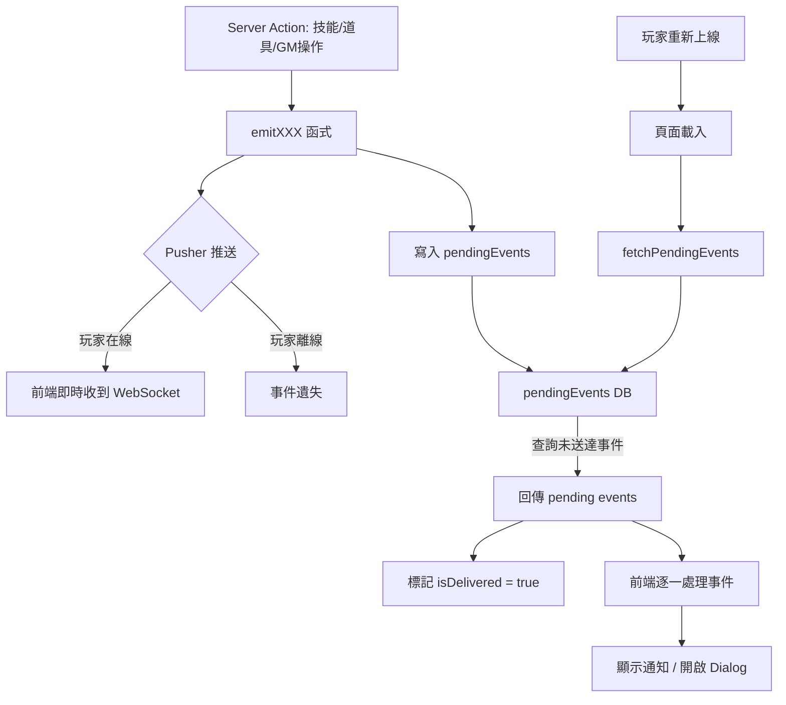
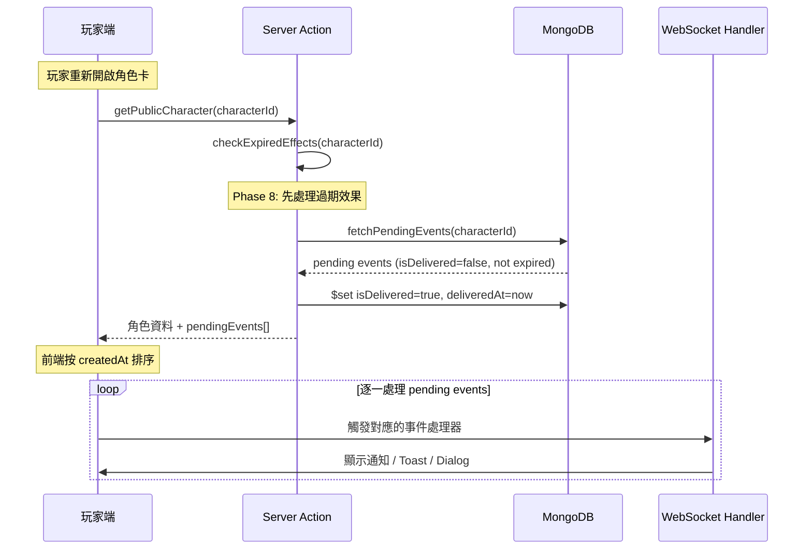
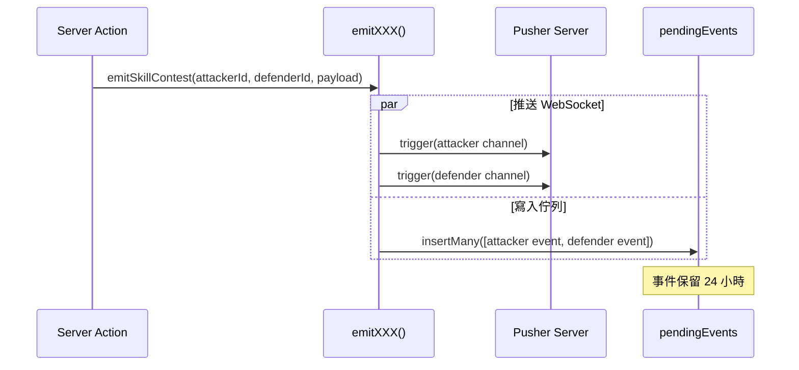

# SPEC-offline-event-queue

## Phase 9：離線事件佇列系統

### 文件版本：v1.0
### 建立日期：2026-02-12
### 實作狀態：✅ 已完成（2026-02-17）

---

## 1. 功能概述

### 1.1 目標

解決玩家離線（瀏覽器關閉、手機休眠、網路中斷）時漏接 WebSocket 事件的問題。實作 Server-side 事件佇列，確保玩家重新上線後能接收到所有錯過的事件通知。

### 1.2 問題場景

```
玩家 A 使用技能對玩家 B 發動對抗檢定
      ↓
玩家 B 的瀏覽器已關閉 → WebSocket 事件無法送達
      ↓
玩家 B 不知道有待處理的對抗 → 對抗卡住
      ↓
現場有人呼叫玩家 B → 玩家 B 重新開啟角色卡
      ↓
【目前】什麼都沒發生，玩家 B 不知道剛才發生了什麼
【Phase 9】自動拉取 pending events，逐一顯示通知，開啟對抗 Dialog
```

### 1.3 核心概念

| 概念 | 說明 |
|------|------|
| 推送 + 寫入 | WebSocket 事件推送的同時，寫入 `pendingEvents` 集合 |
| 拉取 + 送達 | 玩家頁面載入時，查詢並回傳未送達事件，標記為已送達 |
| 逐一顯示 | 前端收到 pending events 後按時間排序，逐一觸發對應通知/dialog |
| 24 小時過期 | 事件保留 24 小時，過期後自動清理 |
| 原子操作 | 使用 `findOneAndUpdate` 確保同一事件不會被重複拉取 |

### 1.4 影響範圍

- **新增 Schema**：`PendingEvent` Mongoose model 或 Character 嵌入陣列
- **修改 WebSocket 事件推送**：`lib/websocket/events.ts` 所有 `emitXXX()` 函式
- **新增 Server Action**：`fetchPendingEvents(characterId)`
- **修改頁面載入**：`getPublicCharacter()` 觸發拉取
- **前端整合**：玩家端頁面載入後處理 pending events
- **Cron 清理**：與 Phase 8 共用 Cron Job

---

## 2. 技術架構

### 2.1 推送 + 佇列雙軌流程



### 2.2 事件拉取與處理序列圖



### 2.3 事件寫入流程（修改 emitXXX）



---

## 3. 資料模型

### 3.1 TypeScript 型別定義

#### 新增 `PendingEvent` 介面（`types/event.ts`）

```typescript
/**
 * Phase 9: 離線事件佇列記錄
 */
export interface PendingEvent {
  id: string;                     // 唯一識別碼
  targetCharacterId: string;      // 接收者角色 ID
  eventType: string;              // WebSocket 事件類型（如 'skill.contest', 'character.affected'）
  eventPayload: Record<string, unknown>; // 原始事件的 payload
  createdAt: Date;                // 事件產生時間
  isDelivered: boolean;           // 是否已送達
  deliveredAt?: Date;             // 送達時間
  expiresAt: Date;                // 過期時間（createdAt + 24h）
}
```

### 3.2 Mongoose Schema

#### 方案：獨立 Collection

```typescript
const pendingEventSchema = new Schema({
  id: { type: String, required: true, unique: true },
  targetCharacterId: { type: String, required: true, index: true },
  eventType: { type: String, required: true },
  eventPayload: { type: Schema.Types.Mixed, required: true },
  createdAt: { type: Date, required: true, default: Date.now },
  isDelivered: { type: Boolean, default: false },
  deliveredAt: { type: Date },
  expiresAt: { type: Date, required: true, index: true },
});

// 複合索引：拉取未送達事件
pendingEventSchema.index({ targetCharacterId: 1, isDelivered: 1, expiresAt: 1 });
```

> **為何選擇獨立 Collection 而非嵌入 Character？**
> - 事件量可能很大（一場遊戲中多個角色互相施放技能），嵌入會讓 Character document 膨脹
> - 獨立 collection 方便建立索引和批次清理
> - 不影響現有的 Character 查詢效能

### 3.3 資料範例

```json
{
  "id": "pevt-1707724800000-abc",
  "targetCharacterId": "507f1f77bcf86cd799439013",
  "eventType": "skill.contest",
  "eventPayload": {
    "contestId": "contest-123",
    "attackerId": "507f1f77bcf86cd799439014",
    "attackerName": "玩家A",
    "defenderId": "507f1f77bcf86cd799439013",
    "defenderName": "玩家B",
    "skillName": "力量對決",
    "subType": "request",
    "attackerValue": 0
  },
  "createdAt": "2026-02-12T10:00:00.000Z",
  "isDelivered": false,
  "expiresAt": "2026-02-13T10:00:00.000Z"
}
```

---

## 4. 問題分析與解決方案

### 4.1 事件重複問題

| 問題 | 說明 | 解決方案 |
|------|------|----------|
| 玩家在線收到 WebSocket + 上線時又收到 pending event | 同一事件被處理兩次 | 前端以 pending event `id` 進行去重；若玩家收到 WebSocket 即時事件，同時也拉取到對應的 pending event，依 `id` 跳過 |
| 多次快速刷新頁面 | 同一批 pending events 被拉取多次 | `fetchPendingEvents` 使用原子操作 `findAndModify` 設定 `isDelivered=true`，第二次查詢不會再回傳 |

### 4.2 雙頻道事件處理

| 問題 | 說明 | 解決方案 |
|------|------|----------|
| `emitSkillContest` 推送兩個頻道 | 攻擊方和防守方各收到一份事件 | 寫入 pending events 時也寫兩筆，`targetCharacterId` 分別為攻擊方和防守方 |
| `emitItemTransferred` 推送兩個頻道 | 轉出方和接收方各一份 | 同上 |
| `emitItemShowcased` 推送兩個頻道 | 展示方和被展示方各一份 | 同上 |
| `emitGameBroadcast` 推送遊戲頻道 | 全劇本角色都要收到 | 需查詢劇本下所有角色，為每個角色各寫一筆 pending event |

### 4.3 game.broadcast 的特殊處理

`emitGameBroadcast` 推送到 `private-game-{gameId}` 頻道，所有訂閱該頻道的角色都會收到。但寫入 pending events 時需要知道具體的角色 ID：

| 方案 | 做法 | 取捨 |
|------|------|------|
| **A：查詢後逐一寫入** | 查詢 gameId 下的所有角色，為每個角色寫一筆 | 多一次 DB 查詢，但最準確 |
| **B：game-level pending events** | 新增 `targetGameId` 欄位，拉取時同時查詢 character-level 和 game-level | 更簡潔，但查詢條件更複雜 |

**建議採用方案 B**：新增 `targetGameId` 欄位（可選），`fetchPendingEvents` 時同時查詢：
- `targetCharacterId === characterId`
- `targetGameId === character.gameId`

### 4.4 不需要寫入佇列的事件

| 事件 | 是否寫入 | 理由 |
|------|----------|------|
| `role.updated` | **否** | 頁面載入時 `getPublicCharacter()` 已回傳最新資料，不需要額外通知 |
| `skill.cooldown` | **否** | 是自己使用技能後的冷卻通知，自己使用時一定在線 |
| `skill.used` | **否** | 是自己使用技能的結果，自己使用時一定在線 |
| 其他所有事件 | **是** | 可能是他人操作影響到自己，需要通知 |

### 4.5 事件清理策略

| 時機 | 動作 |
|------|------|
| `fetchPendingEvents()` 拉取後 | 標記 `isDelivered = true`，`deliveredAt = now` |
| Cron Job（每小時） | 刪除 `expiresAt < now` 的所有記錄（無論是否已送達） |
| Cron Job（每小時） | 刪除 `isDelivered === true && deliveredAt < now - 1h` 的記錄（加速清理） |

---

## 5. 實作步驟

### Phase 9.1：資料模型與 Schema
- [ ] 在 `types/event.ts` 新增 `PendingEvent` 介面
- [ ] 建立 `lib/db/models/PendingEvent.ts` Mongoose model
- [ ] 建立複合索引：`targetCharacterId + isDelivered + expiresAt`
- [ ] 新增 `targetGameId` 可選欄位（用於 game.broadcast）

### Phase 9.2：事件寫入層
- [ ] 建立 `lib/websocket/pending-events.ts`：
  - `writePendingEvent(targetCharacterId, eventType, eventPayload)` — 單一角色寫入
  - `writePendingEvents(targets: Array<{characterId, eventType, payload}>)` — 批次寫入
  - `writePendingGameEvent(gameId, eventType, eventPayload)` — game-level 事件寫入
- [ ] 修改 `lib/websocket/events.ts` 的 `trigger()` 函式：推送同時呼叫 pending events 寫入
- [ ] 處理雙頻道事件（`emitSkillContest`, `emitItemTransferred`, `emitItemShowcased`）：為每個 target 各寫一筆
- [ ] 處理 `emitGameBroadcast`：使用 `writePendingGameEvent()`
- [ ] 排除不需要佇列的事件：`role.updated`, `skill.cooldown`, `skill.used`

### Phase 9.3：事件拉取 Server Action
- [ ] 建立 `app/actions/pending-events.ts`：
  - `fetchPendingEvents(characterId, gameId?)` — 查詢未送達事件 + 標記已送達
  - 查詢條件：`(targetCharacterId === id || targetGameId === gameId) && !isDelivered && expiresAt > now`
  - 使用原子操作避免重複拉取
  - 按 `createdAt` 排序回傳
- [ ] 修改 `app/actions/public.ts` 的 `getPublicCharacter()`：
  - 呼叫 `fetchPendingEvents()` 並在回傳中附帶 `pendingEvents` 欄位

### Phase 9.4：前端整合
- [ ] 建立 `hooks/use-pending-events.ts`：
  - 接收 pending events 列表
  - 與現有的 WebSocket handler 整合，復用 `handleWebSocketEvent()` 逐一處理
  - 以 event `id` 進行去重（避免與即時 WebSocket 事件重複）
- [ ] 修改 `components/player/character-card-view.tsx`（或上層容器）：
  - 頁面載入後，將 pending events 傳入 `usePendingEvents` hook
  - 逐一觸發事件處理（通知、Toast、Dialog）

### Phase 9.5：定期清理
- [ ] 修改 Cron Job `app/api/cron/check-expired-effects/route.ts`（或新建獨立 route）：
  - 新增清理 pending events 邏輯
  - 刪除 `expiresAt < now` 的記錄
  - 刪除 `isDelivered && deliveredAt < now - 1h` 的記錄

---

## 6. API 介面說明

### 6.1 Server Actions

#### `fetchPendingEvents(characterId: string, gameId?: string)`

**檔案位置**：`app/actions/pending-events.ts`

| 項目 | 說明 |
|------|------|
| 參數 | `characterId: string` — 角色 ID；`gameId?: string` — 劇本 ID（用於 game-level 事件） |
| 認證 | 無需認證（與 `getPublicCharacter` 相同，由 URL 存取控制） |
| 回傳 | `{ success, data?: { events: PendingEvent[] }, message? }` |

**實作邏輯**：
1. 查詢 `pendingEvents` 集合：
   - 條件：`(targetCharacterId === characterId || targetGameId === gameId) && isDelivered === false && expiresAt > now`
   - 排序：`createdAt ASC`（最舊的先處理）
2. 原子操作：使用 `updateMany` 將查詢到的事件標記為 `isDelivered = true, deliveredAt = now`
3. 回傳事件列表

### 6.2 寫入輔助函式

#### `writePendingEvent()`

**檔案位置**：`lib/websocket/pending-events.ts`

```typescript
async function writePendingEvent(
  targetCharacterId: string,
  eventType: string,
  eventPayload: Record<string, unknown>,
  options?: { targetGameId?: string }
): Promise<void>
```

#### `writePendingEvents()`（批次）

```typescript
async function writePendingEvents(
  targets: Array<{
    targetCharacterId?: string;
    targetGameId?: string;
    eventType: string;
    eventPayload: Record<string, unknown>;
  }>
): Promise<void>
```

---

## 7. 驗收標準

### 7.1 功能驗收

- [ ] AC-1：玩家 A 對離線的玩家 B 使用技能（`skill.contest` request），玩家 B 上線後自動收到通知並開啟 ContestResponseDialog
- [ ] AC-2：玩家 A 對離線的玩家 B 使用跨角色數值影響（`character.affected`），玩家 B 上線後收到 Toast 通知
- [ ] AC-3：道具轉移（`item.transferred`）、道具展示（`item.showcased`）等事件，離線方上線後收到通知
- [ ] AC-4：GM 廣播（`game.broadcast`）時離線的玩家，上線後收到廣播通知
- [ ] AC-5：秘密揭露（`secret.revealed`）、目標揭露（`task.revealed`）離線時發生，上線後收到通知
- [ ] AC-6：Phase 8 的效果過期事件（`effect.expired`）離線時發生，上線後收到通知
- [ ] AC-7：pending events 按時間排序逐一顯示，不會一次全部彈出
- [ ] AC-8：玩家在線收到 WebSocket 即時事件後，上線拉取時不會重複顯示同一事件
- [ ] AC-9：多次快速刷新頁面不會重複拉取同一批 pending events
- [ ] AC-10：pending events 超過 24 小時後自動被 Cron Job 清理
- [ ] AC-11：`role.updated`、`skill.cooldown`、`skill.used` 不寫入 pending events（自己操作時一定在線）

### 7.2 錯誤處理驗收

- [ ] ERR-1：`fetchPendingEvents` 失敗時不影響 `getPublicCharacter` 正常回傳（graceful degradation）
- [ ] ERR-2：`writePendingEvent` 失敗時不影響 WebSocket 推送（pending event 寫入是 best-effort）
- [ ] ERR-3：pending event 的 `eventPayload` 格式異常時，前端跳過該事件不崩潰
- [ ] ERR-4：Cron Job 清理失敗時記錄 log 但不影響系統運行

### 7.3 使用者體驗驗收

- [ ] UX-1：玩家上線後，pending events 逐一顯示通知（如 Toast、Dialog），間隔適當不會干擾操作
- [ ] UX-2：對抗檢定 pending event 自動開啟 ContestResponseDialog，玩家可立即回應
- [ ] UX-3：道具展示 pending event 自動開啟唯讀 Dialog
- [ ] UX-4：pending events 的通知文字與即時 WebSocket 通知一致（復用 event-mappers）

---

## 8. 潛在風險與對策

### 8.1 技術風險

| 風險 | 影響 | 對策 |
|------|------|------|
| `emitXXX()` 新增 DB 寫入增加延遲 | 每次事件推送多一次 DB 操作 | pending event 寫入使用 `catch` 不阻塞主流程；寫入失敗不影響 WebSocket 推送 |
| `game.broadcast` 需查詢所有角色 | 大型劇本可能有較多角色 | 使用方案 B（`targetGameId`）避免逐一寫入，拉取時一次查詢 |
| pending events 集合增長過快 | DB 空間和查詢效能 | Cron Job 每小時清理；已送達事件 1 小時後刪除；過期事件 24 小時後刪除 |
| 前端去重邏輯可能遺漏邊界案例 | 同一事件被處理兩次 | 以 pending event `id` 為去重 key；即時 WebSocket 事件到達後記錄 `id` |

### 8.2 業務風險

| 風險 | 影響 | 對策 |
|------|------|------|
| 玩家 24 小時未上線，pending events 已過期 | 錯過所有通知 | 這是預期行為；資料本身已正確（stats, items 已更新），只是錯過通知 |
| 對抗檢定 request 在 pending events 中等待 | 攻擊方等待防守方回應 | 由現場人員通知防守方上線；防守方上線後自動拉取並開啟 dialog |

---

## 附錄 A：需要寫入 pending events 的事件對照表

| emitXXX 函式 | 事件類型 | 寫入佇列 | 目標角色 | 備註 |
|--------------|----------|----------|----------|------|
| `emitSkillUsed` | `skill.used` | **否** | 自己 | 自己使用，一定在線 |
| `emitRoleUpdated` | `role.updated` | **否** | 自己 | 頁面載入時已有最新資料 |
| `emitSkillCooldown` | `skill.cooldown` | **否** | 自己 | 自己使用，一定在線 |
| `emitSkillContest` | `skill.contest` | **是** | 攻擊方 + 防守方 | 雙頻道，各寫一筆 |
| `emitCharacterAffected` | `character.affected` | **是** | 目標角色 | 單頻道 |
| `emitItemTransferred` | `item.transferred` | **是** | 轉出方 + 接收方 | 雙頻道，各寫一筆 |
| `emitGameBroadcast` | `game.broadcast` | **是** | game-level | 使用 `targetGameId` |
| `emitTaskUpdated` | `role.taskUpdated` | **是** | 目標角色 | GM 修改任務 |
| `emitInventoryUpdated` | `role.inventoryUpdated` | **是** | 目標角色 | 道具變更通知 |
| `emitSecretRevealed` | `secret.revealed` | **是** | 目標角色 | 秘密揭露 |
| `emitTaskRevealed` | `task.revealed` | **是** | 目標角色 | 目標揭露 |
| `emitItemShowcased` | `item.showcased` | **是** | 展示方 + 被展示方 | 雙頻道，各寫一筆 |
| Phase 8: `emitEffectExpired` | `effect.expired` | **是** | 目標角色 | 效果過期通知 |

---

## 附錄 B：與 Phase 8 的共用基礎設施

| 共用項目 | Phase 8 | Phase 9 |
|----------|---------|---------|
| 頁面載入觸發點 | `checkExpiredEffects(characterId)` | `fetchPendingEvents(characterId, gameId)` |
| Cron Job | 過期效果檢查（每分鐘） | pending events 清理（每小時） |
| 前端事件處理 | `effect.expired` handler | 復用 `handleWebSocketEvent()` |

---

## 附錄 C：設計決策記錄

| 編號 | 問題 | 決策 |
|------|------|------|
| Q1 | 處理範圍 | 所有 WebSocket 事件（排除自己操作的 3 個事件） |
| Q2 | 實作方式 | Server-side 事件佇列（獨立 `pending_events` collection） |
| Q3 | 事件保留時長 | 24 小時，拉取後標記已送達，Cron Job 清理 |
| Q4 | 對抗檢定超時 | 暫不處理，由現場人員通知防守方上線 |
| Q5 | 批次通知 UI | 逐一顯示（按 `createdAt` 排序） |
| Q6 | Phase 歸屬 | 獨立為 Phase 9（原 Phase 9 延後至 Phase 10） |
