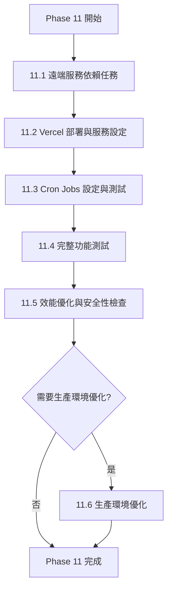
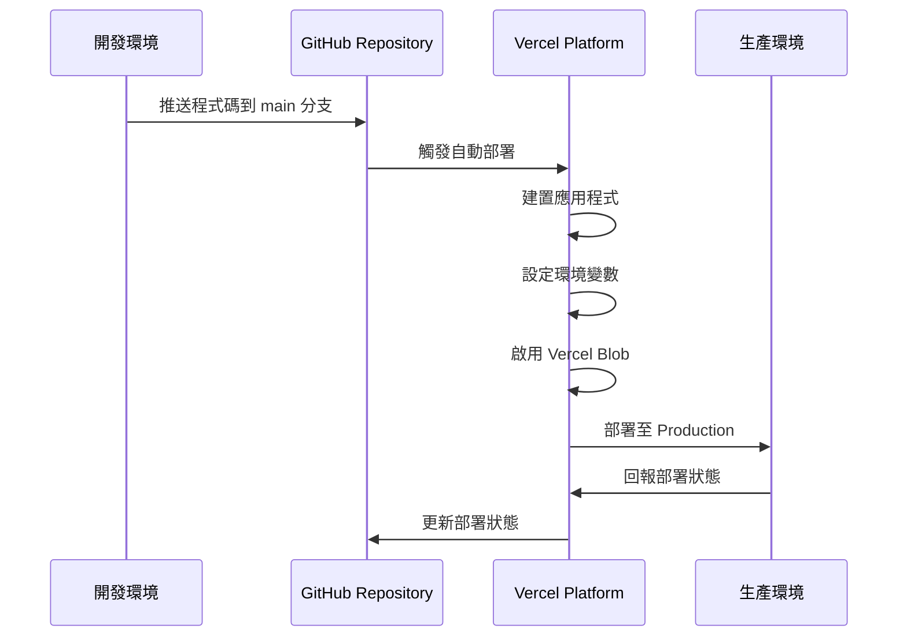

# SPEC-phase11-remote-services-deployment

## 版本：v6.0
## 更新日期：2026-03-11（Phase 11.1~11.5 完成，效能優化與安全性檢查完成）
## 適用範圍：Phase 11 - 遠端服務整合、部署與優化

---

## 1. 功能概述

### 1.1 背景

> **v2.0 更新**：Phase 10 整合測試已於 2026-03-03~04 完成（10 個場景中 9 個通過，1 個跳過待 Phase 11 UI）。
> 原本規劃的 12 個待辦任務中，**8 個已在整合測試期間完成**，剩餘 4 個需要 DB 環境。

> **v3.0 更新（2026-03-08）**：Phase 11.1 程式碼工作已完成。
> - 遷移腳本 DB 邏輯已全面啟用
> - 唯一性檢查確認 Server Actions 已有完整 DB 邏輯（`lib/validation/uniqueness.ts` 為死碼，已移除）
> - 剩餘 11.1 工作：遷移腳本實際執行（待 Production DB）、Cron Job 測試（待 Vercel Cron）

> **v4.0 更新（2026-03-09）**：Phase 11.1~11.3 全部完成。
> - 11.1 遠端服務依賴任務 ✅ 全部完成
> - 11.2 Vercel 部署 ✅ 完成（含 Nodemailer + Gmail SMTP 遷移，Magic Link 驗證通過）
> - 11.3 Cron Jobs ✅ 完成（改為每日一次兜底清理，核心過期處理靠 Lazy Evaluation）
> - 10.8.2 遷移腳本：Production DB 為全新環境，無需執行
> - **Cron Job 架構決策**：Vercel Hobby 方案不支援每分鐘排程，改採 Lazy Evaluation 架構。
>   過期效果在玩家/GM 載入角色資料時即時處理（`processExpiredEffects()`），
>   Cron Job 退化為每日 DB 清潔工（清理 `isExpired: true` 超過 24 小時的舊記錄）。
> - 進入 11.4 完整功能測試階段
>
> **v5.0 更新（2026-03-10）**：Phase 11.4 功能測試全數通過。
> - 11.4 完整功能測試 ✅ 全部通過（6 個測試場景）
> - 整合測試期間發現並修復的問題：
>   - 技能通知訊息缺少目標/技能名稱 → 修正 event-mappers
>   - Mongoose VersionError（時效性效果過期） → 改用原子性 updateOne
>   - GM 時效性效果卡片閃爍 → 移除 timer 內的 loadEffects 呼叫
>   - 攻擊方使用道具後無通知 → 補上 `item.used` WebSocket 事件 pipeline
>   - 偷竊技能按鈕卡住 → 修正 `isContest` 判定遺漏 `random_contest`
>   - 時效性技能使用後按鈕未禁用 → 通用化 `requiresTarget` disabled 檢查
>
> **v6.0 更新（2026-03-11）**：Phase 11.5 效能優化與安全性檢查完成。
> - 11.5 效能優化與安全性檢查 ✅ 完成
>   - 安全性掃描：環境變數保護確認（所有 Secret 未洩露至客戶端）、API 授權快速掃描通過
>   - CRON_SECRET 安全修復：從可選改為必填，未設定時回傳 500（防止未授權存取）
>   - Runtime 模式鎖定按鈕文字修正：與預覽模式一致化（「🔑 重新解鎖」）
>   - README.md 完整重寫：專案概述、技術棧、開發指南
>   - USER_GUIDE.md 新增：使用者操作手冊（GM/玩家）
>   - LICENSE 新增：自訂非商業授權（含 LARP 活動例外、授權變更條款）
> - 進入 PR 合併與部署階段

Phase 1-10 的功能開發已完成**實作與整合測試**。剩餘待 Phase 11 完成的項目：

- ~~Phase 10.8.2: 執行資料遷移腳本~~ ✅ Production DB 為全新環境，無需執行
- ~~Phase 10.9.1~3: 唯一性檢查 DB 邏輯~~ ✅ 已完成（Server Actions 已獨立實作）
- ~~Phase 8 + 9: Cron Job 生產環境測試~~ ✅ 已完成（curl 手動測試通過）

### 1.2 Phase 11 目標

Phase 11 的核心目標是：

1. **完成所有需要遠端服務的開發任務**（共 12 個）
2. **提供完整的部署指南**（Vercel 部署流程）
3. **設定尚未處理的遠端服務**（Vercel Blob、Vercel Cron）
4. **執行完整的功能測試**（Phase 8-10 整合測試）
5. **效能優化與安全性檢查**
6. **部署至生產環境**

### 1.3 服務狀態盤點

| 服務 | 狀態 | 用途 | 設定文檔 |
|------|------|------|---------|
| MongoDB Atlas | ✅ 已設定 | 資料庫 | `10_EXTERNAL_SETUP_CHECKLIST.md` § 1.1 |
| Pusher | ✅ 已設定 | WebSocket | `10_EXTERNAL_SETUP_CHECKLIST.md` § 2.1 |
| Nodemailer + Gmail SMTP | ✅ 已設定 | Email | `SPEC-nodemailer-migration-2026-03-09.md` |
| Session Secret | ✅ 已設定 | Session 加密 | `10_EXTERNAL_SETUP_CHECKLIST.md` § 2.3 |
| Vercel | ✅ 已設定 | 部署平台 | 本文件 § 11.2 |
| Vercel Blob | ✅ 已設定 | 圖片上傳 | 本文件 § 11.2.4 |
| Vercel Cron | ✅ 已設定 | 定時任務（每日兜底清理） | 本文件 § 11.3 |

---

## 2. Phase 11 任務分類與架構



### 2.1 任務優先級（v2.0 更新）

| 優先級 | 分類 | 任務數 | 預估時間 | 前置條件 | v2.0 狀態 |
|--------|------|--------|---------|---------|----------|
| **P0-Critical** | 11.1 遠端服務依賴任務 | ~~12 個~~ **4 個** | ~~1-1.5 天~~ **2 小時** | 環境變數設定完成 | ✅ 完成 |
| **P0-Critical** | 11.2 Vercel 部署與服務設定 | 4 個 | 1-2 小時 | - | ✅ 完成 |
| **P0-Critical** | 11.3 Cron Jobs 設定與測試 | 2 個 | 30 分鐘 | Vercel 部署完成 | ✅ 完成（每日排程 + Lazy Evaluation） |
| **P1-High** | 11.4 完整功能測試 | 6 個測試場景 | 2-3 小時 | 所有功能實作完成 | ✅ 完成（含 bug fixes） |
| **P1-High** | 11.5 效能優化與安全性檢查 | 4 個 | 1-2 小時 | 功能測試通過 | ✅ 完成 |
| **P2-Medium** | 11.6 生產環境優化（選用） | 1 個 | 30 分鐘 | 基礎部署完成 | 未開始 |

---

## 3. 11.1 遠端服務依賴任務（P0-Critical）

### 3.1 任務清單總覽（v2.0 更新）

根據 `phase8-10-remote-dependency-analysis.md`，原本 **12 個待辦任務**，其中 **8 個已在 Phase 10 整合測試期間完成**：

| Phase | 任務編號 | 任務描述 | 需要服務 | 預估時間 | v2.0 狀態 |
|-------|---------|---------|---------|---------|----------|
| 8 | 8.Cron | Cron Job 實際測試 | DB + Cron | 30 分鐘 | ⏳ 待測試 |
| 9 | 9.Cron | Cron Job 清理實際測試 | DB + Cron | 30 分鐘 | ⏳ 待測試 |
| 10.2 | 10.2.2 | 修改 `createGame()` 生成 gameCode | DB | 15 分鐘 | ✅ 已完成 |
| 10.2 | 10.2.3 | GM 端遊戲建立頁面 UI | - | 30 分鐘 | ✅ 已完成 |
| 10.2 | 10.2.4 | GM 端遊戲詳情頁面顯示 gameCode | - | 20 分鐘 | ✅ 已完成 |
| 10.3 | 10.3.4 | GM 端「開始/結束遊戲」按鈕 UI | - | 45 分鐘 | ✅ 已完成 |
| 10.4 | 10.4.3 | 重構所有 Server Actions 使用新讀寫邏輯 | DB | 1-1.5 小時 | ✅ 已完成 |
| 10.7 | 10.7.Test1 | `pushEventToGame()` 實際測試 | DB + Pusher | 20 分鐘 | ✅ 已完成 |
| 10.7 | 10.7.Test2 | `emitGameStarted()` 實際測試 | DB + Pusher | 20 分鐘 | ✅ 已完成 |
| 10.7 | 10.7.Test3 | `emitGameEnded()` 實際測試 | DB + Pusher | 20 分鐘 | ✅ 已完成 |
| 10.8 | 10.8.2 | 執行資料遷移腳本 | DB | 30 分鐘 | ✅ 程式碼啟用，待 Production DB 執行 |
| 10.9 | 10.9.1-3 | 唯一性檢查 DB 邏輯 + 前端 UI | DB | 1 小時 | ✅ 已完成（Server Actions 已有完整 DB 邏輯） |

**剩餘任務**: 8.Cron + 9.Cron（需 Vercel Cron 環境）、10.8.2 遷移腳本執行（需 Production DB）

> **v3.0 更新（2026-03-08）**：
> - `scripts/migrate-phase10.ts`：DB 邏輯已全面啟用
> - ~~`lib/validation/uniqueness.ts`~~：確認為死碼，已移除（唯一性檢查已在 Server Actions 中獨立實作）
> - ~~`types/validation.ts`~~：隨上述檔案一併移除

### 3.2 實作步驟

#### ~~Step 1: Phase 10.2 - Game Code UI（3 個任務）~~ ✅ 已完成

> **v2.0 狀態**：10.2.2、10.2.3、10.2.4 已在 Phase 10 整合測試期間完成。
> - `GameCodeSection` 元件已實作（`components/gm/game-code-section.tsx`）
> - `createGame()` 已整合 `generateUniqueGameCode()`
> - 即時唯一性檢查 UI 已實作（500ms debounce）

---

#### ~~Step 2: Phase 10.3 - 遊戲狀態管理 UI（1 個任務）~~ ✅ 已完成

> **v2.0 狀態**：10.3.4 已在 Phase 10 整合測試期間完成。
> - `GameLifecycleControls` 元件已實作（`components/gm/game-lifecycle-controls.tsx`）
> - 使用 `AlertDialog` 二次確認，支援快照名稱輸入

---

#### ~~Step 3: Phase 10.4 - 讀寫邏輯重構（1 個任務）~~ ✅ 已完成

> **v2.0 狀態**：10.4.3 已在 Phase 10 整合測試期間完成。
> - 所有 Server Actions 已使用 `getCharacterData()` / `updateCharacterData()`
> - 自動判斷 Runtime/Baseline 讀寫

---

#### ~~Step 4: Phase 10.8 - 資料遷移腳本啟用~~ ✅ 程式碼已完成

> **v3.0 狀態（2026-03-08）**：`scripts/migrate-phase10.ts` DB 邏輯已全面啟用。
> 待 Production DB 環境就緒後，按以下步驟執行：

**執行步驟**：

1. 備份資料庫（重要！）
   ```bash
   mongodump --uri="$MONGODB_URI" --out=./backup-$(date +%Y%m%d)
   ```

2. 執行遷移腳本
   ```bash
   npm run migrate:phase10
   ```

3. 檢查 `migration-phase10-report.json` 和 `migration-conflicts.json`

---

#### ~~Step 5: Phase 10.9 - 唯一性檢查~~ ✅ 已完成

> **v3.0 狀態（2026-03-08）**：
> - 唯一性檢查 DB 邏輯已在 Server Actions 中獨立實作（非透過 `lib/validation/uniqueness.ts`）
>   - `app/actions/games.ts` → `checkGameCodeAvailability()` 使用 `isGameCodeUnique()`
>   - `app/actions/characters.ts` → `checkPinAvailability()` 直接查詢 `Character.findOne()`
> - 前端即時驗證（500ms debounce）已實作於 `GameCodeSection` 和角色表單元件
> - ~~`lib/validation/uniqueness.ts`~~ 和 ~~`types/validation.ts`~~ 確認為死碼，已移除

---

#### ~~Step 6: Phase 10.7 - WebSocket 遊戲狀態事件測試（3 個任務）~~ ✅ 已完成

> **v2.0 狀態**：10.7.Test1~3 已在 Phase 10 整合測試期間通過（2026-03-04）。
> - `game.started` 事件：玩家端靜默 `router.refresh()`（不顯示 Toast）
> - `game.ended` 事件：玩家端顯示「感謝您的參與！」Toast 並刷新
> - Pending Events 寫入與清除均正常

---

#### Step 7: Phase 8+9 - Cron Jobs 測試（2 個任務，約 1 小時）

**前置條件**：Vercel Cron Jobs 已設定（參考 § 11.3）

**8.Cron - Phase 8 過期效果 Cron Job 測試**

測試流程：
1. 建立一個時效性效果（duration = 60 秒）
2. 等待 Cron Job 執行（每分鐘）
3. 確認效果過期後：
   - 數值已恢復
   - `effect.expired` 事件已推送
   - 玩家端收到通知

**9.Cron - Phase 9 離線事件清理 Cron Job 測試**

測試流程：
1. 建立一個 Pending Event（設定 24 小時前過期）
2. 等待 Cron Job 執行
3. 確認已過期的 Pending Events 已被清理

---

## 4. 11.2 Vercel 部署與服務設定（P0-Critical）

### 4.1 部署流程總覽



### 4.2 實作步驟

#### Step 1: Vercel 帳號與專案設定（約 15 分鐘）

參考 `10_EXTERNAL_SETUP_CHECKLIST.md` § 3.1。

**重點**：
1. 使用 GitHub 帳號登入 Vercel
2. 匯入 `larp-nexus` Repository
3. Framework Preset：自動偵測為 `Next.js`

#### Step 2: 環境變數配置（約 20 分鐘）

在 Vercel Project Settings → Environment Variables 中設定：

**Production 環境變數**：

```bash
# 資料庫
MONGODB_URI=mongodb+srv://...

# App URL
NEXT_PUBLIC_APP_URL=https://your-project.vercel.app

# Session
SESSION_SECRET=<生成新的 Secret，不要與本地環境相同>

# Pusher
PUSHER_APP_ID=xxx
NEXT_PUBLIC_PUSHER_KEY=xxx
PUSHER_SECRET=xxx
NEXT_PUBLIC_PUSHER_CLUSTER=ap3

# Email (Nodemailer + Gmail SMTP)
SMTP_USER=your@gmail.com
SMTP_PASS=<Gmail App Password>
EMAIL_FROM=your@gmail.com

# Cron Secret (用於保護 Cron API)
CRON_SECRET=<生成新的 Secret>
```

**Preview 環境變數**：
- 可與 Production 相同
- 或使用獨立的 Staging MongoDB

**Development 環境變數**：
- 使用本地開發的變數

#### Step 3: 部署至 Production（約 5 分鐘）

```bash
# 推送至 main 分支觸發自動部署
git checkout main
git merge develop
git push origin main
```

檢查部署狀態：
- Vercel Dashboard → Deployments
- 確認狀態為 ✅ Ready

#### Step 4: 啟用 Vercel Blob（約 5 分鐘）

1. Vercel Project Settings → Storage
2. 點擊「Create Database」→ 選擇「Blob」
3. 建立後，Token 會自動加入環境變數 `BLOB_READ_WRITE_TOKEN`
4. 同步至本地：
   ```bash
   vercel env pull .env.local
   ```

#### Step 5: 驗證部署（約 10 分鐘）

訪問 Production URL：`https://your-project.vercel.app`

測試項目：
- [ ] 首頁正常顯示
- [ ] GM 登入功能正常（Magic Link Email 發送）
- [ ] 圖片上傳功能正常（Vercel Blob）
- [ ] WebSocket 連線正常（Pusher）

---

## 5. 11.3 Cron Jobs 設定與測試（P0-Critical）✅ 已完成

### 5.1 Cron Jobs 總覽

> **v4.0 架構決策**：Vercel Hobby（免費）方案 Cron Jobs 最短間隔為每日一次。
> 經分析，系統已內建 **Lazy Evaluation** 機制（玩家/GM 載入角色資料時自動檢查過期效果），
> 因此 Cron Job 角色退化為「DB 清潔工」，每日兜底清理舊記錄即可。

本專案設定 **1 個 Cron Job**，整合 Phase 8 和 Phase 9 的定時清理任務：

| 路徑 | 頻率 | 用途 | Phase |
|------|------|------|-------|
| `/api/cron/check-expired-effects` | 每日 00:00 UTC | 兜底清理過期效果 + 清理 Pending Events | 8 + 9 |

### 5.2 過期效果處理架構（v4.0）

```
即時處理（主要）：
  玩家載入角色卡 → getPublicCharacter() → processExpiredEffects() → 恢復數值
  GM 載入角色資料 → getCharacterById() → processExpiredEffects() → 恢復數值
  前端倒數歸零 → onEffectExpired() → 呼叫 Server Action 確認

每日兜底清理（輔助）：
  Vercel Cron（每日 00:00 UTC）→ processExpiredEffects() + cleanupPendingEvents()
```

### 5.3 已完成的設定

- ✅ `vercel.json` 已建立（`"schedule": "0 0 * * *"`）
- ✅ `app/api/cron/check-expired-effects/route.ts` 已實作（含 CRON_SECRET 驗證）
- ✅ Vercel 環境變數 `CRON_SECRET` 已設定
- ✅ curl 手動觸發測試通過

---

## 6. 11.4 完整功能測試（P1-High）

### 6.1 測試場景清單

| 場景編號 | 測試項目 | Phase | 預估時間 |
|---------|---------|-------|---------|
| TS-1 | 時效性效果完整流程測試 | 8 | 30 分鐘 |
| TS-2 | 離線事件佇列完整流程測試 | 9 | 30 分鐘 |
| TS-3 | 遊戲狀態分層完整流程測試 | 10 | 45 分鐘 |
| TS-4 | Phase 8+9+10 整合測試 | 8+9+10 | 45 分鐘 |
| TS-5 | 跨角色互動測試 | 6.5+7+7.7 | 30 分鐘 |
| TS-6 | 自動揭露條件測試 | 7.7 | 30 分鐘 |

**總計預估時間**: 約 **3-3.5 小時**

### 6.2 測試步驟

#### TS-1: 時效性效果完整流程測試（Phase 8）

**測試目標**：驗證時效性效果的應用、倒數、過期、恢復流程。

**測試步驟**：
1. GM 建立一個技能，設定 `stat_change` 效果，duration = 60 秒
2. 玩家 A 使用技能，數值變化（如 HP +10）
3. 確認 GM 端時效性效果卡片顯示剩餘時間倒數
4. 等待 60 秒，前端倒數歸零後觸發 `onEffectExpired()` 呼叫後端處理
5. 確認：
   - [ ] 玩家 A 的 HP 恢復至原始值
   - [ ] GM 端時效性效果卡片移除該效果
6. （附加測試）重新整理頁面，確認數值仍然正確（Lazy Evaluation 驗證）

**驗收標準**：所有確認項目皆通過。

---

#### TS-2: 離線事件佇列完整流程測試（Phase 9）

**測試目標**：驗證玩家離線時錯過的事件能正確拉取並顯示。

**測試步驟**：
1. 玩家 A 關閉瀏覽器（模擬離線）
2. GM 推送以下事件給玩家 A：
   - 新增道具（`role.inventoryUpdated`）
   - 新增任務（`role.taskUpdated`）
   - 展示道具（`item.showcased`）
   - 揭露隱藏資訊（`secret.revealed`）
3. 玩家 A 重新開啟角色卡頁面
4. 確認：
   - [ ] 玩家 A 收到所有錯過的事件通知（逐一顯示）
   - [ ] 道具和任務列表已更新
   - [ ] 展示道具 Dialog 自動彈出
   - [ ] 隱藏資訊已揭露
   - [ ] Pending Events 已標記為已送達（DB 確認）

**驗收標準**：所有確認項目皆通過。

---

#### TS-3: 遊戲狀態分層完整流程測試（Phase 10）

**測試目標**：驗證 Baseline / Runtime / Snapshot 的建立、讀寫、清除流程。

**測試步驟**：
1. GM 建立一個遊戲和角色（Baseline）
2. 玩家 A 使用 `gameCode + PIN` 解鎖角色（成功）
3. GM 點擊「開始遊戲」
4. 確認：
   - [ ] `GameRuntime` 和 `CharacterRuntime` 已建立（DB 確認）
   - [ ] 玩家 A 收到 `game.started` 事件並刷新
   - [ ] 遊戲狀態顯示為「進行中」
5. 玩家 A 使用道具/技能，修改數值
6. 確認：
   - [ ] 變更寫入 `CharacterRuntime`（DB 確認）
   - [ ] Baseline 保持不變（DB 確認）
7. GM 點擊「結束遊戲」（輸入 Snapshot 名稱）
8. 確認：
   - [ ] Snapshot 已建立（DB 確認，type = 'snapshot'）
   - [ ] Runtime 已清除（DB 確認）
   - [ ] 玩家 A 收到 `game.ended` 事件並刷新
   - [ ] 遊戲狀態顯示為「待機」
9. 玩家 A 重新解鎖角色
10. 確認：
    - [ ] 角色數值恢復至 Baseline 狀態（之前的變更已清除）

**驗收標準**：所有確認項目皆通過。

---

#### TS-4: Phase 8+9+10 整合測試

**測試目標**：驗證三個 Phase 的深度整合（時效性效果 + 離線佇列 + 遊戲狀態）。

**測試步驟**：
1. GM 開始遊戲（Phase 10）
2. 玩家 A 使用時效性效果技能（Phase 8）
3. 玩家 A 關閉瀏覽器（模擬離線）
4. 等待效果過期時間到達（無需 Cron，Lazy Evaluation 會在下次讀取時處理）
5. 玩家 A 重新開啟角色卡
6. 確認：
   - [ ] 載入時自動處理過期效果（processExpiredEffects 觸發）
   - [ ] Runtime 中的數值已恢復（Phase 10）
   - [ ] 數值顯示正確（已恢復）

**驗收標準**：所有確認項目皆通過。

---

#### TS-5: 跨角色互動測試（Phase 6.5 + 7 + 7.7）

**測試步驟**：
1. 玩家 A 對玩家 B 使用帶隱匿標籤的技能
2. 確認玩家 B 收到通知「你受到了影響」（不顯示攻擊方名稱）
3. 玩家 A 對玩家 B 發起對抗檢定
4. 確認玩家 B 收到對抗請求 Dialog
5. 玩家 A 展示道具給玩家 B
6. 確認玩家 B 收到展示 Dialog

**驗收標準**：所有互動正常，通知訊息符合規格。

---

#### TS-6: 自動揭露條件測試（Phase 7.7）

**測試步驟**：
1. GM 設定隱藏資訊 A 的自動揭露條件：「檢視道具 X」
2. GM 設定隱藏目標 B 的自動揭露條件：「隱藏資訊 A 已揭露」
3. 玩家點開道具 X
4. 確認：
   - [ ] 隱藏資訊 A 自動揭露
   - [ ] 隱藏目標 B 連鎖揭露
   - [ ] 玩家收到兩個揭露通知

**驗收標準**：連鎖揭露正常運作。

---

## 7. 11.5 效能優化與安全性檢查（P1-High）

### 7.1 效能優化項目

| 項目 | 描述 | 預估時間 |
|------|------|---------|
| 圖片優化 | 使用 Next.js Image Component，設定 placeholder | 20 分鐘 |
| Bundle Size 分析 | 使用 `@next/bundle-analyzer` 檢查 | 15 分鐘 |
| Loading State 優化 | 添加 Skeleton UI 和 Suspense | 30 分鐘 |
| Database Query 優化 | 檢查 N+1 問題，添加索引 | 30 分鐘 |
| Caching 策略 | 設定 Next.js Cache 策略（ISR/SWR） | 20 分鐘 |

**總計預估時間**: 約 **2 小時**

### 7.2 安全性檢查項目

| 項目 | 檢查內容 | 預估時間 |
|------|---------|---------|
| 環境變數保護 | 確認所有 Secret 未洩露至客戶端 | 15 分鐘 |
| API 授權驗證 | 確認所有 GM API 有權限檢查 | 20 分鐘 |
| XSS 防護 | 檢查使用者輸入處理（如角色描述） | 20 分鐘 |
| CSRF 保護 | 確認 Next.js 內建 CSRF Token 生效 | 10 分鐘 |

**總計預估時間**: 約 **1 小時**

### 7.3 實作步驟

#### Step 1: 圖片優化

修改所有使用圖片的地方，使用 Next.js Image Component：

```typescript
import Image from 'next/image';

// 修改前


// 修改後
<Image
  src={character.avatar}
  alt={character.name}
  width={200}
  height={200}
  placeholder="blur"
  blurDataURL="/placeholder.png"
/>
```

#### Step 2: Bundle Size 分析

```bash
# 安裝 bundle analyzer
pnpm add -D @next/bundle-analyzer

# 修改 next.config.ts
const withBundleAnalyzer = require('@next/bundle-analyzer')({
  enabled: process.env.ANALYZE === 'true',
});

module.exports = withBundleAnalyzer({
  // ... 其他設定
});

# 執行分析
ANALYZE=true pnpm build
```

檢查是否有過大的 bundle，考慮 Code Splitting。

#### Step 3: 安全性檢查

使用 ESLint 檢查潛在安全問題：

```bash
pnpm lint
```

手動檢查：
- [ ] `.env.local` 在 `.gitignore` 中
- [ ] 所有 Server Actions 有授權檢查
- [ ] 玩家端 API 不回傳 GM 專用欄位

---

## 8. 11.6 生產環境優化（P2-Medium，選用）

### 8.1 項目清單

| 項目 | 描述 | 預估時間 | 參考文檔 |
|------|------|---------|---------|
| 自訂網域設定 | 使用自己的網域 | 30 分鐘 | `10_EXTERNAL_SETUP_CHECKLIST.md` § 4.1 |

**總計預估時間**: 約 **30 分鐘**

---

## 9. 驗收標準

### 9.1 功能驗收

- [ ] **AC-1**: 所有 Phase 8-10 功能在 Production 環境正常運作
- [ ] **AC-2**: 過期效果透過 Lazy Evaluation 即時處理；Cron Job 每日兜底清理正常
- [ ] **AC-3**: 遊戲狀態分層系統（Baseline / Runtime / Snapshot）運作正常
- [ ] **AC-4**: Game Code 和 PIN 唯一性檢查生效
- [ ] **AC-5**: 圖片上傳功能正常（Vercel Blob）
- [ ] **AC-6**: WebSocket 連線穩定，所有事件正常推送

### 9.2 效能驗收

- [ ] **PERF-1**: 首頁 LCP < 2.5 秒
- [ ] **PERF-2**: 角色卡頁面載入時間 < 3 秒
- [ ] **PERF-3**: WebSocket 連線延遲 < 500ms
- [ ] **PERF-4**: Bundle Size < 500KB（主要 chunk）

### 9.3 安全性驗收

- [ ] **SEC-1**: 所有環境變數正確設定，Secret 未洩露
- [ ] **SEC-2**: GM API 有授權檢查，玩家無法存取
- [ ] **SEC-3**: Cron API 有 Secret 保護
- [ ] **SEC-4**: XSS 防護生效（使用者輸入已轉義）

### 9.4 部署驗收

- [ ] **DEPLOY-1**: Production 部署成功，訪問 URL 正常
- [ ] **DEPLOY-2**: Vercel Blob 已啟用，圖片上傳測試通過
- [ ] **DEPLOY-3**: Vercel Cron Jobs 已啟用，定時任務正常執行
- [ ] **DEPLOY-4**: 環境變數在 Production / Preview / Development 都正確設定

---

## 10. 部署檢查清單

### 10.1 部署前檢查

- [ ] 所有待辦任務已完成（11.1 ~ 11.5）
- [ ] 本地測試通過（`pnpm build` 成功）
- [ ] Type-check 通過（`pnpm type-check`）
- [ ] Lint 檢查通過（`pnpm lint`）
- [ ] 環境變數已準備（Production 和 Preview）
- [ ] 資料庫已備份（重要！）
- [ ] GitHub main 分支已更新

### 10.2 部署中檢查

- [ ] Vercel 建置成功（無錯誤）
- [ ] 環境變數已設定（Dashboard 確認）
- [ ] Vercel Blob 已啟用
- [ ] Vercel Cron Jobs 已啟用
- [ ] Domain 設定正確（如有自訂網域）

### 10.3 部署後檢查

- [ ] Production URL 可正常存取
- [ ] GM 登入功能正常（Magic Link）
- [ ] 角色卡解鎖功能正常（Game Code + PIN）
- [ ] 圖片上傳功能正常
- [ ] WebSocket 連線正常
- [ ] Cron Jobs 正常執行（手動觸發測試）
- [ ] 執行完整功能測試（§ 6）

---

## 11. 潛在風險與對策

| 風險 | 影響 | 對策 |
|------|------|------|
| Vercel 免費方案 Serverless 執行時間限制（10 秒） | 中 | 優化 DB 查詢，避免超時；或升級至 Pro 方案 |
| MongoDB 免費方案儲存空間限制（512MB） | 中 | 定期清理過期 Logs 和 Snapshots；或升級至 Shared Cluster |
| Pusher 免費方案訊息數限制（200k/天） | 低 | 監控使用量，必要時升級至 Sandbox ($5/月) |
| Vercel Blob 免費方案儲存空間限制（1GB） | 低 | 壓縮圖片，限制檔案大小；或升級至 Pro 方案 |
| Cron Job 執行失敗（如 DB 連線逾時） | 中 | 添加錯誤處理和重試機制；監控 Vercel Logs |
| 資料遷移失敗（PIN 衝突） | 高 | 事前備份資料庫；提供衝突清單讓 GM 手動解決 |

---

## 12. 後續優化建議（Phase 12+）

以下項目不在 Phase 11 範圍內，可延後至未來 Phase：

1. **測試覆蓋率**：撰寫單元測試和整合測試（Phase 12）
2. **效能監控**：整合 Vercel Analytics 和 Web Vitals（Phase 12）
3. **CI/CD Pipeline**：設定 GitHub Actions 自動化測試和部署（Phase 12）
4. **多語言支援**：i18n 國際化（Phase 13）
5. **移動端 APP**：React Native 或 PWA（Phase 14）

---

## 13. 總結（v6.0 更新）

Phase 11 是專案從**開發階段**邁向**生產環境**的關鍵里程碑。完成 Phase 11.5 後，專案已具備：

✅ **完整功能**：所有 Phase 1-10 功能實際運作，無 TODO 標記
✅ **穩定部署**：部署至 Vercel Production，可對外提供服務
✅ **自動化任務**：Lazy Evaluation 即時處理 + Cron Job 每日兜底清理
✅ **安全保障**：環境變數保護確認、CRON_SECRET 強制驗證、API 授權掃描通過
✅ **專案文件**：README.md、USER_GUIDE.md、LICENSE 完備

### v6.0 進度更新（2026-03-11）

| 項目 | 狀態 | 說明 |
|------|------|------|
| 11.1 遠端服務依賴任務 | ✅ 完成 | 程式碼全部完成，遷移腳本無需執行（全新 DB） |
| 11.2 Vercel 部署 | ✅ 完成 | 含 Nodemailer + Gmail SMTP 遷移、Magic Link 驗證通過 |
| 11.3 Cron Jobs 設定 | ✅ 完成 | 每日排程 + Lazy Evaluation 架構 |
| 11.4 完整功能測試 | ✅ 完成 | 6 個測試場景全數通過（含整合測試期間 bug fixes） |
| 11.5 效能優化與安全性 | ✅ 完成 | 安全性掃描、CRON_SECRET 修復、README/USER_GUIDE/LICENSE |
| 11.6 生產環境優化（選用） | 未開始 | 自訂網域設定 |

**剩餘工作**：
1. 11.6 生產環境優化（選用，30 分鐘）→ 自訂網域設定
