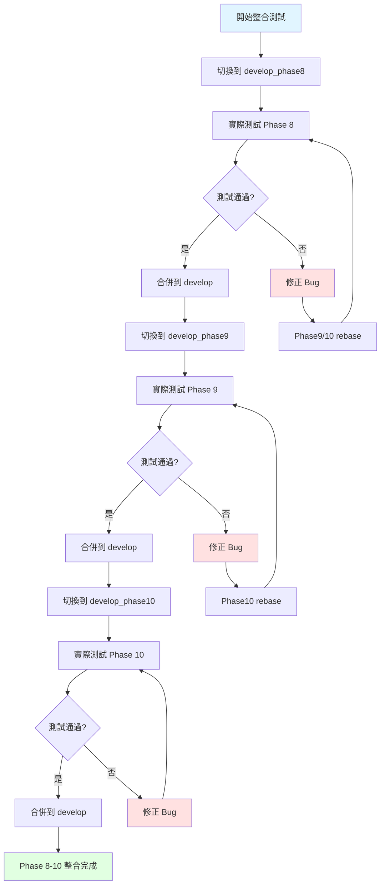
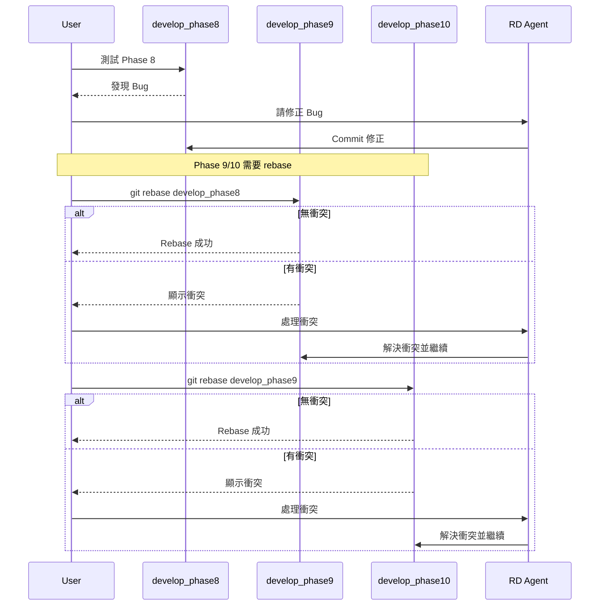
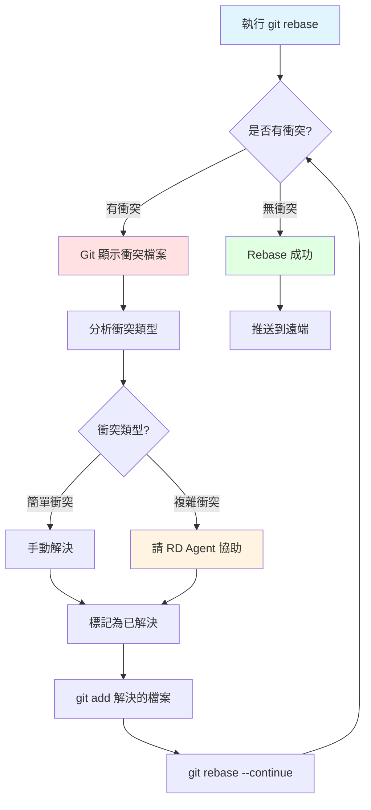

# SPEC-phase8-10-integration-testing-workflow

## 版本：v1.1
## 更新日期：2026-02-19
## 適用範圍：Phase 8-10 整合測試與分支管理規範
## 更新紀錄：v1.1 - 移除分支重命名步驟（已完成）

---

## 1. 功能概述

### 1.1 背景

Phase 8-10 的功能開發已在「無環境變數」的機器上完成框架實作，通過 type-check 驗收。下週將在「已配置 .env」的工作機器上進行實際整合測試。

### 1.2 分支結構

```
develop (main branch)
  ↓
develop_phase8 (Cron Job: 時效性效果系統)
  ↓
develop_phase9 (Cron Job: 離線事件佇列系統)
  ↓
develop_phase10 (Game Code 和遊戲狀態分層系統)
```

### 1.3 整合目標

1. **依序測試並合併分支**：Phase8 → Phase9 → Phase10
2. **每個 Phase 在合併前必須通過實際測試**（前端 UI + DB 驗證）
3. **處理測試中發現的 bug 和規格問題**
4. **安全處理 rebase 和衝突**

---

## 2. 整合測試流程架構

### 2.1 理想流程（無 Bug）



### 2.2 Bug 修正與 Rebase 流程



---

## 3. 實作步驟

### 3.1 前置準備（首次執行）

#### Step 1: 備份當前狀態（重要！）

```bash
# 為每個分支建立備份標籤
git checkout develop_phase8
git tag backup-phase8-$(date +%Y%m%d)

git checkout develop_phase9
git tag backup-phase9-$(date +%Y%m%d)

git checkout develop_phase10
git tag backup-phase10-$(date +%Y%m%d)

# 推送標籤到遠端
git push origin --tags
```

**為什麼需要備份？**
- 如果 rebase 過程中出現問題，可以隨時回滾
- 標籤不會被 rebase 影響，是最安全的備份方式

---

### 3.2 Phase 8 整合測試

#### Step 1: 切換到 Phase 8 分支並測試

```bash
# 1. 切換到 Phase 8 分支
git checkout develop_phase8

# 2. 確保 .env 已配置
# 檢查環境變數是否存在
cat .env | grep -E "MONGODB_URI|PUSHER|CRON_SECRET"

# 3. 安裝依賴（如果需要）
npm install

# 4. 啟動開發伺服器
npm run dev
```

#### Step 2: 執行測試清單

**Phase 8 測試項目**：
- [ ] **8.Cron.1**: Cron Job 定時觸發（`/api/cron/check-expired-effects`）
- [ ] **8.Cron.2**: 過期效果正確移除
- [ ] **8.Cron.3**: 角色屬性正確恢復
- [ ] **8.Cron.4**: 錯誤處理（DB 連接失敗等）

**測試方式**：
1. 手動觸發 Cron Job：`curl http://localhost:3000/api/cron/check-expired-effects`
2. 檢查 Console 輸出
3. 檢查 DB 中的 Character 資料是否正確更新

#### Step 3a: 測試通過 → 合併到 develop

```bash
# 1. 切換到 develop
git checkout develop

# 2. 合併 Phase 8（使用 --no-ff 保留分支歷史）
git merge --no-ff develop_phase8 -m "feat: merge Phase 8 - Cron Job 時效性效果系統"

# 3. 推送到遠端
git push origin develop

# 4. 繼續 Phase 9 測試（跳到 § 3.3）
```

#### Step 3b: 測試失敗 → 修正 Bug

```bash
# 1. 保持在 develop_phase8 分支
# 2. 告知 RD Agent 修正問題（使用 /rd skill）
# 3. RD Agent 會進行修正並 commit

# 範例：
# /rd 在 Phase 8 測試中發現 Cron Job 無法正確刪除過期效果，
# 錯誤訊息為 "Cannot read property 'temporaryEffects' of null"，
# 請修正此問題

# 4. 修正完成後，重新測試（回到 Step 2）
```

#### Step 3c: Bug 修正後 → Rebase Phase 9 和 Phase 10

```bash
# 1. 確保 Phase 8 的 bug 已修正並通過測試

# 2. Rebase Phase 9
git checkout develop_phase9
git rebase develop_phase8

# 3. 處理衝突（如果有，見 § 4）

# 4. Rebase Phase 10
git checkout develop_phase10
git rebase develop_phase9

# 5. 處理衝突（如果有，見 § 4）

# 6. 回到 Step 3a 合併 Phase 8
```

---

### 3.3 Phase 9 整合測試

#### Step 1: 切換到 Phase 9 分支並測試

```bash
# 1. 確保 Phase 8 已合併到 develop
git log develop --oneline -5 | grep "Phase 8"

# 2. 切換到 Phase 9 分支
git checkout develop_phase9

# 3. 啟動開發伺服器
npm run dev
```

#### Step 2: 執行測試清單

**Phase 9 測試項目**：
- [ ] **9.Cron.1**: 離線事件正確儲存到 `PendingEvent` 集合
- [ ] **9.Cron.2**: Cron Job 定時清理過期的離線事件（7 天前）
- [ ] **9.Cron.3**: 玩家上線後正確拉取離線事件
- [ ] **9.Cron.4**: 事件正確推送到前端並顯示

**測試方式**：
1. 建立離線事件（玩家離線時觸發事件）
2. 手動觸發 Cron Job：`curl http://localhost:3000/api/cron/check-expired-effects`
3. 玩家上線並檢查是否收到離線事件

#### Step 3: 測試通過 / 失敗處理

**測試通過** → 合併到 develop
```bash
git checkout develop
git merge --no-ff develop_phase9 -m "feat: merge Phase 9 - 離線事件佇列系統"
git push origin develop
```

**測試失敗** → 修正 Bug 並 Rebase Phase 10
```bash
# 1. 使用 /rd 修正問題
# 2. 修正完成後，rebase Phase 10
git checkout develop_phase10
git rebase develop_phase9

# 3. 重新測試 Phase 9
```

---

### 3.4 Phase 10 整合測試

#### Step 1: 切換到 Phase 10 分支並測試

```bash
# 1. 確保 Phase 8 和 9 已合併到 develop
git log develop --oneline -10 | grep -E "Phase 8|Phase 9"

# 2. 切換到 Phase 10 分支
git checkout develop_phase10

# 3. 啟動開發伺服器
npm run dev
```

#### Step 2: 執行測試清單

**Phase 10.2 測試項目**（Game Code UI）：
- [ ] **10.2.2**: 建立遊戲時自動生成唯一 Game Code
- [ ] **10.2.3**: GM 端遊戲建立頁面顯示 Game Code 欄位
- [ ] **10.2.4**: GM 端遊戲詳情頁面顯示 Game Code

**Phase 10.3 測試項目**（遊戲狀態按鈕）：
- [ ] **10.3.4**: GM 端遊戲詳情頁顯示「開始遊戲」和「結束遊戲」按鈕
- [ ] **10.3.5**: 按鈕狀態根據 `game.status` 正確切換

**Phase 10.4 測試項目**（Server Actions 重構）：
- [ ] **10.4.3**: 所有 Server Actions 使用新的讀寫邏輯
- [ ] **10.4.4**: Baseline 資料正確寫入 Game/Character 集合
- [ ] **10.4.5**: Runtime 資料正確寫入 GameRuntime/CharacterRuntime 集合

**Phase 10.7 測試項目**（WebSocket 事件）：
- [ ] **10.7.Test1**: `pushEventToGame()` 正確推送事件
- [ ] **10.7.Test2**: `emitGameStarted()` 觸發 `game.started` 事件
- [ ] **10.7.Test3**: `emitGameEnded()` 觸發 `game.ended` 事件

**Phase 10.8 測試項目**（資料遷移）：
- [ ] **10.8.2**: 執行遷移腳本：`npm run migrate:phase10`
- [ ] **10.8.3**: 檢查所有遊戲是否都有 Game Code
- [ ] **10.8.4**: 檢查是否有 PIN 衝突

**Phase 10.9 測試項目**（唯一性檢查）：
- [ ] **10.9.1**: Game Code 唯一性檢查（DB 邏輯）
- [ ] **10.9.2**: PIN 唯一性檢查（DB 邏輯）
- [ ] **10.9.3**: 前端 UI 顯示唯一性錯誤訊息

**測試方式**：
1. 建立新遊戲並檢查 Game Code 生成
2. 點擊「開始遊戲」按鈕並檢查 WebSocket 事件
3. 檢查 DB 中的 GameRuntime 和 CharacterRuntime 集合
4. 執行遷移腳本並檢查結果

#### Step 3: 測試通過 / 失敗處理

**測試通過** → 合併到 develop
```bash
git checkout develop
git merge --no-ff develop_phase10 -m "feat: merge Phase 10 - Game Code 和遊戲狀態分層系統"
git push origin develop
```

**測試失敗** → 修正 Bug
```bash
# 1. 使用 /rd 修正問題
# 2. 修正完成後重新測試
```

---

## 4. Rebase 衝突處理指南

### 4.1 衝突發生時的處理流程



### 4.2 常見衝突類型與解決策略

#### 衝突類型 1: 相同檔案的不同區塊修改（低風險）

**範例場景**：
- Phase 8 修改了 `lib/effects/check-expired-effects.ts` 的錯誤處理邏輯
- Phase 9 修改了同檔案的不同函數

**衝突標記**：
```typescript
<<<<<<< HEAD (develop_phase9)
// Phase 9 的修改
export async function cleanPendingEvents() {
  // Phase 9 的邏輯
}
=======
// Phase 8 的修改
export async function checkExpiredEffects() {
  // Phase 8 修正的錯誤處理
}
>>>>>>> develop_phase8
```

**解決方式**：
```bash
# 1. 打開衝突檔案
code lib/effects/check-expired-effects.ts

# 2. 手動保留兩邊的修改（因為是不同函數）
# 移除 <<<<<<<, =======, >>>>>>> 標記
# 保留兩個函數

# 3. 標記為已解決
git add lib/effects/check-expired-effects.ts

# 4. 繼續 rebase
git rebase --continue
```

---

#### 衝突類型 2: 相同邏輯的不同實作（中風險）

**範例場景**：
- Phase 8 修改了 `app/actions/games.ts` 中的錯誤處理
- Phase 10 重構了同一個函數的讀寫邏輯

**衝突標記**：
```typescript
<<<<<<< HEAD (develop_phase10)
// Phase 10 的重構版本
export async function createGame(data: CreateGameInput) {
  const game = await Game.create(data); // Baseline 寫入
  const runtime = await GameRuntime.create({ gameId: game._id }); // Runtime 寫入
  return { game, runtime };
}
=======
// Phase 8 的錯誤處理修正
export async function createGame(data: CreateGameInput) {
  try {
    const game = await Game.create(data);
    return { game };
  } catch (error) {
    console.error('建立遊戲失敗:', error);
    throw new Error('無法建立遊戲');
  }
}
>>>>>>> develop_phase8
```

**解決方式**：
```bash
# ⚠️ 這種衝突需要 RD Agent 協助

# 1. 告知 RD Agent 處理衝突
# /rd 在 rebase develop_phase10 時遇到衝突：
# 檔案：app/actions/games.ts
# 衝突原因：Phase 8 修改了錯誤處理，Phase 10 重構了讀寫邏輯
# 請保留 Phase 10 的重構邏輯，並整合 Phase 8 的錯誤處理

# 2. RD Agent 會合併兩邊的修改：
export async function createGame(data: CreateGameInput) {
  try {
    const game = await Game.create(data); // Baseline 寫入
    const runtime = await GameRuntime.create({ gameId: game._id }); // Runtime 寫入
    return { game, runtime };
  } catch (error) {
    console.error('建立遊戲失敗:', error);
    throw new Error('無法建立遊戲');
  }
}

# 3. 標記為已解決並繼續
git add app/actions/games.ts
git rebase --continue
```

---

#### 衝突類型 3: 檔案新增/刪除衝突（低風險）

**範例場景**：
- Phase 8 新增了 `lib/effects/check-expired-effects.ts`
- Phase 10 也新增了同名檔案（但內容不同）

**解決方式**：
```bash
# 1. 檢查兩個版本的差異
git show HEAD:lib/effects/check-expired-effects.ts > /tmp/phase10-version.ts
git show develop_phase8:lib/effects/check-expired-effects.ts > /tmp/phase8-version.ts
code --diff /tmp/phase8-version.ts /tmp/phase10-version.ts

# 2. 決定保留哪個版本或合併
# 如果 Phase 10 的版本是重構版本，優先保留 Phase 10
git checkout --theirs lib/effects/check-expired-effects.ts

# 3. 如果需要合併，請 RD Agent 協助
# /rd 請合併 Phase 8 和 Phase 10 的 check-expired-effects.ts

# 4. 標記為已解決並繼續
git add lib/effects/check-expired-effects.ts
git rebase --continue
```

---

### 4.3 Rebase 失敗的緊急處理

#### 情境 1: 衝突太多，想重新開始

```bash
# 1. 中止 rebase
git rebase --abort

# 2. 回到 rebase 前的狀態
git reset --hard backup-phase9-20260219  # 使用備份標籤

# 3. 重新分析問題（請 RD Agent 協助）
# /rd 在 rebase develop_phase9 時遇到大量衝突，
# 請分析 Phase 8 的修改和 Phase 9 的差異，
# 提供衝突處理策略
```

#### 情境 2: Rebase 過程中誤操作

```bash
# 1. 使用 git reflog 查看歷史
git reflog

# 2. 找到 rebase 前的 commit（例如 HEAD@{5}）
git reset --hard HEAD@{5}

# 3. 重新執行 rebase
git rebase develop_phase8
```

---

## 5. 最佳實踐與建議

### 5.1 測試前的準備

**環境檢查清單**：
- [ ] `.env` 檔案已配置所有必要變數（MongoDB, Pusher, Resend, Cron Secret）
- [ ] `npm install` 已執行
- [ ] MongoDB Atlas 連線正常（`npm run test:connection`）
- [ ] Pusher 服務正常
- [ ] 備份標籤已建立

### 5.2 與 RD Agent 的協作流程

**何時請 RD Agent 協助**：
1. **修正 Bug**：`/rd 在 Phase 8 測試中發現 [具體問題]，請修正`
2. **處理複雜衝突**：`/rd 在 rebase 時遇到衝突 [檔案路徑]，請協助解決`
3. **驗證修正**：`/rd 請驗證修正後的程式碼是否符合規格`

**RD Agent 的工作方式**：
- RD Agent 會先分析問題
- 提供修正方案並詢問確認
- **每完成一個步驟就暫停，等待驗收**
- 確認無誤後繼續下一步

### 5.3 Commit Message 規範

**Bug 修正的 Commit Message**：
```bash
git commit -m "fix(phase8): 修正 Cron Job 無法刪除過期效果的問題

問題：檢查角色時未處理 null 的情況
解決：新增 null check 並記錄錯誤日誌

Co-Authored-By: Claude Sonnet 4.5 <noreply@anthropic.com>"
```

**Rebase 後的 Commit Message**（如果有衝突處理）：
```bash
git commit -m "chore(phase9): rebase on develop_phase8

解決衝突：
- app/actions/games.ts: 合併錯誤處理和重構邏輯
- lib/effects/check-expired-effects.ts: 保留 Phase 10 的重構版本

Co-Authored-By: Claude Sonnet 4.5 <noreply@anthropic.com>"
```

### 5.4 推送策略

**首次推送（rebase 後）**：
```bash
# ⚠️ Rebase 後需要 force push（因為歷史已改變）
# 但要小心，只在自己的 feature 分支上使用

git push origin develop_phase9 --force-with-lease
```

**為什麼使用 `--force-with-lease`？**
- 比 `--force` 更安全
- 如果遠端有其他人的 commit，會拒絕推送
- 適合個人 feature 分支

---

## 6. 測試檢查清單（Checklist）

### 6.1 Phase 8 測試清單

**功能驗收**：
- [ ] Cron Job 可以手動觸發（`curl http://localhost:3000/api/cron/check-expired-effects`）
- [ ] 過期的時效性效果正確被移除
- [ ] 角色屬性正確恢復到原始值
- [ ] Console 顯示正確的處理日誌

**錯誤處理驗收**：
- [ ] DB 連接失敗時回傳 500 錯誤
- [ ] Cron Secret 錯誤時回傳 401 錯誤
- [ ] 角色不存在時跳過處理（不中斷）

**DB 驗證**：
- [ ] 檢查 `Character` 集合中的 `temporaryEffects` 陣列是否正確更新
- [ ] 檢查角色屬性（如 `hp`, `attributes`）是否正確恢復

---

### 6.2 Phase 9 測試清單

**功能驗收**：
- [ ] 離線事件正確儲存到 `PendingEvent` 集合
- [ ] Cron Job 正確清理 7 天前的離線事件
- [ ] 玩家上線後正確拉取離線事件（`fetchPendingEvents()`）
- [ ] 拉取後離線事件正確刪除

**錯誤處理驗收**：
- [ ] DB 連接失敗時回傳錯誤
- [ ] 推送事件失敗時正確儲存到離線佇列

**DB 驗證**：
- [ ] 檢查 `PendingEvent` 集合中的事件是否正確儲存
- [ ] 檢查舊事件是否被 Cron Job 清理

---

### 6.3 Phase 10 測試清單

**Phase 10.2 - Game Code UI**：
- [ ] 建立遊戲時自動生成唯一 Game Code
- [ ] GM 端建立頁面顯示 Game Code 欄位
- [ ] Game Code 格式正確（6 位英數字大寫）
- [ ] GM 端詳情頁面顯示 Game Code

**Phase 10.3 - 遊戲狀態按鈕**：
- [ ] 遊戲詳情頁顯示「開始遊戲」按鈕（當 status = 'preparing'）
- [ ] 遊戲詳情頁顯示「結束遊戲」按鈕（當 status = 'active'）
- [ ] 點擊「開始遊戲」後狀態變為 'active'
- [ ] 點擊「結束遊戲」後狀態變為 'ended'

**Phase 10.4 - Server Actions 重構**：
- [ ] `createGame()` 正確寫入 Game（Baseline）和 GameRuntime
- [ ] `createCharacter()` 正確寫入 Character（Baseline）和 CharacterRuntime
- [ ] 其他 Server Actions 使用新的讀寫邏輯

**Phase 10.7 - WebSocket 事件**：
- [ ] `pushEventToGame()` 正確推送事件到 Pusher
- [ ] `emitGameStarted()` 觸發 `game.started` 事件
- [ ] `emitGameEnded()` 觸發 `game.ended` 事件
- [ ] 前端正確接收事件

**Phase 10.8 - 資料遷移**：
- [ ] 執行 `npm run migrate:phase10` 成功
- [ ] 所有遊戲都有 Game Code
- [ ] 沒有 PIN 衝突（或已記錄衝突）

**Phase 10.9 - 唯一性檢查**：
- [ ] Game Code 唯一性檢查（DB 查詢）正確
- [ ] PIN 唯一性檢查（DB 查詢）正確
- [ ] 前端顯示唯一性錯誤訊息

---

## 7. 快速參考指令

### 7.1 常用 Git 指令

```bash
# === 分支管理 ===
git branch -a                          # 查看所有分支
git checkout <branch-name>             # 切換分支
git branch -m <old-name> <new-name>    # 重命名分支

# === 備份與回滾 ===
git tag backup-phase8-$(date +%Y%m%d) # 建立備份標籤
git reset --hard <tag-name>            # 回滾到標籤
git reflog                             # 查看歷史操作

# === Rebase ===
git rebase <base-branch>               # Rebase 到目標分支
git rebase --continue                  # 解決衝突後繼續
git rebase --abort                     # 中止 rebase

# === 衝突處理 ===
git status                             # 查看衝突檔案
git add <file>                         # 標記為已解決
git diff <branch1> <branch2> -- <file> # 比較兩個分支的檔案

# === 合併與推送 ===
git merge --no-ff <branch> -m "message" # 合併分支（保留歷史）
git push origin <branch>                # 推送分支
git push origin <branch> --force-with-lease # 強制推送（安全版）
```

### 7.2 常用測試指令

```bash
# === 環境檢查 ===
cat .env | grep -E "MONGODB_URI|PUSHER|CRON_SECRET" # 檢查環境變數
npm run test:connection                             # 測試 DB 連接
npm run test:resend                                 # 測試 Email 服務

# === 開發與驗證 ===
npm run dev                            # 啟動開發伺服器
npm run type-check                     # TypeScript 類型檢查
npm run lint                           # ESLint 代碼檢查

# === Phase 特定 ===
curl http://localhost:3000/api/cron/check-expired-effects # 觸發 Cron Job
npm run migrate:phase10                                   # 執行 Phase 10 遷移
```

---

## 8. 潛在風險與對策

### 8.1 技術風險

| 風險 | 影響 | 機率 | 對策 |
|------|------|------|------|
| **Rebase 衝突過多** | 整合時間延長 | 中 | 1. 事先建立備份標籤<br>2. 請 RD Agent 協助分析衝突<br>3. 必要時使用 `git rebase --abort` 重新規劃 |
| **DB 環境變數錯誤** | 測試無法執行 | 低 | 1. 測試前執行 `npm run test:connection`<br>2. 檢查 `.env` 檔案格式 |
| **Cron Job 無法觸發** | Phase 8/9 測試失敗 | 中 | 1. 檢查 Cron Secret 是否正確<br>2. 手動觸發測試（curl）<br>3. 檢查 Vercel Cron 設定 |
| **WebSocket 連接失敗** | Phase 10.7 測試失敗 | 低 | 1. 檢查 Pusher 環境變數<br>2. 測試 Pusher 連線<br>3. 檢查前端訂閱邏輯 |

### 8.2 流程風險

| 風險 | 影響 | 機率 | 對策 |
|------|------|------|------|
| **忘記 Rebase** | 下游分支缺少上游修正 | 高 | 1. 每次修正 Bug 後立即 Rebase 下游分支<br>2. 使用 checklist 追蹤 |
| **誤操作 force push** | 覆蓋他人 commit | 低 | 1. 使用 `--force-with-lease` 代替 `--force`<br>2. 推送前檢查 `git log` |
| **測試不完整** | 合併後才發現問題 | 中 | 1. 嚴格遵循測試檢查清單<br>2. 每個 Phase 至少測試兩次 |

---

## 9. 總結與建議

### 9.1 整合測試流程總結

```
1. 備份 → 2. 測試 Phase 8 → 3. 修正 Bug（如有） → 4. Rebase Phase 9/10 → 5. 合併 Phase 8
   ↓
6. 測試 Phase 9 → 7. 修正 Bug（如有） → 8. Rebase Phase 10 → 9. 合併 Phase 9
   ↓
10. 測試 Phase 10 → 11. 修正 Bug（如有） → 12. 合併 Phase 10
   ↓
13. Phase 8-10 整合完成 🎉
```

### 9.2 關鍵建議

1. **永遠先備份**：執行任何 rebase 或合併前，先建立備份標籤
2. **逐步測試**：不要一次測試所有 Phase，依序進行
3. **即時 Rebase**：修正 Bug 後立即 Rebase 下游分支，避免累積
4. **善用 RD Agent**：遇到複雜衝突或 Bug，立即請 RD Agent 協助
5. **記錄問題**：每次遇到問題都記錄下來，方便後續優化流程

### 9.3 預估時間

| 階段 | 預估時間 | 備註 |
|------|---------|------|
| 前置準備 | 30 分鐘 | 備份、環境檢查 |
| Phase 8 測試 | 1-2 小時 | 含 Bug 修正和 Rebase |
| Phase 9 測試 | 1-2 小時 | 含 Bug 修正和 Rebase |
| Phase 10 測試 | 2-3 小時 | 含 Bug 修正（任務較多） |
| **總計** | **4.5-7.5 小時** | 約 1 個工作日 |

---

`★ Insight ─────────────────────────────────────`
**Git 工作流程最佳實踐**：
1. **備份優先**：Rebase 和 Force Push 是危險操作，永遠先備份
2. **--force-with-lease**：比 --force 更安全，避免覆蓋他人 commit
3. **衝突分類處理**：簡單衝突手動解決，複雜衝突請 AI 協助
4. **線性歷史的價值**：使用 rebase 保持分支歷史清晰，方便 debug
`─────────────────────────────────────────────────`

---

## 附錄 A：緊急回滾指令

```bash
# 如果 rebase 或合併出現嚴重問題，使用以下指令回滾

# 方法 1: 使用備份標籤
git reset --hard backup-phase9-20260219

# 方法 2: 使用 reflog（查看最近的操作）
git reflog
git reset --hard HEAD@{5}  # 回到 5 步之前

# 方法 3: 中止 rebase
git rebase --abort

# 方法 4: 中止 merge
git merge --abort
```

---

**文件版本**: v1.1
**最後更新**: 2026-02-19
**下次審查**: Phase 8-10 整合測試完成後
