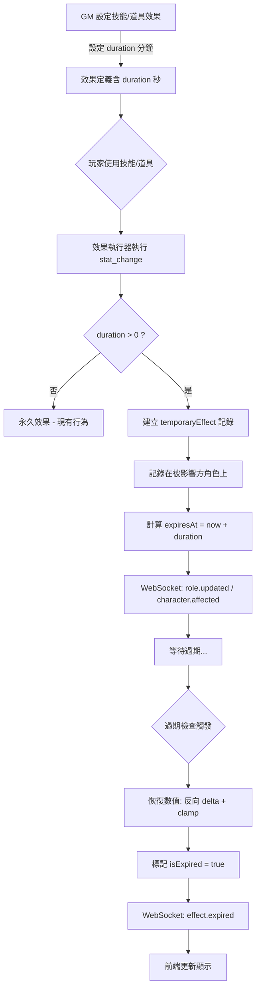
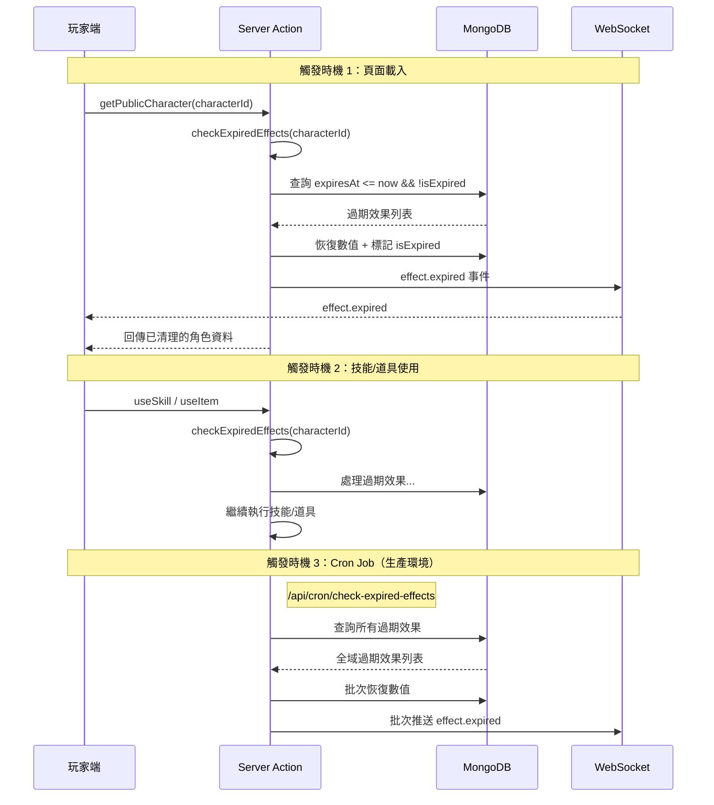
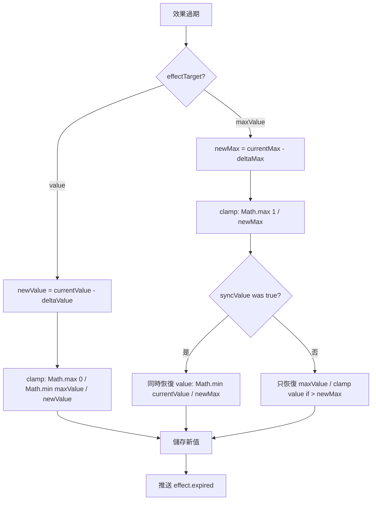

# SPEC-temporary-effects

## Phase 8：時效性效果系統

### 文件版本：v1.0
### 建立日期：2026-02-12

---

## 1. 功能概述

### 1.1 目標

實作時間限制的 `stat_change` 效果系統。當技能或道具的效果附帶 `duration`（持續時間），該效果到期後會自動恢復數值，不再需要 GM 手動撤回。

### 1.2 核心概念

| 概念 | 說明 |
|------|------|
| 永久效果 | `duration` 為 `undefined` 或 `0`，效果永遠生效（現有行為） |
| 時效性效果 | `duration > 0`（秒），到期後自動恢復數值 |
| 效果記錄對象 | 效果記錄儲存在**被影響方**角色上，非施放方 |
| 效果堆疊 | 同一數值可被多個時效性效果同時影響，各自獨立追蹤 |
| 恢復邏輯 | 過期時將 `deltaValue` / `deltaMax` 反向恢復，並 clamp 至 `[0, maxValue]` |
| 單位轉換 | GM 設定介面顯示**分鐘**（整數），後端儲存**秒**（`duration * 60`） |

### 1.3 影響範圍

- **型別定義**：`SkillEffect` 需新增 `duration` 欄位（`ItemEffect` 已有）
- **Mongoose Schema**：Character model 新增 `temporaryEffects` 陣列；技能效果 schema 新增 `duration`
- **效果執行器**：三個執行器都需整合（skill、item、contest）
- **Server Actions**：新增 `checkExpiredEffects()`、`getTemporaryEffects()`
- **API Route**：新增 `/api/cron/check-expired-effects`
- **WebSocket 事件**：新增 `effect.expired` 事件處理
- **GM UI**：角色數值 tab 新增時效性效果卡片
- **玩家 UI**：數值下方新增活躍效果面板（含倒數計時）

---

## 2. 技術架構

### 2.1 效果生命週期流程



### 2.2 過期檢查觸發時機



### 2.3 效果恢復數值邏輯



---

## 3. 資料模型

### 3.1 TypeScript 型別定義

#### 新增 `TemporaryEffect` 介面（`types/character.ts`）

```typescript
/**
 * Phase 8: 時效性效果記錄
 * 記錄在被影響方角色上
 */
export interface TemporaryEffect {
  id: string;                           // 效果唯一識別碼（如 'teff-xxx-123'）
  sourceType: 'skill' | 'item';        // 來源類型
  sourceId: string;                     // 技能/道具 ID
  sourceCharacterId: string;            // 施放者角色 ID
  sourceCharacterName: string;          // 施放者角色名稱
  sourceName: string;                   // 技能/道具名稱
  effectType: 'stat_change';            // 效果類型（Phase 8 僅支援 stat_change）
  targetStat: string;                   // 目標數值名稱
  deltaValue?: number;                  // 對 value 的變化量（恢復時反向）
  deltaMax?: number;                    // 對 maxValue 的變化量（恢復時反向）
  statChangeTarget: 'value' | 'maxValue'; // 數值變化目標
  syncValue?: boolean;                  // 是否同步修改了 value（當 statChangeTarget='maxValue'）
  duration: number;                     // 持續時間（秒）
  appliedAt: Date;                      // 效果套用時間
  expiresAt: Date;                      // 效果過期時間
  isExpired: boolean;                   // 是否已過期
}
```

#### 擴展 `SkillEffect`（`types/character.ts`）

```typescript
export interface SkillEffect {
  type: 'stat_change' | 'item_give' | 'item_take' | 'item_steal' |
        'task_reveal' | 'task_complete' | 'custom';
  targetType?: 'self' | 'other' | 'any';
  requiresTarget?: boolean;
  targetStat?: string;
  value?: number;
  statChangeTarget?: 'value' | 'maxValue';
  syncValue?: boolean;
  targetItemId?: string;
  targetTaskId?: string;
  description?: string;
  duration?: number;  // ← Phase 8 新增：持續時間（秒），undefined/0 = 永久
}
```

#### 擴展 `CharacterData`（`types/character.ts`）

```typescript
export interface CharacterData {
  // ...existing fields...
  temporaryEffects?: TemporaryEffect[];  // ← Phase 8 新增
}
```

#### 新增 `EffectExpiredEvent`（`types/event.ts`）

```typescript
/**
 * Phase 8: 效果過期事件
 */
export interface EffectExpiredEvent {
  type: 'effect.expired';
  timestamp: number;
  payload: {
    targetCharacterId: string;
    effectId: string;
    sourceType: 'skill' | 'item';
    sourceId: string;
    sourceCharacterId: string;
    sourceCharacterName: string;
    sourceName: string;
    effectType: 'stat_change';
    targetStat: string;
    restoredValue: number;        // 恢復後的數值
    restoredMax?: number;         // 恢復後的最大值
    deltaValue?: number;          // 原始的變化量（用於顯示）
    deltaMax?: number;            // 原始的最大值變化量
    statChangeTarget: 'value' | 'maxValue';
    duration: number;
  };
}
```

### 3.2 Mongoose Schema 擴展（`lib/db/models/Character.ts`）

#### 新增 `temporaryEffectSchema`

```typescript
const temporaryEffectSchema = new Schema({
  id: { type: String, required: true },
  sourceType: { type: String, enum: ['skill', 'item'], required: true },
  sourceId: { type: String, required: true },
  sourceCharacterId: { type: String, required: true },
  sourceCharacterName: { type: String, required: true },
  sourceName: { type: String, required: true },
  effectType: { type: String, enum: ['stat_change'], default: 'stat_change' },
  targetStat: { type: String, required: true },
  deltaValue: { type: Number },
  deltaMax: { type: Number },
  statChangeTarget: { type: String, enum: ['value', 'maxValue'], default: 'value' },
  syncValue: { type: Boolean },
  duration: { type: Number, required: true },
  appliedAt: { type: Date, required: true },
  expiresAt: { type: Date, required: true },
  isExpired: { type: Boolean, default: false },
}, { _id: false });
```

#### Character Schema 新增欄位

```typescript
// 在 characterSchema 中新增
temporaryEffects: [temporaryEffectSchema],
```

#### 技能效果 Schema 新增 `duration`

```typescript
// 在 skillEffectSchema 中新增
duration: { type: Number },  // Phase 8: 持續時間（秒）
```

### 3.3 資料範例

#### 角色的 temporaryEffects 陣列

```json
{
  "_id": "507f1f77bcf86cd799439013",
  "name": "勇者小明",
  "stats": [
    { "id": "stat-1", "name": "力量", "value": 15, "maxValue": 20 },
    { "id": "stat-2", "name": "血量", "value": 80, "maxValue": 100 }
  ],
  "temporaryEffects": [
    {
      "id": "teff-1707724800000-abc",
      "sourceType": "skill",
      "sourceId": "skill-buff-001",
      "sourceCharacterId": "507f1f77bcf86cd799439014",
      "sourceCharacterName": "法師小美",
      "sourceName": "力量強化",
      "effectType": "stat_change",
      "targetStat": "力量",
      "deltaValue": 5,
      "statChangeTarget": "value",
      "duration": 300,
      "appliedAt": "2026-02-12T10:00:00.000Z",
      "expiresAt": "2026-02-12T10:05:00.000Z",
      "isExpired": false
    }
  ]
}
```

---

## 4. 問題分析與解決方案

### 4.1 SkillEffect 與 ItemEffect 的不對稱

| 問題 | 現狀 | 解決方案 |
|------|------|----------|
| `ItemEffect` 已有 `duration` | `duration?: number`（line 167） | 無需修改 |
| `SkillEffect` 缺少 `duration` | 無此欄位 | 新增 `duration?: number` |
| Skill Schema 缺少 `duration` | 技能效果 schema 無 `duration` | 新增 `duration: { type: Number }` |

### 4.2 效果堆疊與恢復

| 問題 | 解決方案 |
|------|----------|
| 同一數值被多個效果影響 | 每個效果獨立追蹤 `deltaValue`/`deltaMax`，恢復時只反向該效果的 delta |
| 恢復時數值超出範圍 | Clamp：`Math.max(0, Math.min(maxValue, restoredValue))`；maxValue 恢復時 `Math.max(1, restoredMax)` |
| 中途角色 value 被 GM 手動修改 | 恢復時仍只反向 delta，不會回到「使用前的快照」。這是預期行為 |
| 效果記錄對象不明確 | 一律記錄在**被影響方**。自己用技能 buff 自己 → 記在自己；攻擊他人 → 記在目標 |

### 4.3 過期檢查機制

| 問題 | 解決方案 |
|------|----------|
| 開發環境無 Cron Job | 前端觸發：頁面載入（`getPublicCharacter`）和技能/道具使用時觸發 `checkExpiredEffects` |
| 生產環境定時檢查 | Vercel Cron Job：`/api/cron/check-expired-effects`，每分鐘執行 |
| 效果精確到秒但 Cron 每分鐘跑 | 前端觸發彌補間隔：玩家操作時立即檢查，確保不會使用過期 buff |

### 4.4 對抗檢定中的時效性效果

| 情境 | 處理方式 |
|------|----------|
| 攻擊方勝利，效果有 duration | 在 `contest-effect-executor.ts` 的 `effectTarget` 上建立 temporaryEffect |
| 防守方勝利，效果有 duration | 同上，`effectTarget` 根據 `contestResult` 決定 |
| 效果目標是攻擊方自己 | temporaryEffect 記錄在攻擊方 |
| 效果目標是防守方 | temporaryEffect 記錄在防守方 |

---

## 5. 實作步驟

### Phase 8.1：型別定義與 Schema 擴展
- [ ] 在 `types/character.ts` 新增 `TemporaryEffect` 介面
- [ ] 在 `types/character.ts` 的 `SkillEffect` 新增 `duration?: number` 欄位
- [ ] 在 `types/character.ts` 的 `CharacterData` 新增 `temporaryEffects?: TemporaryEffect[]`
- [ ] 在 `types/event.ts` 新增 `EffectExpiredEvent` 介面，並加入 `WebSocketEvent` 聯合類型
- [ ] 在 `lib/db/models/Character.ts` 新增 `temporaryEffectSchema` 和 `temporaryEffects` 欄位
- [ ] 在 `lib/db/models/Character.ts` 的技能效果 schema 新增 `duration: { type: Number }`

### Phase 8.2：效果執行器整合
- [ ] 建立共用工具 `lib/effects/create-temporary-effect.ts`：
  - 函式 `createTemporaryEffectRecord()`：建立 TemporaryEffect 記錄並寫入目標角色
  - 參數：characterId, sourceInfo, statChange, duration
- [ ] 修改 `lib/skill/skill-effect-executor.ts`：
  - 在 `stat_change` 效果成功套用後，檢查 `effect.duration > 0`
  - 若有 duration，呼叫 `createTemporaryEffectRecord()` 在 `effectTarget` 上建立記錄
- [ ] 修改 `lib/item/item-effect-executor.ts`：
  - 同上邏輯：在 stat_change 套用後檢查 duration，建立記錄
- [ ] 修改 `lib/contest/contest-effect-executor.ts`：
  - 同上邏輯：在 contest 結果處理中的 stat_change 套用後檢查 duration
  - 注意 `effectTarget` 根據 `contestResult` 動態決定

### Phase 8.3：過期檢查與數值恢復
- [ ] 建立 `lib/effects/check-expired-effects.ts`：
  - 函式 `processExpiredEffects(characterId?: string)`：核心過期處理邏輯
  - 查詢 `temporaryEffects` 中 `expiresAt <= now && isExpired === false`
  - 對每個過期效果：反向恢復數值 + clamp + 標記 isExpired
  - 推送 `effect.expired` WebSocket 事件
- [ ] 建立 `app/actions/temporary-effects.ts`：
  - `checkExpiredEffects(characterId?)` Server Action
  - `getTemporaryEffects(characterId)` Server Action（GM 端用）
- [ ] 建立 `app/api/cron/check-expired-effects/route.ts`：
  - GET handler，呼叫 `processExpiredEffects()`
  - 支援 Vercel Cron Job 認證（`CRON_SECRET` header）

### Phase 8.4：WebSocket 事件處理
- [ ] 在 `lib/websocket/events.ts` 新增 `emitEffectExpired()` 函式
- [ ] 在 `hooks/use-character-websocket-handler.ts` 新增 `effect.expired` 事件處理：
  - 顯示 Toast 通知：「[技能/道具名稱] 的效果已結束，[數值名稱] 已恢復」
  - 呼叫 `router.refresh()` 刷新角色資料
  - 加入通知面板
- [ ] 在 `lib/utils/event-mappers.ts` 新增 `effect.expired` 的通知映射

### Phase 8.5：前端觸發整合
- [ ] 修改 `app/actions/public.ts` 的 `getPublicCharacter()`：
  - 在回傳資料前呼叫 `checkExpiredEffects(characterId)`
  - 回傳 `temporaryEffects`（僅 `isExpired === false` 的記錄）
- [ ] 修改 `app/actions/skill-use.ts` 的 `useSkill()`：
  - 在技能執行前呼叫 `checkExpiredEffects(characterId)`
- [ ] 修改 `app/actions/item-use.ts` 的 `useItem()`：
  - 在道具執行前呼叫 `checkExpiredEffects(characterId)`

### Phase 8.6：GM 端 UI
- [ ] 建立 `components/gm/temporary-effects-card.tsx`：
  - 顯示角色所有活躍的時效性效果
  - 每個效果卡片包含：來源資訊、目標數值、變化量、剩餘時間倒數
  - 倒數計時使用 `useEffect` + `setInterval` 每秒更新
  - 效果過期後自動從列表中移除（透過 WebSocket 或定時刷新）
  - **擴展空間**：預留「暫停」、「延長時間」按鈕位置（Phase 8 暫不實作）
- [ ] 修改 GM 角色編輯頁（數值 Tab）：
  - 在 `stats-edit-form.tsx` 下方或同頁面整合 `temporary-effects-card`
  - 傳入角色的 `temporaryEffects` 資料

### Phase 8.7：玩家端 UI
- [ ] 修改 `components/player/stats-display.tsx`：
  - 在 `StatsDisplay` 組件下方新增「活躍效果面板」
  - 顯示所有活躍的 temporaryEffects（`isExpired === false`）
  - 每個效果顯示：效果名稱、數值變化、剩餘時間倒數
  - 倒數計時使用 `useEffect` + `setInterval` 每秒更新
  - 效果過期時自動移除（配合 `effect.expired` WebSocket 事件）
- [ ] 建立 `components/player/active-effects-panel.tsx`：
  - 專用的活躍效果面板組件
  - Badge 風格顯示，帶倒數計時器
  - 效果到期動畫（如漸淡消失）

### Phase 8.8：GM 設定介面擴展
- [ ] 修改 `components/gm/skill-edit-dialog.tsx`（或相關組件）：
  - 在 `stat_change` 效果表單中新增「持續時間」欄位
  - 輸入單位為**分鐘**（整數），儲存時轉換為秒（`value * 60`）
  - 空值 / 0 = 永久效果
- [ ] 修改 `components/gm/item-edit-dialog.tsx`（或相關組件）：
  - 同上：在 `stat_change` 效果表單中新增「持續時間」欄位
  - `ItemEffect` 已有 `duration` 欄位，只需新增 UI 輸入

---

## 6. API 介面說明

### 6.1 Server Actions

#### `checkExpiredEffects(characterId?: string)`

**檔案位置**：`app/actions/temporary-effects.ts`

| 項目 | 說明 |
|------|------|
| 參數 | `characterId?: string` — 可選，若未提供則檢查所有角色 |
| 認證 | 無需認證（可由 Cron Job 呼叫） |
| 回傳 | `{ success, data?: { processedCount, restoredStats[] }, message? }` |

**實作邏輯**：
1. 查詢 `temporaryEffects` 中 `expiresAt <= now && isExpired === false`
2. 對每個過期效果：
   - 讀取目標角色的當前 stat
   - 反向恢復：`newValue = currentValue - deltaValue`（或 maxValue）
   - Clamp：`Math.max(0, Math.min(maxValue, newValue))`
   - 更新 DB：`$set` stat 新值 + `temporaryEffects.$.isExpired = true`
3. 推送 `effect.expired` WebSocket 事件
4. 回傳處理結果

#### `getTemporaryEffects(characterId: string)`

**檔案位置**：`app/actions/temporary-effects.ts`

| 項目 | 說明 |
|------|------|
| 參數 | `characterId: string` |
| 認證 | 需 GM Session |
| 回傳 | `{ success, data?: { effects[] }, message? }` |

**實作邏輯**：
1. 驗證角色存在且屬於當前 GM
2. 過濾 `isExpired === false` 的效果
3. 計算每個效果的 `remainingSeconds`
4. 回傳效果列表

### 6.2 API Routes

#### `GET /api/cron/check-expired-effects`

**檔案位置**：`app/api/cron/check-expired-effects/route.ts`

| 項目 | 說明 |
|------|------|
| 認證 | Vercel Cron：驗證 `Authorization: Bearer ${CRON_SECRET}` |
| 回傳 | JSON `{ success, processedCount }` |
| 觸發 | Vercel Cron Job 每分鐘呼叫 |

**`vercel.json` 設定**：
```json
{
  "crons": [
    {
      "path": "/api/cron/check-expired-effects",
      "schedule": "* * * * *"
    }
  ]
}
```

### 6.3 WebSocket 事件

#### `effect.expired`

已定義於 `04_WEBSOCKET_EVENTS.md`。

**推送目標**：被影響方角色的專屬頻道

**Payload**：
```typescript
{
  targetCharacterId: string;
  effectId: string;
  sourceType: 'skill' | 'item';
  sourceId: string;
  sourceCharacterId: string;
  sourceCharacterName: string;
  sourceName: string;
  effectType: 'stat_change';
  targetStat: string;
  restoredValue: number;
  restoredMax?: number;
  deltaValue?: number;
  deltaMax?: number;
  statChangeTarget: 'value' | 'maxValue';
  duration: number;
}
```

---

## 7. 驗收標準

### 7.1 功能驗收

- [ ] AC-1：GM 在技能效果設定中可輸入「持續時間」（分鐘），儲存後轉換為秒
- [ ] AC-2：GM 在道具效果設定中可輸入「持續時間」（分鐘），儲存後轉換為秒
- [ ] AC-3：玩家使用帶 duration 的技能後，stat_change 效果正常套用
- [ ] AC-4：效果套用後，被影響方角色的 `temporaryEffects` 陣列新增一筆記錄
- [ ] AC-5：效果過期後，數值自動恢復（反向 delta + clamp）
- [ ] AC-6：效果過期後，被影響方收到 `effect.expired` WebSocket 事件
- [ ] AC-7：玩家端顯示 Toast：「[來源名稱] 的效果已結束，[數值名稱] 已恢復」
- [ ] AC-8：同一數值可被多個時效性效果同時影響，各自獨立追蹤與恢復
- [ ] AC-9：GM 端角色數值 tab 可見所有活躍的時效性效果與倒數計時
- [ ] AC-10：玩家端數值顯示下方可見活躍效果面板與倒數計時
- [ ] AC-11：頁面載入時自動檢查並處理過期效果
- [ ] AC-12：使用技能/道具前自動檢查並處理過期效果
- [ ] AC-13：對抗檢定結果產生的 stat_change 效果，若有 duration，正確建立 temporaryEffect
- [ ] AC-14：跨角色效果（用技能/道具影響他人）的 temporaryEffect 記錄在被影響方

### 7.2 錯誤處理驗收

- [ ] ERR-1：恢復數值時，value 不會小於 0，不會大於 maxValue
- [ ] ERR-2：恢復 maxValue 時，maxValue 不會小於 1
- [ ] ERR-3：若目標角色在效果期間被刪除，過期檢查不會崩潰
- [ ] ERR-4：若目標數值在效果期間被 GM 移除，過期檢查跳過該效果並標記為 isExpired
- [ ] ERR-5：Cron Job 路由驗證 `CRON_SECRET`，未授權呼叫回傳 401
- [ ] ERR-6：效果執行器建立 temporaryEffect 失敗時，stat_change 仍正常執行（效果退化為永久）

### 7.3 使用者體驗驗收

- [ ] UX-1：玩家端活躍效果面板的倒數計時每秒即時更新
- [ ] UX-2：效果到期時面板中的效果卡片自動移除（無需手動刷新）
- [ ] UX-3：GM 設定效果持續時間的輸入欄位清楚標示「分鐘」單位
- [ ] UX-4：GM 端時效性效果卡片的倒數計時每秒即時更新
- [ ] UX-5：永久效果（duration=0 或 undefined）的行為完全不受影響

---

## 8. 潛在風險與對策

### 8.1 技術風險

| 風險 | 影響 | 對策 |
|------|------|------|
| Schema 變更導致舊資料相容性問題 | 已有角色缺少 `temporaryEffects` 欄位 | `temporaryEffects` 預設為空陣列；查詢時使用 `character.temporaryEffects \|\| []` |
| 前端觸發過期檢查在高並發下重複執行 | 同一效果被恢復兩次導致數值錯誤 | 使用 MongoDB 的 `findOneAndUpdate` 原子操作，配合 `isExpired: false` 作為查詢條件 |
| Cron Job 與前端觸發同時處理同一效果 | 同上 | 同上：原子操作保證只處理一次 |
| 效果恢復時 stat 已被 GM 手動大幅修改 | 恢復後數值可能不符合 GM 預期 | 文件說明：恢復是基於「反向 delta」而非「回到使用前的快照」；GM 可手動調整 |
| `temporaryEffects` 陣列隨時間增長 | 舊的 isExpired=true 記錄堆積 | 過期檢查時清除超過 24 小時的已過期記錄（`$pull` isExpired && expiredAt < 24h ago） |

### 8.2 業務風險

| 風險 | 影響 | 對策 |
|------|------|------|
| GM 誤設 duration 導致效果意外恢復 | 遊戲體驗中斷 | GM 設定介面明確標示「持續時間（分鐘），留空 = 永久效果」 |
| 玩家利用效果即將過期的時間差作弊 | 公平性問題 | 前端觸發檢查確保操作前清理過期效果 |
| 效果恢復通知洩露施放者資訊 | 在有隱匿標籤的效果中，玩家不應知道來源 | `effect.expired` 事件中的 `sourceCharacterName` 需根據效果來源的隱匿標籤決定是否顯示（與 `character.affected` 同樣邏輯） |

---

## 附錄 A：與現有程式碼的整合點一覽

| 檔案 | 修改類型 | 說明 |
|------|----------|------|
| `types/character.ts` | 新增型別 + 修改 | `TemporaryEffect`、`SkillEffect.duration`、`CharacterData.temporaryEffects` |
| `types/event.ts` | 新增型別 | `EffectExpiredEvent`，加入 `WebSocketEvent` 聯合型別 |
| `lib/db/models/Character.ts` | Schema 擴展 | `temporaryEffectSchema`、`temporaryEffects` 欄位、技能 `duration` |
| `lib/effects/create-temporary-effect.ts` | 新建 | 共用工具：建立 temporaryEffect 記錄 |
| `lib/effects/check-expired-effects.ts` | 新建 | 核心邏輯：過期檢查與數值恢復 |
| `lib/skill/skill-effect-executor.ts` | 修改 | stat_change 後檢查 duration，建立記錄 |
| `lib/item/item-effect-executor.ts` | 修改 | 同上 |
| `lib/contest/contest-effect-executor.ts` | 修改 | 同上（注意 effectTarget 的動態決定） |
| `lib/websocket/events.ts` | 新增函式 | `emitEffectExpired()` |
| `lib/utils/event-mappers.ts` | 新增映射 | `effect.expired` → 通知文字 |
| `app/actions/temporary-effects.ts` | 新建 | `checkExpiredEffects()`、`getTemporaryEffects()` |
| `app/actions/public.ts` | 修改 | 頁面載入時觸發過期檢查 |
| `app/actions/skill-use.ts` | 修改 | 使用前觸發過期檢查 |
| `app/actions/item-use.ts` | 修改 | 使用前觸發過期檢查 |
| `app/api/cron/check-expired-effects/route.ts` | 新建 | Cron Job API Route |
| `hooks/use-character-websocket-handler.ts` | 修改 | 新增 `effect.expired` 事件處理 |
| `components/gm/temporary-effects-card.tsx` | 新建 | GM 端時效性效果卡片 |
| `components/gm/stats-edit-form.tsx` (或上層頁面) | 修改 | 整合效果卡片 |
| `components/gm/skill-edit-dialog.tsx` | 修改 | 新增 duration 輸入欄位 |
| `components/gm/item-edit-dialog.tsx` | 修改 | 新增 duration 輸入欄位 |
| `components/player/stats-display.tsx` | 修改 | 整合活躍效果面板 |
| `components/player/active-effects-panel.tsx` | 新建 | 活躍效果面板組件（倒數計時） |
| `vercel.json` | 新建/修改 | Cron Job 設定 |

---

## 附錄 B：Q&A 設計決策記錄

| 編號 | 問題 | 決策 |
|------|------|------|
| Q1 | Duration 在介面與後端的單位？ | 介面顯示分鐘（整數），後端儲存秒（`minutes * 60`） |
| Q2 | 哪些效果類型需支援 duration？ | `SkillEffect` 和 `ItemEffect` 都需要支援 `duration` |
| Q3 | TemporaryEffect 記錄儲存在哪？ | 儲存在**被影響方**角色上。對抗檢定中記錄在 effectTarget |
| Q4 | 恢復時的數值 clamp？ | `Math.max(0, Math.min(maxValue, newValue))`；maxValue 至少為 1 |
| Q5 | GM 端 UI 範圍？ | 唯讀顯示（方案 A），預留擴展空間（暫停/延長按鈕位置） |
| Q6 | 玩家端 UI 範圍？ | 方案 B+C：活躍效果面板 + 倒數計時器，位於數值下方 |
| Q7 | 過期檢查觸發方式？ | 前端觸發（頁面載入 + 技能/道具使用前），搭配 Cron Job（生產環境） |
