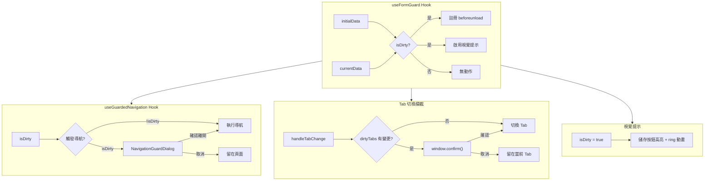
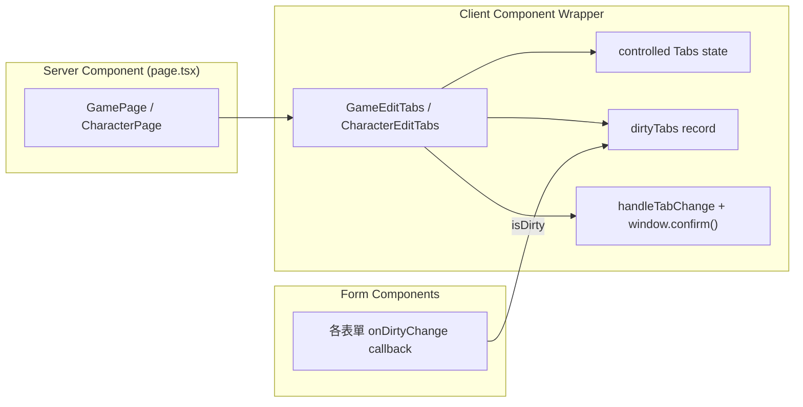

# SPEC-unsaved-changes-guard

## 版本：v2.0
## 日期：2026-03-04（v2.0 更新於 2026-03-08）
## 適用範圍：GM 端表單未儲存變更保護機制

---

## 1. 功能概述

### 1.1 問題描述

GM 端目前有 **6 個獨立表單**，全部採用「本地累積修改 → 手動點擊儲存按鈕」模式，且 **零保護機制**：

| 表單 | 檔案 | 儲存模式 | 風險 |
|------|------|---------|------|
| GameEditForm | `components/gm/game-edit-form.tsx` | 單層：修改 → 儲存按鈕 | 中 |
| CharacterEditForm | `components/gm/character-edit-form.tsx` | 單層：修改 → 儲存按鈕 | 中 |
| StatsEditForm | `components/gm/stats-edit-form.tsx` | 單層：修改 → 儲存按鈕 | 中 |
| SkillsEditForm | `components/gm/skills-edit-form.tsx` | **二層**：Dialog 確認 → 主儲存按鈕 | **高** |
| TasksEditForm | `components/gm/tasks-edit-form.tsx` | **二層**：Dialog 確認 → 主儲存按鈕 | **高** |
| ItemsEditForm | `components/gm/items-edit-form.tsx` | **二層**：Dialog 確認 → 主儲存按鈕 | **高** |

**使用者痛點**：
- GM 編輯完資料後，忘記點擊儲存按鈕就離開頁面，所有修改消失
- 二層儲存的表單（Skills/Tasks/Items）尤其危險：Dialog 內按了「確認」後使用者以為已儲存，但其實只是存入本地 state，還需要再按主儲存按鈕
- 無任何視覺提示告知使用者「你有未儲存的變更」

### 1.2 目標

實作 **導航攔截 + 視覺提示** 機制：

1. **Dirty State 追蹤**：偵測表單是否有未儲存的變更
2. **導航攔截**：離開頁面時彈出確認對話框
3. **Tab 切換攔截**：切換分頁時以 `window.confirm()` 提醒
4. **視覺提示**：儲存按鈕在有未儲存變更時高亮提示
5. **不改變現有儲存流程**：最小侵入性，保持手動儲存按鈕

---

## 2. 技術架構

### 2.1 整體架構



### 2.2 攔截範圍

| 場景 | 攔截方式 | 說明 |
|------|---------|------|
| 瀏覽器關閉/重新整理 | `window.beforeunload` | 瀏覽器原生確認對話框（L1） |
| 瀏覽器上一頁/下一頁 | `window.beforeunload` | 瀏覽器原生確認對話框（L1） |
| 表單內「返回」按鈕 | `NavigationGuardDialog` | 自訂確認對話框（L2） |
| Tab 分頁切換 | `window.confirm()` | 瀏覽器原生確認對話框（L3） |

### 2.3 Tab 切換攔截架構

由於 Next.js App Router 的頁面檔案為 Server Component，無法使用 `useState` 或傳遞 function props。解決方案是建立 **Client Component Wrapper**：



**關鍵設計決策**：`<Tabs>` 元件必須設定 `activationMode="manual"`，避免 Radix UI 的 automatic 模式在單次點擊時同時觸發 `focus` 和 `click` 兩個事件，導致 `onValueChange` 被呼叫兩次、`window.confirm()` 連續彈出。

---

## 3. 資料模型

### 3.1 TypeScript 介面

```typescript
/**
 * useFormGuard Hook 的參數
 */
interface UseFormGuardOptions<T> {
  /** 表單初始資料（從 props 或 Server 取得的原始值） */
  initialData: T;
  /** 表單當前資料（使用者修改後的值） */
  currentData: T;
  /** 自訂比較函數（選用，預設使用 JSON.stringify 深比較） */
  compareFn?: (initial: T, current: T) => boolean;
  /** 是否啟用保護（預設 true，儲存中可暫時關閉） */
  enabled?: boolean;
}

/**
 * useFormGuard Hook 的回傳值
 */
interface UseFormGuardReturn {
  /** 表單是否有未儲存的變更 */
  isDirty: boolean;
  /** 手動重置 dirty 狀態（儲存成功後呼叫） */
  resetDirty: () => void;
  /** 手動設定 dirty 狀態（二層儲存場景：Dialog 確認後手動標記） */
  markDirty: () => void;
}

/**
 * SaveButton 元件 Props（增強版儲存按鈕）
 */
interface SaveButtonProps {
  /** 是否有未儲存變更 */
  isDirty: boolean;
  /** 是否儲存中 */
  isLoading: boolean;
  /** 按鈕文字（預設：儲存變更） */
  label?: string;
  /** 點擊事件 */
  onClick?: () => void;
  /** 按鈕類型（預設：submit） */
  type?: 'submit' | 'button';
}

/**
 * Tab Wrapper 的 dirty 狀態追蹤
 */
type DirtyTabs = Record<string, boolean>;
```

### 3.2 Dirty State 判定邏輯

```typescript
// 單層表單：直接比較 initialData vs currentData
const isDirty = JSON.stringify(initialData) !== JSON.stringify(currentData);

// 二層表單（Skills/Tasks/Items）：
// Dialog 內「確認」後，資料寫入本地 array state
// 此時 currentData（本地 array）與 initialData（原始 props）不同 → isDirty = true
// 主儲存按鈕送出後，initialData 更新 → isDirty = false
```

---

## 4. 問題分析與解決方案

### 4.1 Next.js App Router 的導航攔截限制

**問題**：Next.js App Router 不提供 `router.events`（Pages Router 才有），無法直接攔截 client-side navigation。

**解決方案**：三層防護

| 層級 | 覆蓋場景 | 實作方式 |
|------|---------|---------|
| **L1: beforeunload** | 瀏覽器關閉、重新整理、手動輸入 URL | `window.addEventListener('beforeunload', ...)` |
| **L2: 元件內攔截** | 表單內的「取消」、「返回」按鈕 | `useGuardedNavigation` + `NavigationGuardDialog` |
| **L3: Tab 切換攔截** | 分頁切換 | `handleTabChange` + `window.confirm()` |

### 4.2 二層儲存的特殊處理

**問題**：Skills/Tasks/Items 的 Dialog 內按「確認」只是存入本地 state，使用者容易誤以為已儲存。

**解決方案**：
- Dialog 確認後 `useFormGuard` 自動偵測 `initialData !== currentData`
- 主儲存按鈕立即高亮（ring 效果 + 圓點前綴）

### 4.3 `router.refresh()` 後的 State 同步

**問題**：儲存成功後呼叫 `router.refresh()` 會觸發 Server Component 重新渲染，`initialData` props 更新，但 `useFormGuard` 需要同步重置。

**解決方案**：在 `useFormGuard` 內部偵測 `initialData` 變化時自動重置 dirty 狀態：

```typescript
const [prevInitialData, setPrevInitialData] = useState(initialData);
if (!compareFn(initialData, prevInitialData)) {
  setPrevInitialData(initialData);
  setManualDirty(false);
}
```

### 4.4 Radix Tabs activationMode 雙重觸發問題

**問題**：Radix UI Tabs 預設 `activationMode="automatic"`，點擊 TabsTrigger 時瀏覽器依序觸發 `focus` → `click`。兩個事件都會呼叫 `onValueChange`。由於 `window.confirm()` 是同步阻塞的，React 無法在兩次事件之間 re-render，導致一次點擊觸發兩次 `window.confirm()`。

**解決方案**：設定 `activationMode="manual"`，僅 `click` 事件觸發 tab 切換。

---

## 5. 實作步驟

### 5.1 新建檔案

- [x] **Step 1**：建立 `hooks/use-form-guard.ts` — 核心 Hook
- [x] **Step 2**：建立 `hooks/use-guarded-navigation.ts` — 受保護的導航 Hook
- [x] **Step 3**：建立 `components/gm/navigation-guard-dialog.tsx` — 導航確認對話框
- [x] **Step 4**：建立 `components/gm/save-button.tsx` — 增強版儲存按鈕（含 dirty 視覺提示）

### 5.2 整合至現有表單

- [x] **Step 5**：整合 `GameEditForm`（單層表單）
- [x] **Step 6**：整合 `CharacterEditForm`（單層 + guardedNavigation）
- [x] **Step 7**：整合 `StatsEditForm`（單層 + array 比較）
- [x] **Step 8**：整合 `SkillsEditForm`（二層儲存）
- [x] **Step 9**：整合 `TasksEditForm`（二層儲存）
- [x] **Step 10**：整合 `ItemsEditForm`（二層儲存 + WebSocket）

### 5.3 Tab 切換攔截

- [x] **Step 11**：建立 `components/gm/game-edit-tabs.tsx` — 劇本頁 Tab wrapper
- [x] **Step 12**：建立 `components/gm/character-edit-tabs.tsx` — 角色頁 Tab wrapper
- [x] **Step 13**：更新 `app/(gm)/games/[gameId]/page.tsx` — 使用 `GameEditTabs`
- [x] **Step 14**：更新 `app/(gm)/games/[gameId]/characters/[characterId]/page.tsx` — 使用 `CharacterEditTabs`
- [x] **Step 15**：修正 Radix Tabs `activationMode="manual"` — 防止雙重觸發

### 5.4 驗證

- [x] **Step 16**：TypeScript type-check 通過（0 errors）
- [x] **Step 17**：ESLint 通過（0 errors）
- [x] **Step 18**：手動驗證所有攔截場景

---

## 6. 實作細節

### 6.1 `useFormGuard` Hook

```typescript
// hooks/use-form-guard.ts
'use client';

import { useState, useEffect, useCallback, useMemo } from 'react';

export function useFormGuard<T>({
  initialData,
  currentData,
  compareFn = defaultCompare,
  enabled = true,
}: UseFormGuardOptions<T>): UseFormGuardReturn {
  const [manualDirty, setManualDirty] = useState(false);
  const [prevInitialData, setPrevInitialData] = useState(initialData);

  // initialData 從 server 更新時，自動重置
  if (!compareFn(initialData, prevInitialData)) {
    setPrevInitialData(initialData);
    setManualDirty(false);
  }

  const isDirty = useMemo(() => {
    if (!enabled) return false;
    return manualDirty || !compareFn(initialData, currentData);
  }, [enabled, manualDirty, initialData, currentData, compareFn]);

  // L1: beforeunload 攔截
  useEffect(() => {
    if (!isDirty) return;
    const handler = (e: BeforeUnloadEvent) => {
      e.preventDefault();
      e.returnValue = '';
    };
    window.addEventListener('beforeunload', handler);
    return () => window.removeEventListener('beforeunload', handler);
  }, [isDirty]);

  const resetDirty = useCallback(() => setManualDirty(false), []);
  const markDirty = useCallback(() => setManualDirty(true), []);

  return { isDirty, resetDirty, markDirty };
}
```

### 6.2 `useGuardedNavigation` Hook

```typescript
// hooks/use-guarded-navigation.ts
'use client';

import { useState, useCallback } from 'react';
import { useRouter } from 'next/navigation';

export function useGuardedNavigation(isDirty: boolean) {
  const router = useRouter();
  const [showDialog, setShowDialog] = useState(false);
  const [pendingAction, setPendingAction] = useState<(() => void) | null>(null);

  const guardedBack = useCallback(() => {
    if (isDirty) {
      setPendingAction(() => () => router.back());
      setShowDialog(true);
    } else {
      router.back();
    }
  }, [isDirty, router]);

  const guardedPush = useCallback((path: string) => {
    if (isDirty) {
      setPendingAction(() => () => router.push(path));
      setShowDialog(true);
    } else {
      router.push(path);
    }
  }, [isDirty, router]);

  const confirmNavigation = useCallback(() => {
    setShowDialog(false);
    pendingAction?.();
    setPendingAction(null);
  }, [pendingAction]);

  const cancelNavigation = useCallback(() => {
    setShowDialog(false);
    setPendingAction(null);
  }, []);

  return { guardedBack, guardedPush, showDialog, confirmNavigation, cancelNavigation };
}
```

### 6.3 `SaveButton` 增強元件

```typescript
// components/gm/save-button.tsx
'use client';

import { Button } from '@/components/ui/button';
import { Save } from 'lucide-react';
import { cn } from '@/lib/utils';

export function SaveButton({
  isDirty,
  isLoading,
  label = '儲存變更',
  onClick,
  type = 'submit',
  className,
}: SaveButtonProps) {
  return (
    <Button
      type={type}
      onClick={onClick}
      disabled={isLoading}
      className={cn(
        'transition-all duration-300',
        isDirty && !isLoading && [
          'ring-2 ring-primary ring-offset-2',
        ],
        className
      )}
    >
      <Save className="mr-2 h-4 w-4" />
      {isLoading ? '儲存中...' : isDirty ? `● ${label}` : label}
    </Button>
  );
}
```

### 6.4 Tab Wrapper 元件

#### GameEditTabs（劇本頁）

```typescript
// components/gm/game-edit-tabs.tsx
'use client';

export function GameEditTabs({ game, broadcastPanel, charactersTab }: GameEditTabsProps) {
  const [activeTab, setActiveTab] = useState('info');
  const [infoDirty, setInfoDirty] = useState(false);

  const handleTabChange = useCallback((newTab: string) => {
    if (activeTab === 'info' && infoDirty) {
      const confirmed = window.confirm('您有未儲存的變更，確定要離開嗎？');
      if (!confirmed) return;
    }
    setActiveTab(newTab);
  }, [activeTab, infoDirty]);

  return (
    // activationMode="manual" 防止 Radix focus+click 雙重觸發
    <Tabs value={activeTab} onValueChange={handleTabChange} activationMode="manual">
      {/* ... */}
    </Tabs>
  );
}
```

#### CharacterEditTabs（角色頁）

```typescript
// components/gm/character-edit-tabs.tsx
'use client';

export function CharacterEditTabs({ character, gameId, randomContestMaxValue }: CharacterEditTabsProps) {
  const [activeTab, setActiveTab] = useState('basic');
  const [dirtyTabs, setDirtyTabs] = useState<Record<string, boolean>>({});

  // useMemo 建立穩定的 callback references，避免子表單不必要的 re-render
  const dirtyCallbacks = useMemo(() => {
    const create = (key: string) => (dirty: boolean) => {
      setDirtyTabs((prev) => ({ ...prev, [key]: dirty }));
    };
    return {
      basic: create('basic'),
      stats: create('stats'),
      tasks: create('tasks'),
      items: create('items'),
      skills: create('skills'),
    };
  }, []);

  const handleTabChange = useCallback((newTab: string) => {
    if (dirtyTabs[activeTab]) {
      const confirmed = window.confirm('您有未儲存的變更，確定要離開嗎？');
      if (!confirmed) return;
    }
    setActiveTab(newTab);
  }, [activeTab, dirtyTabs]);

  return (
    <Tabs value={activeTab} onValueChange={handleTabChange} activationMode="manual">
      {/* 5 個 TabsContent，每個 form 傳入 onDirtyChange={dirtyCallbacks.xxx} */}
    </Tabs>
  );
}
```

### 6.5 表單整合模式（onDirtyChange callback）

每個表單新增 `onDirtyChange?: (dirty: boolean) => void` prop，透過 `useEffect` 回報 dirty 狀態：

```typescript
// 各表單內統一模式
const { isDirty, resetDirty } = useFormGuard({
  initialData: initialXxx,
  currentData: xxx,
});

useEffect(() => { onDirtyChange?.(isDirty); }, [isDirty, onDirtyChange]);
```

---

## 7. 驗收標準

### 7.1 功能驗收

- [x] **AC-1**：GM 修改任何表單欄位後，儲存按鈕出現 ring 高亮和圓點前綴
- [x] **AC-2**：GM 點擊儲存成功後，按鈕恢復正常樣式
- [x] **AC-3**：GM 有未儲存變更時關閉瀏覽器分頁，出現瀏覽器原生確認對話框
- [x] **AC-4**：GM 有未儲存變更時點擊「返回」按鈕，出現自訂確認對話框（CharacterEditForm）
- [x] **AC-5**：確認對話框中選擇「留在頁面」，頁面不導航
- [x] **AC-6**：確認對話框中選擇「確認離開」，正常導航且不儲存
- [x] **AC-7**：GM 在角色編輯頁切換 Tab 時，若當前 Tab 有未儲存變更，出現 `window.confirm()` 確認
- [x] **AC-8**：GM 在劇本編輯頁從「劇本資訊」切換至「角色列表」時，若有未儲存變更，出現確認
- [x] **AC-9**：SkillsEditForm/TasksEditForm/ItemsEditForm Dialog 確認後，主儲存按鈕立即高亮
- [x] **AC-10**：所有 6 個表單均正確追蹤 dirty state
- [x] **AC-11**：Tab 切換確認對話框的取消按鈕正確攔截（不會連續彈出對話框）

### 7.2 錯誤處理驗收

- [x] **ERR-1**：儲存失敗時，dirty state 保持不變（不會誤重置）
- [x] **ERR-2**：WebSocket 導致的 `router.refresh()` 不應觸發「未儲存變更」誤判（ItemsEditForm 的 state 同步機制）
- [x] **ERR-3**：快速連續修改欄位時，dirty state 正確追蹤

### 7.3 使用者體驗驗收

- [x] **UX-1**：儲存按鈕的高亮動畫為 `ring` 效果，不干擾使用
- [x] **UX-2**：確認對話框文案清晰，使用者能理解後果
- [x] **UX-3**：無變更時儲存按鈕正常樣式，不會造成混淆
- [x] **UX-4**：Tab 切換不會造成版面跳動（已移除 Banner 橫幅）

---

## 8. 潛在風險與對策

### 8.1 技術風險

| 風險 | 影響 | 對策 |
|------|------|------|
| `JSON.stringify` 比較的順序敏感性 | 物件屬性順序不同可能誤判為 dirty | 表單資料結構固定，順序一致；如有問題可改用 `lodash.isEqual` |
| WebSocket 觸發 `router.refresh()` 覆蓋使用者修改 | ItemsEditForm 中可能丟失本地修改 | 現有機制已處理（`prevInitialStats` pattern），`useFormGuard` 同樣採用此模式 |
| Next.js App Router 無法攔截所有 client-side 導航 | 側邊欄 `<Link>` 點擊不會被攔截 | 對 GM layout 中的側邊欄連結，可考慮加入全域 dirty 狀態查詢 |
| Radix Tabs automatic 模式導致 `onValueChange` 雙重觸發 | `window.confirm()` 連續彈出 | **已修正**：設定 `activationMode="manual"` |

### 8.2 業務風險

| 風險 | 影響 | 對策 |
|------|------|------|
| 過度頻繁的警告可能煩擾使用者 | UX 負面體驗 | 只在確實有未儲存變更時才顯示，使用原生對話框而非自訂彈窗 |

---

## 9. 影響範圍

### 9.1 新增檔案

| 檔案 | 說明 |
|------|------|
| `hooks/use-form-guard.ts` | 表單保護核心 Hook |
| `hooks/use-guarded-navigation.ts` | 受保護的導航 Hook |
| `components/gm/save-button.tsx` | 增強版儲存按鈕 |
| `components/gm/navigation-guard-dialog.tsx` | 導航確認對話框 |
| `components/gm/game-edit-tabs.tsx` | 劇本頁 Tab 切換攔截 wrapper |
| `components/gm/character-edit-tabs.tsx` | 角色頁 Tab 切換攔截 wrapper |

### 9.2 修改檔案

| 檔案 | 修改內容 |
|------|---------|
| `components/gm/game-edit-form.tsx` | 整合 `useFormGuard` + `SaveButton` + `onDirtyChange` |
| `components/gm/character-edit-form.tsx` | 整合 `useFormGuard` + `SaveButton` + `guardedNavigation` + `onDirtyChange` |
| `components/gm/stats-edit-form.tsx` | 整合 `useFormGuard` + `SaveButton` + `onDirtyChange` |
| `components/gm/skills-edit-form.tsx` | 整合 `useFormGuard` + `SaveButton` + `onDirtyChange` |
| `components/gm/tasks-edit-form.tsx` | 整合 `useFormGuard` + `SaveButton` + `onDirtyChange` |
| `components/gm/items-edit-form.tsx` | 整合 `useFormGuard` + `SaveButton` + `onDirtyChange` |
| `app/(gm)/games/[gameId]/page.tsx` | 使用 `GameEditTabs` 取代直接 `<Tabs>` |
| `app/(gm)/games/[gameId]/characters/[characterId]/page.tsx` | 使用 `CharacterEditTabs` 取代直接 `<Tabs>` |

### 9.3 已刪除檔案

| 檔案 | 說明 |
|------|------|
| `components/gm/unsaved-changes-banner.tsx` | 黃色橫幅（造成版面跳動，已移除） |

### 9.4 不修改的檔案

- Server Actions（`app/actions/*`）：不受影響
- 資料庫模型（`lib/db/models/*`）：不受影響
- 玩家端元件（`components/player/*`）：不受影響

---

## 附錄 A：設計決策記錄

### A.1 為何移除 UnsavedChangesBanner

v1.0 規格包含頂部黃色橫幅提示。實作後發現橫幅的出現/消失會導致版面跳動（layout shift），影響使用者體驗。決定移除橫幅，改為：
- 儲存按鈕的 ring 高亮已足夠提供視覺提示
- Tab 切換、頁面離開均有對話框攔截

### A.2 為何 Tab 切換使用 `window.confirm()` 而非自訂 Dialog

保持所有「離開畫面」提醒的一致性：
- `beforeunload` 使用瀏覽器原生對話框
- Tab 切換使用 `window.confirm()`（同為原生對話框）
- 只有 `router.back()/push()` 因為需要 async 控制流，使用自訂 `NavigationGuardDialog`

### A.3 為何需要 `activationMode="manual"`

Radix UI Tabs 預設 `activationMode="automatic"` 會在 focus 時自動切換 tab。點擊觸發 focus → click 兩個事件，在 controlled mode + synchronous `window.confirm()` 的組合下，`onValueChange` 會被呼叫兩次，導致連續彈出兩個確認對話框。設定 `activationMode="manual"` 後只有 click 觸發切換，修復此問題。

### A.4 為何 Tab Wrapper 需要 Client Component

Next.js App Router 的 page.tsx 為 Server Component，無法使用 React Hooks（`useState`, `useCallback`）。解決方案是將 `<Tabs>` + 所有 `<Form>` 包裝在 Client Component 中：
- `GameEditTabs` 接受 `broadcastPanel` 和 `charactersTab` 作為 `React.ReactNode` props，保留 Server-rendered 的內容
- `CharacterEditTabs` 直接管理所有 5 個表單元件
